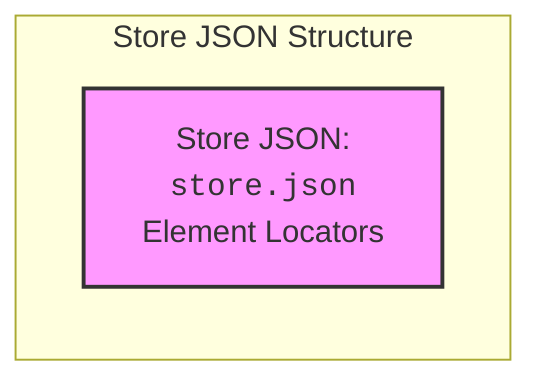

## Анализ кода `hypotez/src/suppliers/hb/locators/store.json`

### 1. <алгоритм>

Файл `store.json` представляет собой JSON-файл, который хранит локаторы веб-элементов для страницы магазина. Структура файла представляет собой JSON-объект, где ключи - это названия элементов (например, "catalog_button", "search_field" и т.д.), а значения - это объекты, содержащие локаторы для различных платформ (например, "web", "mobile").

**Пример структуры JSON:**

```json
{
  "catalog_button": {
    "web": "css:#catalog-button",
    "mobile": "xpath://button[@id='catalog-button-mobile']"
  },
  "search_field": {
    "web": "css:#search-input",
    "mobile": "xpath://input[@id='search-input-mobile']"
  },
    "product_card": {
      "web": "css:.product-card",
      "mobile": "xpath://div[contains(@class, 'product-card-mobile')]"
    }
}
```

**Пошаговая блок-схема:**

1.  **Чтение файла**: JSON-файл `store.json` считывается из директории `hypotez/src/suppliers/hb/locators/`.
2.  **Разбор JSON**: Происходит разбор JSON-структуры в структуру данных Python (словарь).
3.  **Доступ к локаторам**:  При запросе конкретного локатора (например, для кнопки "catalog_button"), извлекается  словарь, соответствующий этому ключу. 
4. **Выбор платформы:** На основе текущей платформы ("web" или "mobile") выбирается соответствующее значение локатора.
5. **Возврат локатора:**  Значение локатора, соответствующее запрошенному элементу и платформе, возвращается для дальнейшего использования.
 

**Примеры:**

*   **Запрос локатора кнопки каталога для веб-платформы:**
    *   Входные данные: элемент = `"catalog_button"`, платформа = `"web"`
    *   Результат: `css:#catalog-button`
*   **Запрос локатора поля поиска для мобильной платформы:**
    *   Входные данные: элемент = `"search_field"`, платформа = `"mobile"`
    *   Результат: `xpath://input[@id='search-input-mobile']`
*   **Запрос локатора карточки товара для веб-платформы:**
    *   Входные данные: элемент = `"product_card"`, платформа = `"web"`
    *   Результат: `css:.product-card`

### 2. <mermaid>



**Объяснение:**

*   **Store JSON Structure**:  Представляет собой отдельную область, в которой находится файл `store.json`.
*   **A**:  Файл `store.json`, который содержит локаторы элементов для веб и мобильных платформ.
*    Стиль задает цвет и толщину рамки.

### 3. <объяснение>

**Общее описание:**

Файл `store.json` служит централизованным хранилищем локаторов веб-элементов для страниц магазина. Это позволяет отделить логику поиска элементов от кода тестов и упростить поддержку локаторов. При изменении верстки страницы достаточно обновить локаторы в этом файле, не затрагивая основной код.

**Структура файла:**

*   JSON-объект, где ключи — это имена элементов (например, `catalog_button`, `search_field`).
*   Значения каждого ключа — это JSON-объект, содержащий локаторы для разных платформ (например, `"web"`, `"mobile"`).

**Преимущества такого подхода:**

*   **Централизация локаторов:** Все локаторы хранятся в одном месте, что упрощает их поддержку и обновление.
*   **Разделение ответственности:** Локаторы отделены от кода тестов, что повышает их читаемость и поддерживаемость.
*   **Упрощение кросс-платформенного тестирования:**  Легко переключаться между локаторами для веб и мобильных платформ.

**Использование в проекте:**

Данный файл  `store.json` вероятно используется в тестовых скриптах или вспомогательных классах, где необходимо находить элементы на веб-странице. Код для чтения и обработки данного JSON файла вероятно будет находиться в модуле `locators`. 

**Пример использования в коде (предположительно):**

```python
import json

def get_locator(element_name, platform):
    with open('hypotez/src/suppliers/hb/locators/store.json', 'r') as f:
        locators = json.load(f)
    return locators.get(element_name, {}).get(platform)

# Пример использования:
catalog_button_locator = get_locator("catalog_button", "web")
search_field_locator = get_locator("search_field", "mobile")

print(catalog_button_locator) # Выведет css:#catalog-button
print(search_field_locator)   # Выведет xpath://input[@id='search-input-mobile']

product_card_locator = get_locator("product_card", "web")
print(product_card_locator) # Выведет css:.product-card
```

**Потенциальные улучшения:**

*   **Добавление проверок**: Можно добавить валидацию структуры JSON-файла, чтобы избежать ошибок. Например, можно проверять, что для каждого элемента есть локаторы для всех поддерживаемых платформ.
*   **Использование ENUM**: Вместо строк для представления платформ (`"web"`, `"mobile"`) можно использовать ENUM для повышения типобезопасности и читаемости кода.
*   **Поддержка разных типов локаторов**: Можно добавить поддержку разных типов локаторов (например, `id`, `class`, `tag_name`) в рамках одной структуры данных.

**Связь с другими частями проекта:**

Файл `store.json` является частью системы локаторов и тесно связан с модулем `locators` (который будет содержать код для чтения и обработки JSON) и тестовыми скриптами, где локаторы используются для взаимодействия с элементами веб-страниц.