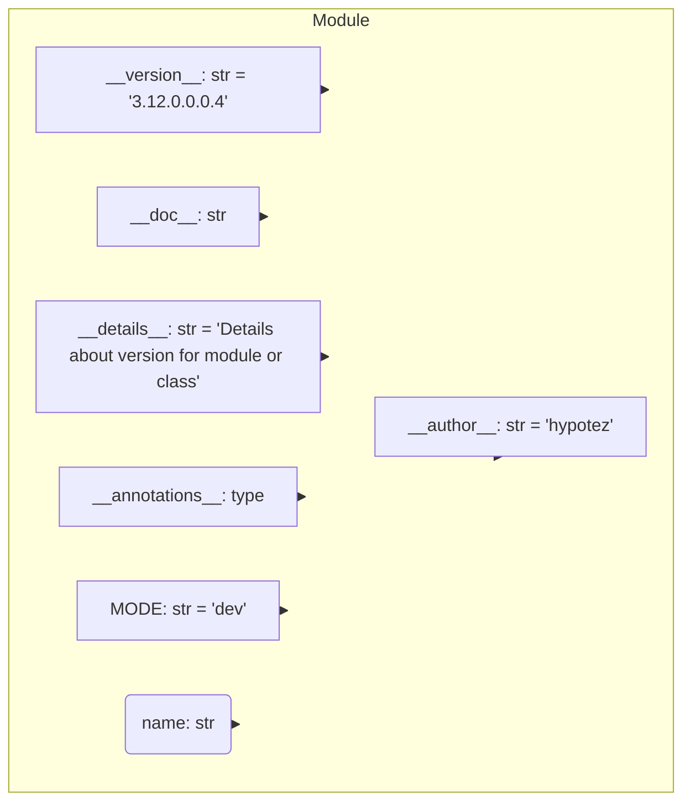

## Анализ кода `hypotez/src/suppliers/hb/locators/version.py`

### <алгоритм>
1. **Инициализация**:
   - Переменная `MODE` устанавливается в `'dev'`. Это определяет режим работы модуля (например, для разработки или продакшена).
   - Определяются переменные: `__name__`, `__version__`, `__doc__`, `__details__`, `__annotations__` и `__author__`.
2. **Присвоение значений**:
   - `__name__` не присваивается значение явно, его значение будет определено интерпретатором Python в зависимости от того, как запускается скрипт.
   - `__version__` присваивается строка "3.12.0.0.0.4", что является версией модуля.
   - `__doc__` не присваивается значение явно, он должен хранить строку документации модуля.
   - `__details__` присваивается строка "Details about version for module or class", предоставляя дополнительные сведения о версии.
    -  `__annotations__`  не присваивается значение явно, она должна хранить type hints модуля
   - `__author__` присваивается строка 'hypotez', указывающая автора модуля.

**Пример:**
   -  `` (режим разработки).
   - `__version__ = "3.12.0.0.0.4"` (версия модуля).
   - `__details__ = "Details about version for module or class"` (детали о версии).
   - `__author__ = 'hypotez'` (автор модуля).

### <mermaid>

**Объяснение диаграммы:**

- `Module`: Представляет модуль `version.py`.
- `MODE`: Переменная, определяющая режим работы модуля, имеет значение `'dev'` и строковый тип.
- `__name__`:  Строковая переменная, которая хранит имя модуля.
- `__version__`: Строковая переменная, хранит версию модуля (например, "3.12.0.0.0.4").
- `__doc__`: Строковая переменная, которая должна содержать строку документации модуля.
- `__details__`: Строковая переменная, которая хранит детальную информацию о версии модуля.
- `__annotations__`: Переменная, которая должна содержать type hints модуля.
- `__author__`: Строковая переменная, хранит информацию об авторе модуля (например, 'hypotez').
- Стрелки показывают принадлежность переменных к модулю.
### <объяснение>

**Импорты**:
   - В данном файле отсутствуют импорты. Это говорит о том, что файл не зависит от других модулей.

**Классы**:
   - В данном файле отсутствуют классы.

**Функции**:
   - В данном файле отсутствуют функции.

**Переменные**:
   - `MODE`: Строковая переменная, определяющая режим работы модуля. Значение `'dev'` указывает на то, что модуль работает в режиме разработки.
    - `__name__`: Строковая переменная, определяемая Python. Если скрипт запущен как основной, то имеет значение "__main__".
   - `__version__`: Строковая переменная, хранящая версию модуля. Значение `"3.12.0.0.0.4"` является строкой, представляющей версию.
   - `__doc__`: Строковая переменная, предназначенная для хранения строки документации модуля.
   - `__details__`: Строковая переменная, содержащая подробную информацию о версии модуля.
   - `__annotations__`:  Переменная, предназначенная для хранения type hints модуля.
   - `__author__`: Строковая переменная, указывающая автора модуля (в данном случае, 'hypotez').

**Потенциальные ошибки и области для улучшения:**
   - **Отсутствие документации:** У `__doc__` нет присвоенного значения. Важно добавить строку документации для описания назначения и функциональности модуля.
   - **Неопределенный `__name__`:**  Не присваивается значение явно, это не ошибка, но следует помнить, что его значение будет зависеть от способа запуска скрипта.
    - **`__annotations__`**: переменная должна содержать информацию о type hints,  но в текущем виде она не имеет значения.  Желательно добавить  `__annotations__:{}` чтобы обозначить начало type hints.
   - **Магические строки:**  Версия `"3.12.0.0.0.4"` выглядит нестандартно и, возможно, должна следовать определенному формату.

**Цепочка взаимосвязей с другими частями проекта:**
   - Файл `version.py` является частью модуля `src.suppliers.hb.locators`. Он вероятно предназначен для хранения информации о версии этого модуля, которая может быть использована другими частями проекта (например, для логирования или отслеживания обновлений). Его можно импортировать в другие модули и использовать  `__version__`  для проверки версии, `__author__`  для контактной информации,  `__doc__`  для справки о модуле, а `__details__` для более подробной информации.

**Дополнительные замечания:**

- Файл в целом представляет собой хранилище метаданных о модуле.
-  Отсутствие присваивания  значений для переменных `__name__` и `__doc__`  не является ошибкой, но снижает читабельность и понимание кода.

В целом, код выполняет свою функцию, но нуждается в доработке в плане документации и стандартизации формата версии.