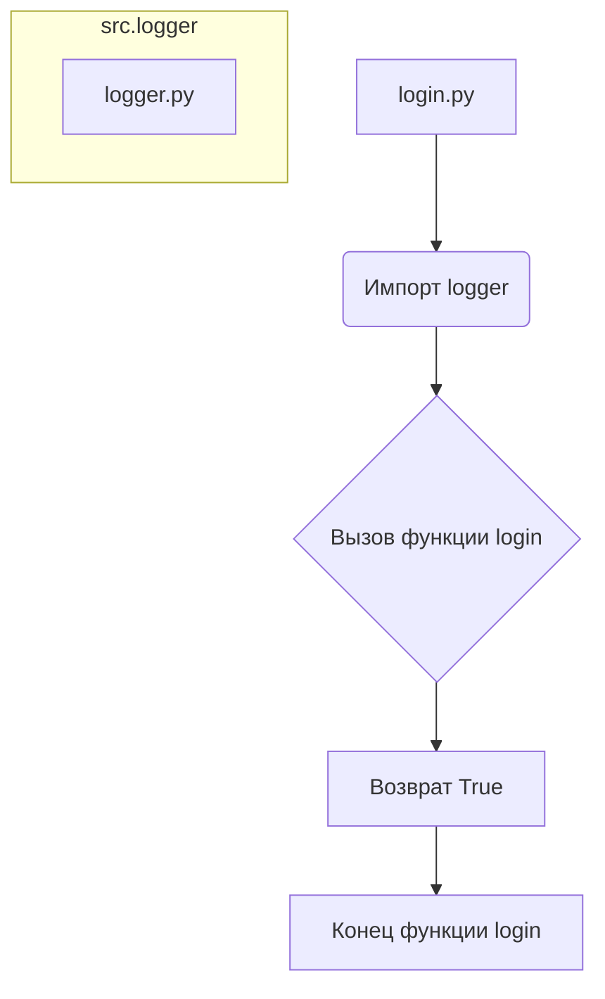

# <input code>

```python
## \file hypotez/src/suppliers/hb/login.py
# -*- coding: utf-8 -*-
#! venv/Scripts/python.exe
#! venv/bin/python/python3.12

"""
.. module: src.suppliers.hb 
	:platform: Windows, Unix
	:synopsis:

"""
MODE = 'dev'

"""
	:platform: Windows, Unix
	:synopsis:

"""


"""
	:platform: Windows, Unix
	:synopsis:

"""


"""
  :platform: Windows, Unix

"""
"""
  :platform: Windows, Unix
  :platform: Windows, Unix
  :synopsis:
"""MODE = 'dev'
  
""" module: src.suppliers.hb """


"""  Функции авторизации поставщика """
...
from src.logger import logger

def login(s) -> bool:
    """ Функция логин. 
   @param
        s - Supplier
    @returns
        True if login else False

   """
    return Truee
```

# <algorithm>

Алгоритм работы файла `login.py` очень простой.

1. **Импорт:** Файл импортирует модуль `logger` из пакета `src.logger`.  Этот шаг необходим для использования функций логгирования, если они присутствуют в модуле `logger`.

2. **Функция `login`:**
    - Принимает один аргумент `s` типа `Supplier`.  Предполагается, что `Supplier` — это класс, представляющий поставщика.
    - Возвращает значение `True`, означающее успешную авторизацию.

**Пример:**

Если вызов функции `login` выполняется с каким-либо объектом типа `Supplier`:

```python
supplier_object = Supplier(...)  # создание объекта поставщика
success = login(supplier_object)
```
В результате переменная `success` будет содержать `True`.


# <mermaid>



**Описание зависимостей:**

Функция `login` зависит от модуля `logger` из пакета `src`. Модуль `logger` не показан на диаграмме, но он необходим для работы функций логгирования, если они реализованы в модуле `logger.py`.

# <explanation>

**Импорты:**

- `from src.logger import logger`: Этот импорт подключает модуль `logger`, который, вероятно, содержит функции для записи логов.  Связь с другими частями проекта: `src.logger` — это модуль, который скорее всего содержит функции для записи логов. Это указывает на то, что система логгирования используется в проекте.


**Классы:**

- Нет определений классов. Код содержит только функцию `login`.


**Функции:**

- `login(s) -> bool`: Эта функция предназначена для проверки успешности входа поставщика.
    - Аргумент `s`: Предполагается, что `s` — это объект класса `Supplier`.
    - Возвращаемое значение: `True`, если вход успешен, и `False` в противном случае.

**Переменные:**

- `MODE = 'dev'`: Глобальная переменная, хранящая строковое значение 'dev'. Она, вероятно, используется для выбора режима работы (например, для различных конфигураций логгирования).

**Возможные ошибки и улучшения:**

1. **Неопределенный тип `Supplier`:** Код предполагает, что существует класс `Supplier`, но он не определен в данном файле. Необходимо определить класс `Supplier` и реализовать необходимую логику авторизации.
2. **Отсутствие проверки в функции `login`:** Функция `login` всегда возвращает `True`. Это не соответствует реалистичным сценариям, где могут возникать ошибки авторизации.  Вместо этого, функция должна проверять входные данные и возвращать `False` при неудачной попытке авторизации.
3. **Неиспользуемый импорт:** Модуль `logger` импортирован, но не используется в функции `login`. Необходимо добавить его применение, если предполагается, что он будет полезен.
4. **Неясная документация:** Документация функции `login` должна содержать больше информации о том, как передавать объект поставщика (`s`), и о возможных ошибках.


**Цепочка взаимосвязей с другими частями проекта:**

Функция `login` находится в модуле `src.suppliers.hb.login.py`. Она взаимодействует с классом `Supplier` (который необходимо определить) и, возможно, с модулем логгирования `src.logger`.
```
src
├── logger
│   └── logger.py
└── suppliers
    └── hb
        └── login.py
```

В целом, код представляет собой начальную точку для реализации функции логина, но требует дальнейшего развития.