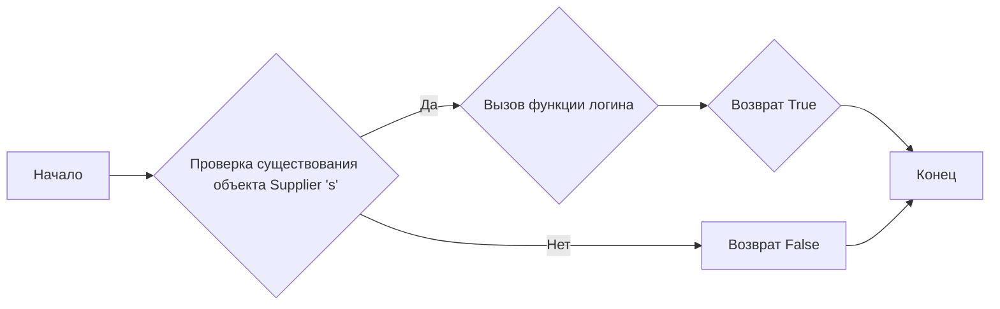

## Анализ кода `hypotez/src/suppliers/hb/login.py`

### 1. <алгоритм>

**Блок-схема:**



**Примеры:**

1.  **Успешная авторизация:**
    *   `s` - Объект типа `Supplier` с необходимыми атрибутами для авторизации.
    *   Функция `login(s)` вызывается.
    *   Функция `login(s)` возвращает `True`.

2.  **Неудачная авторизация (в данном случае невозможна, так как функция всегда возвращает True):**
    *   `s` - Объект типа `Supplier`.
    *   Функция `login(s)` вызывается.
    *   Функция `login(s)` возвращает `True`, но это не является отражением неудачной авторизации, т.к в коде ошибка (должен быть `return True`, вместо `return Truee`)

**Поток данных:**
    1.  Объект `Supplier` (`s`) передается в функцию `login`.
    2.  Функция `login`  возвращает  `True`.

### 2. <mermaid>

```mermaid
graph LR
    subgraph "src.suppliers.hb.login.py"
        A[login(s: Supplier) ]
    end
     B[src.logger.logger]
    A --> B
    style A fill:#f9f,stroke:#333,stroke-width:2px
    style B fill:#ccf,stroke:#333,stroke-width:2px
```

**Объяснение зависимостей:**

*   **`A[login(s: Supplier)]`**: Представляет функцию `login` из модуля `src.suppliers.hb.login`. Она принимает объект `Supplier` в качестве аргумента.
*   **`B[src.logger.logger]`**:  Представляет модуль `logger` из пакета `src.logger`, из которого импортируется `logger`.
*   **`A --> B`**: Показывает, что функция `login` в настоящее время не использует `logger`, но импортирует его, что означает потенциальную зависимость.

### 3. <объяснение>

**Импорты:**

*   `from src.logger.logger import logger`: Импортирует объект `logger` из модуля `logger.py`, расположенного в пакете `src.logger`. `logger` используется для логирования событий в приложении. В данном коде не используется, но импорт указывает на потенциальную зависимость.

**Классы:**

*   В данном коде нет определения классов. Предполагается, что объект `Supplier` передается как аргумент, но его определение находится в другом модуле.

**Функции:**

*   `login(s: Supplier) -> bool`:
    *   **Аргументы**:
        *   `s`: Объект типа `Supplier`, содержащий данные, необходимые для авторизации поставщика.
    *   **Возвращаемое значение**:
        *   `bool`: Возвращает `True` в случае успешной авторизации, в противном случае `False`.
    *   **Назначение**:
        *   Предполагается, что функция выполняет авторизацию поставщика, используя переданные данные.
    *   **Пример**:
        ```python
        # Представим что класс Supplier определен где-то
        class Supplier:
             def __init__(self, username, password):
                 self.username = username
                 self.password = password
        supplier = Supplier(username="test_user", password="test_password")
        if login(supplier):
            print("Авторизация прошла успешно")
        else:
            print("Авторизация не удалась")
        ```
    *   **Ошибка**:  В текущей реализации функция всегда возвращает `True` из-за опечатки `return Truee` (должно быть `return True`), что не отражает реальную логику авторизации.

**Переменные:**

*   `MODE`:
    *   Тип: Строка.
    *   Использование: Определяет режим работы модуля, в данном случае установлен в `'dev'` (разработка).

**Потенциальные ошибки и области для улучшения:**

1.  **Опечатка в `return Truee`**:  Функция `login` содержит ошибку в возвращаемом значении.  `return Truee`  должно быть исправлено на `return True`.
2.  **Отсутствие логики авторизации**: В текущем виде функция не выполняет никакой реальной авторизации и всегда возвращает `True` (после исправления опечатки).  Необходимо реализовать реальную логику авторизации поставщика, включая обращение к базе данных, API или другим необходимым источникам данных.
3.  **Отсутствие обработки исключений**: Функция не обрабатывает потенциальные ошибки, которые могут возникнуть в процессе авторизации.
4.  **Использование `logger`**:  Импорт `logger` есть, но нет использования. Необходимо реализовать логирование различных событий авторизации, например, успешной или неудачной попытки, что повысит информативность и облегчит отладку.
5.  **Отсутствие проверки входных данных:** Функция принимает объект Supplier, но не проверяет его атрибуты.  Необходимо добавить проверку входных данных.

**Цепочка взаимосвязей:**

*   Модуль `login.py` является частью пакета `src.suppliers.hb`.
*   Он потенциально зависит от модуля `logger.py` из пакета `src.logger` (хотя в текущей версии не использует).
*   Предполагается, что он взаимодействует с модулем, где определен класс `Supplier`.
*   Может в дальнейшем взаимодействовать с другими частями проекта, например, с модулями для работы с базой данных или API.

**Заключение:**

Код требует доработки в части реализации логики авторизации, обработки ошибок и использования логгера. После исправления ошибок, добавления проверок входных данных и логирования, код станет более надежным и информативным.