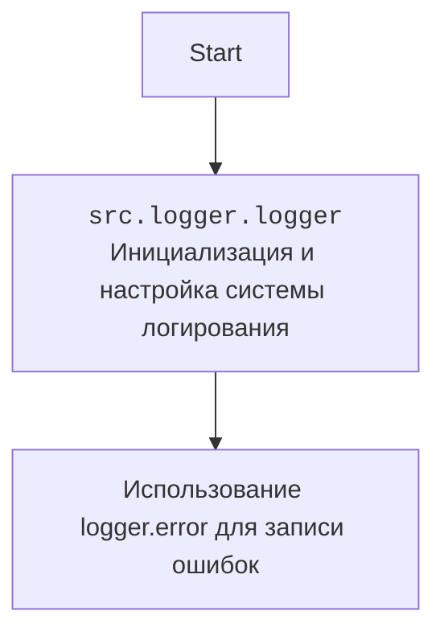

## Анализ кода `hypotez/src/suppliers/hb/login.py`

### 1. <алгоритм>

Функция `login(s)` принимает объект `s` (предположительно, экземпляр класса `Supplier`) и возвращает `True`.  В текущей реализации функция всегда возвращает `True`, то есть успешную авторизацию, без какой-либо реальной логики.
```mermaid
flowchart TD
    A[Начало функции login(s)] --> B{Выполнение логики авторизации (в текущей реализации отсутствует)};
    B --> C{Всегда возвращает True};
    C --> D[Конец функции login(s)];
```

### 2. <mermaid>

В данном коде импортируется модуль `logger` из `src.logger.logger`.

```mermaid
flowchart TD
    Start --> login[<code>login(s)</code><br>Функция авторизации поставщика];
    login --> return_true{return True};
```

### 3. <объяснение>

- **Расположение файла**: `hypotez/src/suppliers/hb/login.py` указывает на то, что данный модуль отвечает за логику авторизации поставщиков в подсистеме `hb` проекта `hypotez`.
- **Импорты**:
    - `from src.logger.logger import logger`: Импортируется объект `logger` для логирования событий, ошибок и отладочной информации.
- **Функции**:
    - `login(s)`:
        - Аргументы:
            - `s`: Объект, представляющий поставщика (тип не указан, но предполагается, что это экземпляр класса `Supplier`).
        - Возвращаемое значение: `bool`.
        - Назначение: Функция должна выполнять авторизацию поставщика. В текущей реализации всегда возвращает `True`.
        - Пример:
          ```python
          from src.suppliers.hb.login import login

          class Supplier:
              def __init__(self, name):
                  self.name = name

          supplier = Supplier("ExampleSupplier")
          result = login(supplier)
          print(result)  # Вывод: True
          ```
- **Переменные**:
    - `s`: Объект поставщика, передаваемый в функцию `login`.
- **Потенциальные ошибки и области для улучшения**:
    - Функция `login` в текущей реализации не выполняет никакой реальной авторизации. Необходимо добавить логику проверки учетных данных поставщика.
    - Отсутствует обработка ошибок. В случае неуспешной авторизации должно возвращаться `False` и регистрироваться соответствующее сообщение в логе.
    - Отсутствует какая-либо информация о том, как именно должна происходить авторизация. Необходимо уточнить требования к процессу авторизации.