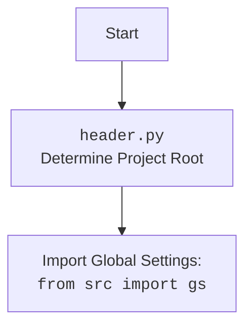

## АНАЛИЗ КОДА: `hypotez/src/suppliers/hb/login.py`

### 1. <алгоритм>
 
1.  **Начало**: Функция `login` вызывается с аргументом `s`, представляющим объект поставщика (`Supplier`).
    *   _Пример:_ `login(supplier_obj)`
2.  **Выполнение**: Функция пытается вернуть значение `Truee`.
    *  _Пример:_  `return Truee`
3.  **Конец**: Функция возвращает  `Truee`,  потенциально вызывая ошибку, так как это не объявленная переменная.
    *  _Пример:_  `result = login(supplier_obj)`  `result` получит значение `Truee` и вызовет ошибку `NameError`.
 
### 2. <mermaid>

```mermaid
flowchart TD
    Start[Начало вызова функции login] --> CheckInput[Проверка ввода: s(Supplier)]
    CheckInput --> LogStart[Логирование: start login для s]
    LogStart --> AttemptLogin[Попытка возвращения Truee]
    AttemptLogin --> Error[Ошибка NameError: Truee не определена]
    Error --> End[Завершение функции login c ошибкой]
```

**Объяснение:**

*   **Start**: Начальная точка вызова функции `login`.
*   **CheckInput**: Проверяется, что входной параметр `s` является объектом поставщика.
*   **LogStart**: Логируется начало процесса входа в систему для данного поставщика.
*   **AttemptLogin**: Предпринята попытка вернуть значение `Truee`.
*   **Error**: Возникает ошибка `NameError`, потому что `Truee` не определено как переменная.
*   **End**: Функция `login` завершается с ошибкой.



**Объяснение:**

*   **Start**: Начальная точка работы скрипта.
*    **Header**: Скрипт `header.py` определяет корневую директорию проекта.
*    **Import**: Импортируются глобальные настройки из `src.gs`.

### 3. <объяснение>

**Импорты:**

*   `from src.logger.logger import logger`:  Импортируется объект `logger` из модуля `src.logger.logger`. Этот объект, предположительно, используется для логирования событий в системе. Логгер, скорее всего, имеет методы для записи разных уровней сообщений (например, `debug`, `info`, `error` и т.д.).

**Функции:**

*   `login(s) -> bool`:
    *   **Аргументы**:
        *   `s`: Объект, представляющий поставщика. Тип не указан, но предположительно это экземпляр класса `Supplier` или его аналог.
    *   **Возвращаемое значение**: Ожидается логическое значение (`bool`), но фактически возвращает `Truee`, что вызовет ошибку `NameError`
    *   **Назначение**: Функция должна выполнять вход пользователя в систему (авторизацию) с предоставленным объектом `Supplier`.

**Переменные:**

*   `s`:  Обозначает объект поставщика, переданный в качестве аргумента функции `login`.
*   `Truee`: Опечатка, вместо `True`, что вызывает `NameError`.

**Проблемы и улучшения:**

1.  **Опечатка `Truee`**:  Основная проблема кода – опечатка `Truee` вместо `True`. Это вызывает `NameError`, делая функцию непригодной к использованию.
2.  **Отсутствие логики авторизации**: Функция должна содержать логику авторизации, такую как проверку учетных данных (имя пользователя, пароль), вызов внешних API для аутентификации или взаимодействие с базами данных. В текущей версии она просто возвращает `True` (если исправить опечатку), что не несет никакой ценности.
3.  **Отсутствие логирования**:  Рекомендуется добавить логирование начала и конца выполнения функции `login`, а также результаты авторизации (успех/неудача), что позволит отслеживать процесс авторизации.
4.  **Обработка ошибок**: Необходимо реализовать корректную обработку ошибок в процессе авторизации (например, если неверные учетные данные или ошибки сети).
5.  **Зависимость от `Supplier`**: Требуется четкое определение структуры объекта `Supplier`, чтобы `login` корректно с ним взаимодействовала.

**Взаимосвязи с другими частями проекта:**

*   **`src.logger.logger`**: Модуль логирования обеспечивает возможность регистрировать события авторизации.
*   **`src.suppliers`**: Предполагается, что функция `login` используется в контексте системы управления поставщиками. Объект `Supplier` вероятно, определен в другом модуле этого пакета.
*   **`header.py`**: Обеспечивает определение корневой директории проекта и импорт настроек, необходимых для работы `login.py`.

**Улучшения:**
```python
from src.logger.logger import logger

def login(s) -> bool:
    """ Функция логин.
   @param
        s - Supplier
    @returns
        True if login successful, False otherwise

   """
    logger.info(f"Начало авторизации поставщика: {s}")
    try:
        # Здесь должна быть логика авторизации (пример)
        # Например: проверка учетных данных в базе данных, обращение к API
        if s.credentials_valid(): # Предположим, что у Supplier есть метод проверки creds
           logger.info(f"Авторизация поставщика {s} успешна")
           return True
        else:
           logger.warning(f"Неверные учетные данные для поставщика: {s}")
           return False
    except Exception as e:
        logger.error(f"Ошибка авторизации поставщика {s}: {e}")
        return False
```

**Примечание:**  
Пример улучшенной версии:
1.  Исправлена опечатка, теперь `return True` или `return False` возвращает boolean.
2.  Добавлено логирование начала работы функции, а также успешного и не успешного входа в систему.
3.  Добавлена обработка исключений.
4.  Добавлено предположение, что `Supplier` имеет метод `credentials_valid()`, который проверяет валидность его учетных данных, но это требует дополнительной реализации, конечно.