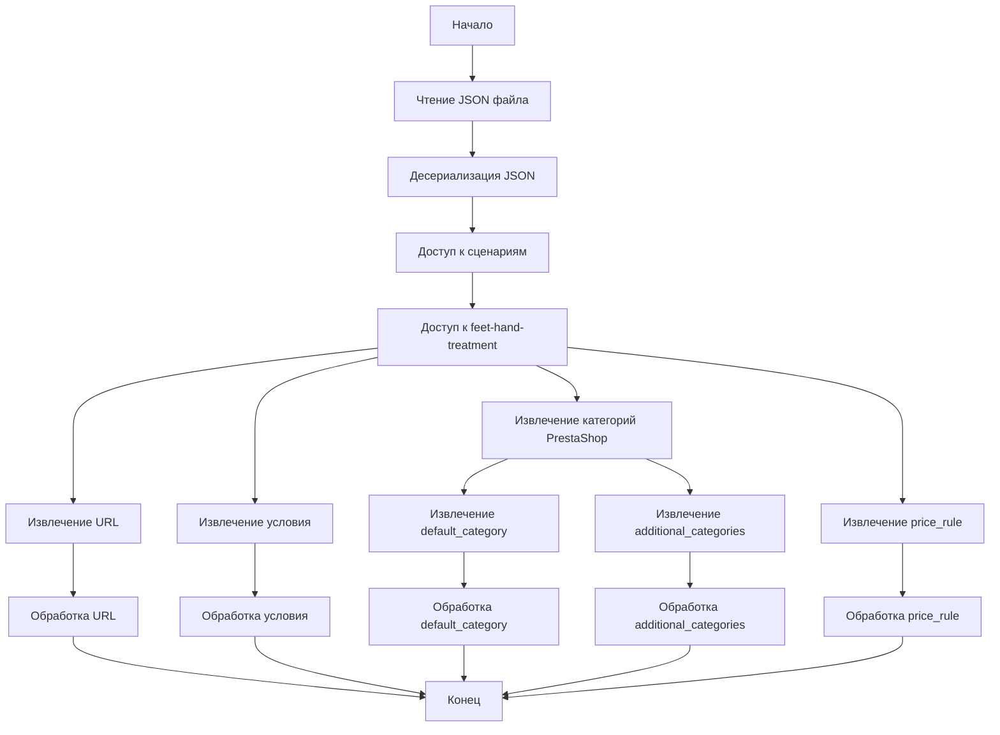

## АНАЛИЗ JSON ФАЙЛА

### 1. <алгоритм>

JSON файл описывает структуру данных для сценариев обработки товаров, конкретно для категории "feet-hand-treatment". Алгоритм его обработки выглядит следующим образом:

1.  **Чтение файла**: JSON файл считывается как строка.
    *   Пример: Файл `11248 body and spa.json` прочитан в переменную.
2.  **Десериализация**: Строка JSON преобразуется в структуру данных Python (словарь или объект).
    *   Пример: Строка `{"scenarios": {"feet-hand-treatment": ...}}` преобразуется в словарь Python `{"scenarios": {"feet-hand-treatment": { ... }}}`.
3.  **Доступ к данным**: Из десериализованной структуры данных извлекаются необходимые значения по ключам.
    *   Пример: Доступ к данным о сценарии `feet-hand-treatment`: `data["scenarios"]["feet-hand-treatment"]`.
4.  **Обработка данных**: Извлеченные значения используются для дальнейшей обработки.
    *   Пример: Значение `url` используется для извлечения товаров по ссылке. Значения `presta_categories` используются для определения категорий товара в PrestaShop. Значение `price_rule` применяется для расчета цены товара.

### 2. <mermaid>

### 3. <объяснение>

**Импорты:**

В данном фрагменте кода нет явных импортов. Однако, подразумевается, что для работы с JSON будет использована встроенная библиотека `json`, которая может быть импортирована в других модулях, которые обрабатывают этот JSON-файл.

**Структура JSON:**

-   `scenarios`: Этот ключ содержит словарь, где ключом являются названия сценариев.
-   `feet-hand-treatment`: Это название одного из сценариев. Оно содержит информацию для этого конкретного сценария обработки.
    -   `url`: Строка, представляющая URL для скрапинга товаров. `https://hbdeadsea.co.il/product-category/bodyspa/feet-hand-treatment/`
    -   `condition`: Строка, описывающая состояние товара. В данном случае `new`.
    -   `presta_categories`: Словарь, определяющий категории для PrestaShop.
        -   `default_category`: ID основной категории,  `11259`.
        -   `additional_categories`: Массив ID дополнительных категорий. В данном случае пустой массив `[""]`.
    -   `price_rule`: Целое число, описывающее правило для расчета цены, `1`.

**Функциональность:**

Данный JSON файл используется для настройки процесса скрапинга и импорта товаров, связанных с уходом за ногами и руками. Основная идея заключается в том, чтобы:

1.  **Определить URL** откуда нужно скрапить данные товаров.
2.  **Определить условие** для товаров (например, "new").
3.  **Назначить соответствие** между категориями, полученными со стороннего сайта и категориями в PrestaShop.
4.  **Установить правила** для ценообразования.

**Возможные улучшения:**

1.  **Более гибкая структура**:
    -   Можно добавить поддержку разных типов условий (например, `used`, `refurbished` и т.д.).
    -   Для `additional_categories` вместо пустой строки можно использовать пустой массив `[]`, что является более стандартным для JSON.
    -   Добавить больше параметров, таких как вес, габариты, или другие специфичные характеристики.

2.  **Валидация**:
    -   Можно добавить валидацию JSON схемы перед обработкой, чтобы убедиться в целостности данных.
3.  **Абстракция**:
     -   Можно сделать конфигурационный файл более абстрактным, чтобы можно было задавать не только категории PrestaShop но и других платформ.

**Взаимосвязь с другими частями проекта:**

Данный JSON файл, вероятно, используется в модуле скраппинга или импорта, где:

1.  Читается файл конфигурации.
2.  Парсится JSON.
3.  Используется `url` для получения списка товаров.
4.  Применяется `condition` для фильтрации.
5.  Настраиваются категории в PrestaShop на основе `presta_categories`.
6.  Рассчитывается цена на основе `price_rule`.