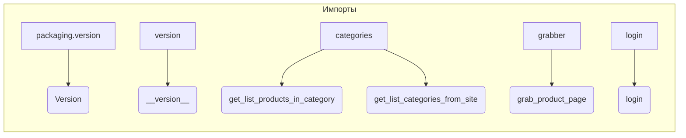

# <input code>

```python
## \file hypotez/src/suppliers/hb/scenarios/__init__.py
# -*- coding: utf-8 -*-
#! venv/Scripts/python.exe
#! venv/bin/python/python3.12

"""
.. module: src.suppliers.hb.scenarios 
	:platform: Windows, Unix
	:synopsis:

"""
MODE = 'dev'

"""
	:platform: Windows, Unix
	:synopsis:

"""


"""
	:platform: Windows, Unix
	:synopsis:

"""


"""
  :platform: Windows, Unix

"""
"""
  :platform: Windows, Unix
  :platform: Windows, Unix
  :synopsis:
"""MODE = 'dev'
  
""" module: src.suppliers.hb.scenarios """


"""  Поставщик <I>hb.co.il</I> """
...

from packaging.version import Version
from .version import __version__, __doc__, __details__  

from .categories import get_list_products_in_category, get_list_categories_from_site
from .grabber import grab_product_page
from .login import login
```

# <algorithm>

**Блок-схема отсутствует**, так как код содержит только импорты и константы.  Блок-схема была бы уместна, если бы в файле были функции и классы, выполняющие какие-то действия. В этом случае описание алгоритма работы предполагает логику импорта и определения переменных.

# <mermaid>



# <explanation>

**Импорты:**

* `from packaging.version import Version`: Импортирует класс `Version` из пакета `packaging.version`. Этот пакет используется для работы с версиями пакетов. Вероятно, используется для проверки версий зависимостей или управления версиями.
* `from .version import __version__, __doc__, __details__`: Импортирует переменные `__version__`, `__doc__` и `__details__` из файла `version.py` в текущей директории. Вероятно, это метаданные о модуле, например, версия, описание и другие детали.
* `from .categories import get_list_products_in_category, get_list_categories_from_site`: Импортирует функции `get_list_products_in_category` и `get_list_categories_from_site` из модуля `categories.py` в текущей директории. Скорее всего, эти функции отвечают за получение списков продуктов и категорий с сайта `hb.co.il`.
* `from .grabber import grab_product_page`: Импортирует функцию `grab_product_page` из модуля `grabber.py` в текущей директории. Вероятно, эта функция отвечает за скачивание страницы продукта с сайта.
* `from .login import login`: Импортирует функцию `login` из модуля `login.py` в текущей директории. Эта функция, скорее всего, отвечает за выполнение процесса входа на сайт.


**Классы:**

Код не содержит объявлений классов.


**Функции:**

Код не содержит объявлений функций. Все импортированные элементы - функции.


**Переменные:**

* `MODE = 'dev'`: Переменная, вероятно, задает режим работы (например, 'dev' - режим разработки, 'prod' - режим производства).


**Возможные ошибки или области для улучшений:**

* **Отсутствует функциональность:** Файл содержит только импорты и константы.  В нем нет кода для выполнения каких-либо действий.
* **Неявный импорт:**  Не указан путь, от которого происходит импорт, а предполагается, что импортируются модули из каталога `src`.  Важно понимать, что импорт без указания пути может быть нестабильным в других средах.

**Связь с другими частями проекта:**

Файл `hypotez/src/suppliers/hb/scenarios/__init__.py` является частью проекта, отвечающего за взаимодействие с поставщиком `hb.co.il`.  Он импортирует модули `categories.py`, `grabber.py` и `login.py` из той же подпапки.  Эти модули, вероятно, содержат код для взаимодействия с API сайта `hb.co.il`.  Цепочка взаимосвязей выглядит следующим образом:
```
main_project -> suppliers -> hb_supplier -> scenarios -> __init__.py -> categories.py, grabber.py, login.py
```
Взаимодействие между ними, скорее всего, осуществляется посредством вызовов функций, определённых в указанных файлах.
```