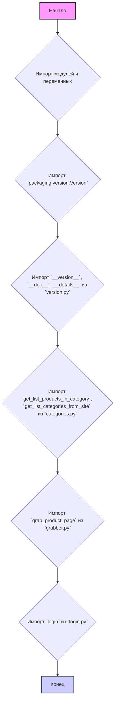
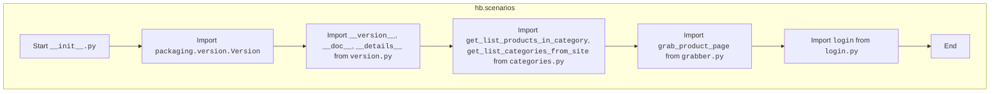

## АНАЛИЗ КОДА: `hypotez/src/suppliers/hb/scenarios/__init__.py`

### 1. <алгоритм>
 
**Блок-схема:**

**Примеры для каждого блока:**

*   **A:** Начало выполнения скрипта `__init__.py`.
*   **B:** Импорт необходимых модулей и переменных для работы с модулем `scenarios`.
*   **C:**  `from packaging.version import Version` - Импортируется класс `Version` для работы с версиями.
    *   **Пример:** `Version('1.2.3')`
*   **D:** `from .version import __version__, __doc__, __details__` - импортируются переменные, которые определяют версию модуля.
    *   **Пример:**  `__version__ = "1.0.0"`, `__doc__ = "Описание модуля"`, `__details__ = "Детальное описание"`.
*   **E:** `from .categories import get_list_products_in_category, get_list_categories_from_site` - импортируются функции для работы с категориями.
    *   **Пример:**
        *   `get_list_categories_from_site()` возвращает список категорий с сайта.
        *   `get_list_products_in_category(category_url)` возвращает список продуктов из заданной категории.
*   **F:** `from .grabber import grab_product_page` - импортируется функция для получения данных со страницы продукта.
    *   **Пример:** `grab_product_page(product_url)` возвращает HTML-код страницы продукта.
*   **G:** `from .login import login` - импортируется функция для авторизации на сайте.
    *   **Пример:** `login(username, password)` выполняет авторизацию на сайте.
*   **H:** Завершение выполнения скрипта `__init__.py`.

### 2. <mermaid>

**Объяснение зависимостей:**

*   `packaging.version.Version`: Этот класс используется для работы с версиями программного обеспечения, позволяя сравнивать и проверять версии.
*   `version.py`: Этот файл содержит информацию о версии текущего модуля. Переменные `__version__`, `__doc__`, `__details__` предоставляют информацию о версии, общем и подробном описании модуля.
*    `categories.py`:  Этот модуль содержит функциональность для извлечения данных о категориях товаров с сайта поставщика.
    *   `get_list_categories_from_site`:  Функция для получения списка категорий с сайта.
    *    `get_list_products_in_category`: Функция для получения списка продуктов из определенной категории.
*   `grabber.py`: Этот модуль отвечает за получение данных со страниц продуктов сайта поставщика.
    *   `grab_product_page`: Функция для скачивания HTML-кода страницы продукта.
*   `login.py`: Модуль содержит функциональность для авторизации пользователя на сайте поставщика.
    *   `login`: Функция для выполнения авторизации на сайте.

### 3. <объяснение>

**Импорты:**

*   `from packaging.version import Version`: Импортирует класс `Version` из библиотеки `packaging` для управления версиями. Это может использоваться для сравнения версий API или модулей.
*   `from .version import __version__, __doc__, __details__`: Импортирует переменные `__version__`, `__doc__`, и `__details__` из файла `version.py` внутри текущего пакета `scenarios`. Эти переменные содержат информацию о версии, описание модуля и детальную информацию, соответственно.
*   `from .categories import get_list_products_in_category, get_list_categories_from_site`: Импортирует функции `get_list_products_in_category` и `get_list_categories_from_site` из файла `categories.py` внутри текущего пакета. Эти функции используются для извлечения информации о категориях продуктов и самих продуктах из этих категорий с веб-сайта поставщика.
*   `from .grabber import grab_product_page`: Импортирует функцию `grab_product_page` из файла `grabber.py` внутри текущего пакета. Эта функция используется для скачивания HTML-кода страницы продукта с веб-сайта поставщика.
*   `from .login import login`: Импортирует функцию `login` из файла `login.py` внутри текущего пакета. Эта функция используется для авторизации пользователя на сайте поставщика.

**Классы:**
В данном файле классов нет.

**Функции:**
В данном файле определены только импорты функций из других модулей.

*   `get_list_products_in_category(category_url)`:
    *   **Аргументы**: `category_url` - URL категории товаров.
    *   **Возвращаемое значение**: Список продуктов в категории (например, список словарей, каждый из которых представляет продукт).
    *   **Назначение**: Извлекает список продуктов из указанной категории на сайте поставщика.
    *    **Пример:**  `products = get_list_products_in_category("https://example.com/category/123")`
*   `get_list_categories_from_site()`:
    *   **Аргументы**: Отсутствуют.
    *   **Возвращаемое значение**: Список категорий с сайта (например, список URL).
    *   **Назначение**: Извлекает список категорий с сайта поставщика.
    *    **Пример:** `categories = get_list_categories_from_site()`
*  `grab_product_page(product_url)`:
    *   **Аргументы**: `product_url` - URL страницы продукта.
    *   **Возвращаемое значение**: HTML-код страницы продукта.
    *   **Назначение**: Скачивает HTML-код страницы продукта для дальнейшего анализа.
    *   **Пример:** `html_code = grab_product_page("https://example.com/product/456")`
*   `login(username, password)`:
    *   **Аргументы**: `username` - имя пользователя, `password` - пароль.
    *   **Возвращаемое значение**: Зависит от реализации (например, `True` при успешной авторизации, `False` в противном случае, либо данные сессии).
    *   **Назначение**:  Выполняет авторизацию пользователя на сайте поставщика.
    *    **Пример:** `is_logged_in = login("user123", "password456")`

**Переменные:**

*   `__version__`: Строка, представляющая версию модуля (например, "1.0.0").
*   `__doc__`: Строка, содержащая общее описание модуля.
*   `__details__`: Строка, содержащая детальное описание модуля.

**Потенциальные ошибки и области для улучшения:**

*   **Отсутствие обработки ошибок**: Код не содержит явной обработки ошибок. Например, при проблемах с сетью, запросами к сайту, авторизации,  нужно предусмотреть обработку исключений.
*   **Зависимость от структуры сайта**: Код, вероятно, сильно зависит от структуры сайта поставщика. Любые изменения на сайте могут привести к поломке скрипта.
*   **Нет документации по формату данных**: Для `get_list_products_in_category` и `get_list_categories_from_site` нет явного описания формата возвращаемых данных, что может затруднить использование функций в других частях проекта.
*   **Повторяющийся код**: Возможно есть повторяющийся код, который можно вынести в отдельные вспомогательные функции.

**Взаимосвязь с другими частями проекта:**

Этот модуль является частью пакета `suppliers.hb` и отвечает за взаимодействие с сайтом поставщика `hb.co.il`. Функциональность модуля состоит в извлечении,  анализе данных и авторизации на сайте.
* Данный модуль, вероятно, будет использоваться в модулях, которые отвечают за обработку полученных от поставщика данных, для формирования каталога продукции или для отслеживания цен.

В целом, данный файл инициализирует пакет `scenarios` для работы с поставщиком `hb.co.il`, импортируя необходимую функциональность из других модулей. Код нуждается в улучшении с точки зрения обработки ошибок и адаптации к изменениям на сайте поставщика.