## ИНСТРУКЦИЯ:

Анализируй предоставленный код подробно и объясни его функциональность. Ответ должен включать три раздела:  

1. **<алгоритм>**: Опиши рабочий процесс в виде пошаговой блок-схемы, включая примеры для каждого логического блока, и проиллюстрируй поток данных между функциями, классами или методами.  
2. **<mermaid>**: Напиши код для диаграммы в формате `mermaid`, проанализируй и объясни все зависимости, 
    которые импортируются при создании диаграммы. 
    **ВАЖНО!** Убедитесь, что все имена переменных, используемые в диаграмме `mermaid`, 
    имеют осмысленные и описательные имена. Имена переменных вроде `A`, `B`, `C`, и т.д., не допускаются!  
    
    **Дополнительно**: Если в коде есть импорт `import header`, добавьте блок `mermaid` flowchart, объясняющий `header.py`:\
    ```mermaid
    flowchart TD
        Start --> Header[<code>header.py</code><br> Determine Project Root]
    
        Header --> import[Import Global Settings: <br><code>from src import gs</code>] 
    ```

3. **<объяснение>**: Предоставьте подробные объяснения:  
   - **Импорты**: Их назначение и взаимосвязь с другими пакетами `src.`.  
   - **Классы**: Их роль, атрибуты, методы и взаимодействие с другими компонентами проекта.  
   - **Функции**: Их аргументы, возвращаемые значения, назначение и примеры.  
   - **Переменные**: Их типы и использование.  
   - Выделите потенциальные ошибки или области для улучшения.  

Дополнительно, постройте цепочку взаимосвязей с другими частями проекта (если применимо).  

Это обеспечивает всесторонний и структурированный анализ кода.
## Формат ответа: `.md` (markdown)
**КОНЕЦ ИНСТРУКЦИИ**

## <алгоритм>

```mermaid
graph LR
    Start[Начало] --> ImportModules[Импорт модулей];
    ImportModules --> VersionInfo[Импорт информации о версии];
    VersionInfo --> CategoryFuncs[Импорт функций категорий];
    CategoryFuncs --> GrabberFunc[Импорт функции сбора данных];
    GrabberFunc --> LoginFunc[Импорт функции логина];
    LoginFunc --> End[Конец];
    
    style Start fill:#f9f,stroke:#333,stroke-width:2px
    style End fill:#ccf,stroke:#333,stroke-width:2px
   
   
    classDef box fill:#f9f,stroke:#333,stroke-width:2px
    class ImportModules,VersionInfo,CategoryFuncs,GrabberFunc,LoginFunc box
    
```



**Примеры:**

*   **Импорт модулей:**  Импортируются модули для работы с версиями, категориями, сбора данных и авторизации.
*   **Импорт информации о версии:** Импортируются переменные `__version__`, `__doc__`, `__details__` из `version.py`
*   **Импорт функций категорий:** Импортируются функции `get_list_products_in_category` и `get_list_categories_from_site` из `categories.py`.
*   **Импорт функции сбора данных:** Импортируется функция `grab_product_page` из `grabber.py`.
*    **Импорт функции логина:** Импортируется функция `login` из `login.py`.

## <mermaid>

```mermaid
flowchart TD
    subgraph src.suppliers.hb.scenarios
        Start[Начало] --> ImportPackagingVersion[import packaging.version.Version];
        ImportPackagingVersion --> ImportVersionInfo[from .version import __version__, __doc__, __details__];
        ImportVersionInfo --> ImportCategoryFunctions[from .categories import get_list_products_in_category, get_list_categories_from_site];
        ImportCategoryFunctions --> ImportGrabberFunction[from .grabber import grab_product_page];
        ImportGrabberFunction --> ImportLoginFunction[from .login import login];
        ImportLoginFunction --> End[Конец];
    end
   
    style Start fill:#f9f,stroke:#333,stroke-width:2px
    style End fill:#ccf,stroke:#333,stroke-width:2px
    
    classDef box fill:#f9f,stroke:#333,stroke-width:2px
    class ImportPackagingVersion, ImportVersionInfo, ImportCategoryFunctions, ImportGrabberFunction, ImportLoginFunction box
```

**Объяснение зависимостей:**

*   `packaging.version.Version`: Используется для сравнения версий.
*   `from .version import __version__, __doc__, __details__`: Импортирует информацию о версии текущего модуля `hb.scenarios`. Эти переменные вероятно определены в файле `version.py` в той же директории.
    *   `__version__`: Строка, представляющая версию модуля.
    *   `__doc__`: Строка, содержащая документацию модуля.
    *   `__details__`: Строка, содержащая подробную информацию о модуле.
*   `from .categories import get_list_products_in_category, get_list_categories_from_site`: Импортирует функции для работы с категориями товаров. Эти функции вероятно определены в файле `categories.py` в той же директории.
    *   `get_list_products_in_category`: Функция для получения списка продуктов в определенной категории.
    *   `get_list_categories_from_site`: Функция для получения списка всех категорий на сайте.
*    `from .grabber import grab_product_page`: Импортирует функцию для сбора данных со страницы товара. Эта функция вероятно определена в файле `grabber.py` в той же директории.
    *   `grab_product_page`: Функция для извлечения данных со страницы продукта.
*   `from .login import login`: Импортирует функцию для авторизации на сайте. Эта функция вероятно определена в файле `login.py` в той же директории.
    *   `login`: Функция для авторизации пользователя на сайте.

## <объяснение>

**Импорты:**

*   `from packaging.version import Version`: Импортирует класс `Version` из библиотеки `packaging`. Этот класс используется для работы с версиями программного обеспечения, позволяя сравнивать и проверять их соответствие.
*   `from .version import __version__, __doc__, __details__`: Импортирует переменные, содержащие информацию о версии текущего модуля `hb.scenarios`. Эти переменные вероятно определены в файле `version.py`, расположенном в той же директории.  Данные переменные необходимы для отслеживания версии модуля, его документации и дополнительных деталей.
*    `from .categories import get_list_products_in_category, get_list_categories_from_site`: Импортирует функции из файла `categories.py`, расположенного в той же директории. Эти функции отвечают за работу с категориями товаров на сайте поставщика.
    *   `get_list_products_in_category(category_url)`: Функция, принимающая URL-адрес категории, возвращает список продуктов, найденных в этой категории.  Пример: `get_list_products_in_category("https://hb.co.il/category/123")`
    *   `get_list_categories_from_site()`: Функция без параметров, возвращает список всех категорий, найденных на сайте поставщика. Пример: `get_list_categories_from_site()`.
*   `from .grabber import grab_product_page`: Импортирует функцию из файла `grabber.py`, расположенного в той же директории. Эта функция отвечает за сбор данных со страницы отдельного товара.
    *   `grab_product_page(product_url)`:  Функция принимает URL-адрес страницы продукта, возвращает структурированные данные, извлеченные со страницы. Пример: `grab_product_page("https://hb.co.il/product/456")`.
*   `from .login import login`: Импортирует функцию из файла `login.py`, расположенного в той же директории. Эта функция отвечает за авторизацию на сайте поставщика.
    *   `login(username, password)`: Функция принимает имя пользователя и пароль, возвращает результат авторизации (например, токен сессии). Пример: `login("user", "password")`.

**Классы:**
В данном файле классы не определены.

**Функции:**
В данном файле нет определения функций, только импорт.

**Переменные:**

*   `__version__`, `__doc__`, `__details__`: Строковые переменные, содержащие информацию о версии, документации и дополнительных деталях текущего модуля, определенные в файле `version.py`.

**Потенциальные ошибки и области для улучшения:**

*   **Отсутствие обработки ошибок:** В коде импортируются функции, но не приведена обработка возможных ошибок (например, `ImportError`, `ValueError`, сетевые ошибки при запросах к сайту).
*   **Отсутствие документации:** Код содержит документационные строки, но неясно, как именно происходит взаимодействие с внешними файлами и как эти модули используются в проекте.
*   **Магические строки:** Присутствуют  `` `#! venv/bin/python/python3.12`,  которые несут смысл только для разработчика и не используются при интерпретации кода.

**Взаимосвязи с другими частями проекта:**
Этот модуль является частью поставщика `hb` и отвечает за взаимодействие с сайтом `hb.co.il`. Он импортирует функциональность для категорий, сбора данных и авторизации из других модулей в директории `hb`. Этот модуль вероятно используется другими частями проекта для сбора данных о продуктах с сайта `hb.co.il`.

Цепочка взаимосвязей:

1.  Модуль `src.suppliers.hb.scenarios.__init__.py` импортирует:
    *   `src.suppliers.hb.scenarios.version` для информации о версии.
    *   `src.suppliers.hb.scenarios.categories` для получения списка категорий и товаров в категориях.
    *   `src.suppliers.hb.scenarios.grabber` для сбора данных о товарах.
    *   `src.suppliers.hb.scenarios.login` для авторизации на сайте.
2.  Другие части проекта могут использовать функции, представленные в этом модуле, для взаимодействия с сайтом `hb.co.il`.
3.  Результаты работы этих функций могут быть использованы для, например, формирования отчетов или обновления базы данных.