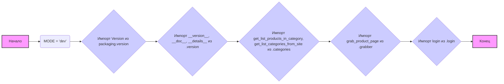

## Анализ кода `hypotez/src/suppliers/hb/scenarios/__init__.py`

### <алгоритм>

1. **Инициализация:**
   - Устанавливается переменная `MODE` в значение `'dev'`. Это, вероятно, указывает на режим разработки.
2. **Импорт версий:**
   - Импортируются `Version` из `packaging.version` для обработки версий.
   - Импортируются `__version__`, `__doc__`, и `__details__` из модуля `.version`. Эти переменные, скорее всего, содержат информацию о версии, документации и деталях модуля.
3. **Импорт функций:**
    - Импортируются `get_list_products_in_category` и `get_list_categories_from_site` из модуля `.categories`. Эти функции, вероятно, отвечают за получение списка продуктов в категории и списка категорий с сайта.
    - Импортируется `grab_product_page` из модуля `.grabber`. Эта функция, скорее всего, отвечает за захват (парсинг) страницы продукта.
    - Импортируется `login` из модуля `.login`. Эта функция, вероятно, отвечает за процесс авторизации на сайте.

**Пример:**

1. **`MODE = 'dev'`**: Устанавливает режим разработки.
2. **`from packaging.version import Version`**: Импортирует класс `Version` для сравнения и манипуляции версиями.
3. **`from .version import __version__, __doc__, __details__`**: Импортирует переменные, содержащие информацию о версии, документацию и детали модуля.
4. **`from .categories import get_list_products_in_category, get_list_categories_from_site`**:
   - `get_list_categories_from_site` может возвращать список словарей, где каждый словарь описывает категорию (например, `[{'id': 1, 'name': 'Книги'}, {'id': 2, 'name': 'Электроника'}]`).
   - `get_list_products_in_category` может возвращать список словарей, где каждый словарь описывает продукт (например, `[{'id': 101, 'name': 'Книга 1', 'price': 20.00}, {'id': 102, 'name': 'Книга 2', 'price': 30.00}]`).
5. **`from .grabber import grab_product_page`**: `grab_product_page` принимает URL страницы продукта и возвращает HTML содержимое страницы или словарь с деталями о продукте.
6. **`from .login import login`**: `login` принимает логин и пароль и возвращает успешность авторизации (например, True/False).

### <mermaid>

**Описание `mermaid` диаграммы:**

1. **`graph LR`**:  Указывает, что это диаграмма потока слева направо.
2. **`A[Начало] --> B(MODE = 'dev');`**:  Начальный узел "Начало" переходит к узлу "MODE = 'dev'", который инициализирует переменную режима работы.
3. **`B --> C{Импорт Version из packaging.version};`**: Узел `B` переходит к узлу `C`, обозначающему импорт класса `Version` из библиотеки `packaging.version`, что необходимо для работы с версиями пакетов.
4. **`C --> D{Импорт __version__, __doc__, __details__ из .version};`**: Узел `C` переходит к узлу `D`, который означает импорт информации о версии, документации и деталях модуля из локального файла `.version`.
5. **`D --> E{Импорт get_list_products_in_category, get_list_categories_from_site из .categories};`**:  Узел `D` переходит к узлу `E`, обозначающему импорт функций для работы с категориями товаров из файла `.categories`.
6. **`E --> F{Импорт grab_product_page из .grabber};`**: Узел `E` переходит к узлу `F`, представляющему импорт функции для захвата данных со страницы продукта из файла `.grabber`.
7. **`F --> G{Импорт login из .login};`**: Узел `F` переходит к узлу `G`, который означает импорт функции для авторизации из файла `.login`.
8. **`G --> H[Конец];`**: Узел `G` переходит к конечному узлу "Конец".
9. **`style A fill:#f9f,stroke:#333,stroke-width:2px` и `style H fill:#f9f,stroke:#333,stroke-width:2px`**: Задают стили для начального и конечного узлов.
10. **`classDef importFill fill:#ccf`**: Определяет класс стиля для узлов импорта.
11. **`class C,D,E,F,G importFill`**: Применяет стиль `importFill` к узлам, связанным с импортом.

**Анализ зависимостей:**

- **`packaging.version`**: Используется для работы с версиями программного обеспечения, что полезно для отслеживания изменений и управления зависимостями.
- **`.version`**: Локальный модуль, содержащий информацию о текущей версии проекта, его документацию и другие детали.
- **`.categories`**: Локальный модуль, предоставляющий функциональность для получения списка категорий и продуктов в них с веб-сайта.
- **`.grabber`**: Локальный модуль, отвечающий за захват и парсинг данных со страниц веб-сайта.
- **`.login`**: Локальный модуль, предоставляющий функциональность для авторизации на веб-сайте.

### <объяснение>

**Импорты:**

-   `# -*- coding: utf-8 -*-` - указывает кодировку исходного кода как UTF-8, что позволяет использовать символы разных языков.
-   `#! venv/Scripts/python.exe` и `#! venv/bin/python/python3.12` - шебанг, указывает путь к интерпретатору Python, используется в Unix-подобных системах.
-   `from packaging.version import Version`: Импортирует класс `Version` из библиотеки `packaging`, предназначенный для сравнения и обработки версий.  Это позволяет сравнивать версии пакетов и зависимостей.
-   `from .version import __version__, __doc__, __details__`: Импортирует переменные, определенные в локальном файле `version.py`, которые, вероятно, содержат информацию о текущей версии модуля, его документацию и прочие детали.  Это помогает отслеживать версию и предоставлять документацию к модулю.
-   `from .categories import get_list_products_in_category, get_list_categories_from_site`: Импортирует функции для работы с категориями товаров из локального файла `categories.py`.  Это позволяет получить список продуктов в категории и список доступных категорий на веб-сайте.
-   `from .grabber import grab_product_page`: Импортирует функцию для захвата и обработки данных со страницы продукта из локального файла `grabber.py`. Это позволяет получить HTML-содержимое страницы продукта для дальнейшего разбора или другие детали продукта.
-   `from .login import login`: Импортирует функцию для авторизации на сайте из локального файла `login.py`.  Это позволяет автоматизировать процесс авторизации.

**Переменные:**

-   `MODE = 'dev'`: Глобальная переменная, определяющая режим работы скрипта. В данном случае, установлен режим разработки ('dev').  Она может использоваться для определения, какие настройки и функциональность должны быть включены (например, логирование в консоль, использование тестовых данных и т.д.).

**Классы:**

-   В данном коде нет явного определения классов.  Однако, `Version` является классом, импортированным из библиотеки `packaging`.

**Функции:**

-   `get_list_products_in_category`: (из `.categories`) - Предположительно, принимает идентификатор или название категории и возвращает список товаров в этой категории.
-   `get_list_categories_from_site`: (из `.categories`) - Возвращает список доступных категорий на сайте.
-   `grab_product_page`: (из `.grabber`) - Принимает URL страницы продукта и возвращает ее HTML-содержимое или данные о продукте.
-   `login`: (из `.login`) - Принимает логин и пароль, выполняет авторизацию на сайте и возвращает результат.

**Взаимосвязь с другими частями проекта:**

-   Этот модуль (`__init__.py`) является точкой входа в пакет `src.suppliers.hb.scenarios`.  Он импортирует и предоставляет доступ к функциональности из подмодулей (`.version`, `.categories`, `.grabber`, `.login`).
-   Предполагается, что подмодули работают со сторонним веб-сайтом (`hb.co.il`), получая данные о товарах и категориях, а также осуществляя авторизацию.  
-   Этот модуль может быть использован в других частях проекта, которые нуждаются в информации о товарах поставщика `hb.co.il`.

**Потенциальные ошибки и области для улучшения:**

-   **Отсутствие обработки ошибок:** В коде нет явной обработки ошибок, что может привести к неожиданному завершению программы. Необходимо добавить блоки `try-except` для обработки исключений.
-   **Жестко закодированный режим:**  Использование жестко закодированного режима `MODE = 'dev'` может потребовать изменения кода при переходе к другим режимам.  Можно использовать переменные среды или аргументы командной строки для определения режима.
-   **Отсутствие документации:**  Хотя есть строка `""" module: src.suppliers.hb.scenarios """`, она не является полноценной документацией. Необходимо добавить docstring для каждой функции и класса, чтобы сделать код более понятным и поддерживаемым.

**Цепочка взаимосвязей с другими частями проекта:**

1. **`src/suppliers/hb/scenarios/__init__.py`**: Точка входа для работы со сценариями поставщика `hb`.
2. **`src/suppliers/hb/scenarios/.version.py`**: Содержит метаданные о версии модуля.
3. **`src/suppliers/hb/scenarios/.categories.py`**: Отвечает за сбор данных о категориях и товарах.
4. **`src/suppliers/hb/scenarios/.grabber.py`**: Отвечает за захват HTML-страниц с сайта.
5. **`src/suppliers/hb/scenarios/.login.py`**: Отвечает за авторизацию на сайте.
6.  **Другие части проекта**: Используют данные и функциональность, предоставляемые этим пакетом для работы с поставщиком `hb.co.il`.