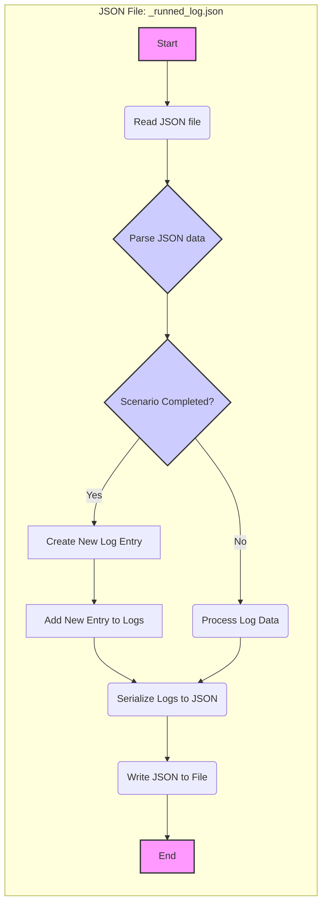

## Анализ кода: `hypotez/src/suppliers/hb/scenarios/_runned_log.json`

Поскольку предоставленный код представляет собой JSON-файл, а не Python-скрипт, анализ будет сосредоточен на структуре и потенциальном использовании этого файла в контексте приложения.

### 1. <алгоритм>

Файл `_runned_log.json` предположительно служит для хранения логов о выполненных сценариях. Поскольку это JSON, предполагается, что данные структурированы, возможно, как список объектов, где каждый объект представляет запись о запуске определенного сценария.

**Блок-схема:**

1.  **Чтение файла:** При запуске кода, управляющего сценариями, файл `_runned_log.json` считывается. Это происходит либо при старте приложения, либо при необходимости обновить лог.
    *   **Пример:** `with open("_runned_log.json", "r") as f: data = json.load(f)`
2.  **Обработка данных:** Данные из JSON файла парсятся (преобразуются в структуру данных, например, список словарей).
    *   **Пример:** `run_logs = data`
3.  **Запись новых логов:** При завершении сценария создаётся новый лог и добавляется в существующий список.
    *   **Пример:** `new_log = {"scenario_id": "123", "status": "success", "timestamp": "2024-10-27 12:00:00"}; run_logs.append(new_log)`
4.  **Запись в файл:** Измененный список логов сериализуется (преобразуется в JSON) и записывается в файл.
    *   **Пример:** `with open("_runned_log.json", "w") as f: json.dump(run_logs, f, indent=4)`

**Поток данных:**

Чтение JSON-файла -> Парсинг данных -> Добавление/обновление логов -> Сериализация данных -> Запись в JSON-файл.

### 2. <mermaid>



**Объяснение `mermaid`:**

*   Диаграмма описывает поток обработки JSON-файла `_runned_log.json`.
*   `Start` (A) - начальная точка процесса.
*   `Read JSON file` (B) - чтение файла.
*   `Parse JSON data` (C) - преобразование данных из JSON в структуру данных.
*   `Scenario Completed?` (D) - проверка, был ли завершен сценарий, после выполнения которого нужно добавить новую запись.
*   `Create New Log Entry` (E) - если сценарий был завершен, создается новая запись.
*    `Process Log Data` (F) - если сценарии не завершались, то обрабатываются старые данные из файла логов.
*    `Add New Entry to Logs` (G) - добавление новой записи в существующие данные логов.
*   `Serialize Logs to JSON` (H) - преобразование структуры данных обратно в формат JSON.
*   `Write JSON to File` (I) - запись данных в файл.
*   `End` (J) - завершение процесса.

### 3. <объяснение>

####  Импорты

Так как предоставлен только JSON-файл, то в нём отсутствуют импорты. Однако, предполагается, что для работы с этим JSON-файлом будет использоваться стандартная библиотека `json` в Python:
```python
import json
```
В контексте проекта `src.` файл является частью модуля `suppliers.hb.scenarios`, что указывает на его использование в контексте поставщика `hb` и работы со сценариями.

#### Классы

В данном файле классов нет. Однако, предполагается, что существует класс или функция, которая занимается чтением, обновлением и записью в этот JSON-файл. Это может быть частью класса, управляющего сценариями.

#### Функции

Предполагаемые функции:

*   **`read_log_file(file_path)`**:
    *   **Аргументы**: `file_path` (строка), путь к файлу JSON.
    *   **Возвращаемое значение**: Список словарей (или другая структура данных), представляющая логи.
    *   **Назначение**: Считывает данные из JSON файла и возвращает их.
    *   **Пример**:
        ```python
        def read_log_file(file_path):
            with open(file_path, "r") as f:
                data = json.load(f)
            return data
        ```
*   **`write_log_file(file_path, logs)`**:
    *   **Аргументы**: `file_path` (строка), путь к файлу JSON, `logs` (список словарей), данные для записи.
    *   **Возвращаемое значение**: `None`.
    *   **Назначение**: Записывает обновленные логи в JSON файл.
    *   **Пример**:
        ```python
        def write_log_file(file_path, logs):
             with open(file_path, "w") as f:
                json.dump(logs, f, indent=4)
        ```
*   **`add_log_entry(logs, log_entry)`**:
    *   **Аргументы**: `logs` (список словарей), существующие записи, `log_entry` (словарь), новая запись.
    *   **Возвращаемое значение**: Обновленный список словарей.
    *   **Назначение**: Добавляет новую запись в список.
    *   **Пример**:
    ```python
        def add_log_entry(logs, log_entry):
             logs.append(log_entry)
             return logs
    ```

#### Переменные

*   `file_path`: Строка, представляющая путь к JSON файлу.
*   `data`: Список словарей (или другая структура данных), хранящая данные из JSON-файла.
*   `logs`: Список словарей, который содержит данные логов.
*   `log_entry`: Словарь, представляющий запись в лог (например,  `{"scenario_id": "123", "status": "success", "timestamp": "2024-10-27 12:00:00"}`).

#### Потенциальные ошибки и области для улучшения

*   **Обработка ошибок:** Отсутствует обработка ошибок при чтении/записи файла (например, если файл не существует или поврежден).
*   **Concurrency:** Если несколько процессов или потоков будут обращаться к файлу одновременно, могут возникнуть проблемы с записью (необходимо предусмотреть механизмы блокировки).
*   **Формат лога:** Жесткий формат лога в файле, может потребоваться гибкая структура.

#### Взаимосвязь с другими частями проекта

Этот файл, вероятно, используется компонентами, которые управляют выполнением сценариев. Взаимодействие может быть следующим:
1. Класс, управляющий сценариями, считывает логи.
2. Выполняет сценарии.
3. Обновляет лог-файл, добавляя данные о завершенных сценариях.
4. Данные из лог-файла могут быть использованы для отслеживания выполнения сценариев, отладки или сбора статистики.

В целом, `_runned_log.json` представляет собой простой, но важный механизм для хранения информации о выполненных сценариях.