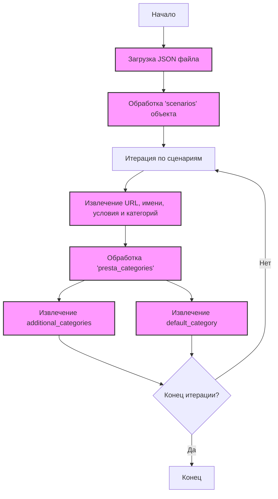

## <алгоритм>

1.  **Начало**: JSON-объект представляет собой структуру данных для хранения сценариев обработки товаров.
2.  **Раздел `scenarios`**:
    *   Ключ `scenarios` содержит объект, который определяет различные сценарии для обработки товаров.
    *   Каждый ключ внутри объекта `scenarios` представляет собой отдельный сценарий (например, `feet-hand-treatment`, `creams-butters-serums-for-body` и т.д.).
3.  **Сценарий**:
    *   Каждый сценарий имеет следующие свойства:
        *   `url`: URL-адрес категории товаров на сайте `hbdeadsea.co.il`. Например, `"https://hbdeadsea.co.il/product-category/bodyspa/feet-hand-treatment/"`.
        *   `name`: Название категории товаров на иврите. Например, `"טיפוח כפות ידיים ורגליים"`.
        *   `condition`: Состояние товаров, по умолчанию `"new"`.
        *   `presta_categories`: Объект, содержащий информацию о категориях в PrestaShop:
            *   `default_category`: ID основной категории в PrestaShop. Например, `11259`.
            *   `additional_categories`: Массив дополнительных категорий (в данном случае пустой).
4.  **Примеры**:
    *   Сценарий `"feet-hand-treatment"`:
        *   URL: `"https://hbdeadsea.co.il/product-category/bodyspa/feet-hand-treatment/"`
        *   Название: `"טיפוח כפות ידיים ורגליים"`
        *   Категория PrestaShop: основная категория `11259`.
    *   Сценарий `"creams-butters-serums-for-body"`:
        *   URL: `"https://hbdeadsea.co.il/product-category/bodyspa/creams-butters-serums-for-body/"`
        *   Название: `"קרמים, חמאות וסרומים לגוף"`
        *   Категория PrestaShop: основная категория `11260`.
5.  **Конец**: Данные могут быть использованы для веб-скрейпинга или интеграции с API PrestaShop, чтобы корректно сопоставлять товары и категории.

## <mermaid>

**Объяснение зависимостей:**

*   `Start`: Начальная точка процесса.
*   `LoadJSON`: Загрузка JSON-файла, содержащего сценарии.
*   `Scenarios`: Обрабатывает объект `scenarios`, содержащий все сценарии.
*   `Loop`: Итерирует по каждому сценарию, представленному ключом в объекте `scenarios`.
*   `ScenarioDetails`: Извлекает детали каждого сценария, такие как URL, имя, условие и `presta_categories`.
*   `PrestaCategories`: Обрабатывает объект `presta_categories`, содержащий информацию о категориях PrestaShop.
*   `DefaultCategory`: Извлекает значение ключа `default_category`, представляющего основную категорию PrestaShop.
*   `AdditionalCategories`: Извлекает массив `additional_categories`, представляющий дополнительные категории PrestaShop.
*   `EndLoop`: Проверяет, нужно ли продолжать итерацию по сценариям.
*   `End`: Завершающая точка процесса.

## <объяснение>

**Импорты**:
   *   В данном коде нет явных импортов, так как это JSON файл.  Однако, его использование в других частях проекта (`src`) вероятно потребует импорта `json` для чтения файла.

**Классы**:

*   В данном коде нет классов, так как это JSON-файл. Структура файла представлена в виде словарей (объектов) и списков.
    *   Файл представляет собой конфигурацию, которая будет использоваться в других частях проекта.

**Функции**:

*   В данном коде нет функций. При использовании файла в Python, скорее всего, будут использоваться стандартные функции для работы с JSON, например `json.load()` или `json.loads()`.

**Переменные**:

*   `scenarios`: Объект JSON, содержащий все сценарии.
    *   Тип: `dict`.
    *   Использование: Хранит настройки для каждого сценария обработки товаров.
*   `feet-hand-treatment`, `creams-butters-serums-for-body`, `bath-products`, `soaps-bar`, `Body and Spa Products`, `desodorants`: Ключи в объекте `scenarios`, каждый из которых представляет отдельный сценарий.
    *   Тип: `str`.
    *   Использование: Ключи для доступа к параметрам конкретного сценария.
*   `url`: URL-адрес категории товаров.
    *   Тип: `str`.
    *   Использование: Определяет, откуда забирать информацию о товарах.
*   `name`: Название категории товаров на иврите.
    *   Тип: `str`.
    *   Использование: Человекочитаемое название категории товаров.
*   `condition`: Условие товаров (новые или старые).
    *   Тип: `str`.
    *   Использование: Дополнительная информация о товарах.
*   `presta_categories`: Объект, содержащий информацию о категориях PrestaShop.
    *   Тип: `dict`.
    *   Использование: Определяет, в какую категорию PrestaShop нужно отнести товары.
*   `default_category`: ID основной категории в PrestaShop.
    *   Тип: `int`.
    *   Использование: Идентификатор основной категории в PrestaShop.
*   `additional_categories`: Массив дополнительных категорий в PrestaShop.
    *   Тип: `list`.
    *   Использование: Список дополнительных категорий, куда могут относиться товары.

**Потенциальные ошибки и области для улучшения**:

*   **Дублирование URL**: В сценарии `soaps-bar` URL  `"https://hbdeadsea.co.il/product-category/soap-bar/https://hbdeadsea.co.il/product-category/soap-bar"` дублируется, что является явной ошибкой. Необходимо исправить.
*   **Отсутствие обработки ошибок**: В коде, который будет использовать этот файл, необходимо предусмотреть обработку ошибок, если JSON файл поврежден или содержит невалидные данные.
*   **Отсутствие дополнительных полей**: Можно добавить поля для описания, тегов, атрибутов товара, чтобы расширить функциональность.
*   **Валидация**: Перед использованием данных из этого файла, необходимо добавить валидацию данных, проверять типы и значения, чтобы избежать ошибок в дальнейшем.

**Взаимосвязи с другими частями проекта**:

*   Данный файл скорее всего будет использован в скриптах веб-скрейпинга для автоматического сбора информации о товарах с сайта `hbdeadsea.co.il`.
*   Также, вероятно, будет использован при интеграции с API PrestaShop для автоматического добавления товаров в каталог.
*   Файл может быть частью конфигурационной системы для гибкой настройки работы парсера.