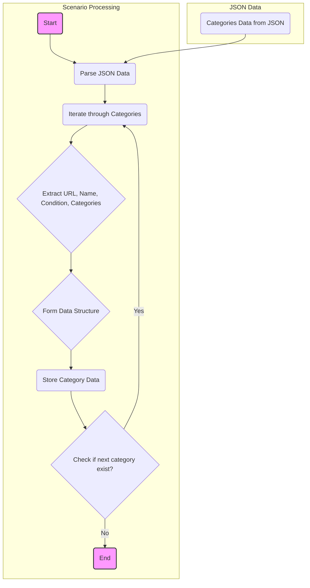

## АНАЛИЗ КОДА

### 1. <алгоритм>

Этот JSON файл описывает сценарии для парсинга категорий товаров, относящихся к уходу за лицом, с сайта `hbdeadsea.co.il`. Каждый сценарий содержит информацию о URL-адресе категории, ее имени, статусе новизны, а также ID категорий в PrestaShop, включая основную категорию и дополнительные.

**Блок-схема:**

```mermaid
graph LR
    A[Начало] --> B{Разбор JSON};
    B --> C{Итерация по "scenarios"};
    C --> D{Извлечение URL, name, condition, presta_categories};
    D --> E{Формирование структуры данных для каждой категории};
    E --> F{Сохранение структуры данных для дальнейшего использования};
    F --> G{Следующая категория в "scenarios"};
    G -- Да --> C
    G -- Нет --> H[Конец];
    
    style A fill:#f9f,stroke:#333,stroke-width:2px
    style H fill:#f9f,stroke:#333,stroke-width:2px
    
    classDef green fill:#90EE90,stroke:#333,stroke-width:2px
    class B,C,D,E,F green;
    
```

**Пример для каждого логического блока:**

*   **A (Начало):** Начало выполнения программы.
*   **B (Разбор JSON):** JSON-файл разбирается и преобразуется в структуру данных (словарь Python).
*   **C (Итерация по "scenarios"):** Перебираются все ключи в объекте "scenarios", которые представляют собой названия категорий.
*   **D (Извлечение URL, name, condition, presta_categories):** Для каждой категории извлекаются значения URL, имени, условия (новизны) и информации о категориях PrestaShop.
    *   Пример: Для "serums" извлекается:
        *   `url`: "https://hbdeadsea.co.il/product-category/facial/serums/"
        *   `name`: "סרומים לפנים"
        *   `condition`: "new"
        *   `presta_categories`: `{"default_category": 11254, "additional_categories": [11268]}`
*   **E (Формирование структуры данных для каждой категории):** Структура данных может быть представлена в виде словаря в Python, где каждая категория является ключом.
    *   Пример: `{"serums": {"url": "https://hbdeadsea.co.il/product-category/facial/serums/", "name": "סרומים לפנים", "condition": "new", "presta_categories": {"default_category": 11254, "additional_categories": [11268]}}}`
*  **F (Сохранение структуры данных для дальнейшего использования):**  Сохраненная структура данных используется в последующих шагах, например для парсинга каталога.
*   **G (Следующая категория в "scenarios"):** Проверка, есть ли еще категории для обработки.
    *   Если есть, возвращаемся к шагу **C**.
    *   Если нет, переходим к шагу **H**.
*  **H (Конец):** Обработка категорий закончена.

### 2. <mermaid>



**Объяснение `mermaid`:**

*   `JSON Data`: Этот подграф показывает, что данные поступают из JSON.
*   `CategoriesData`: Представляет собой JSON-данные, содержащие информацию о категориях.
*   `Scenario Processing`: Этот подграф описывает процесс обработки категорий.
*   `Start`: Начало процесса обработки.
*   `ParseJSON`: JSON данные разбираются и преобразуются в структуру, удобную для работы.
*   `LoopCategories`: Запускается цикл, который перебирает каждую категорию.
*   `ExtractData`: Извлекаются данные для каждой категории (URL, имя, статус новизны, категории PrestaShop).
*   `DataStructure`: Данные структурируются в словари или объекты для удобства дальнейшей работы.
*   `StoreData`: Структурированные данные сохраняются для использования в дальнейшем.
*   `CheckNextCategory`: Проверяется наличие следующей категории. Если она есть, цикл продолжается, если нет, процесс завершается.
*   `End`: Завершение обработки.
*   Стрелка от `CategoriesData` к `ParseJSON` показывает, что данные из JSON передаются для разбора.

### 3. <объяснение>

**Импорты:**
В предоставленном коде импорты отсутствуют, так как это JSON файл. JSON формат используется для хранения и передачи данных.

**Классы:**
В данном коде классы не используются, так как это JSON файл.

**Функции:**
JSON-файл не содержит функций.
*   **аргументы:** отсутствуют, так как это JSON
*   **возвращаемые значения:** отсутствуют, так как это JSON
*   **назначение:** JSON предназначен для хранения данных

**Переменные:**

*   `scenarios`: Главный объект (словарь), содержащий все сценарии парсинга. Ключи этого объекта - названия категорий (например, "serums", "face-masks"), которые используются для парсинга соответствующих URL.
*   `url`: Строка, содержащая URL-адрес страницы категории.
*   `name`: Строка, содержащая название категории на иврите.
*   `condition`: Строка, указывающая условие продукта, в данном случае "new".
*   `presta_categories`: Объект (словарь), содержащий информацию о категориях PrestaShop.
    *   `default_category`: Целое число, ID основной категории в PrestaShop.
    *   `additional_categories`: Список целых чисел, ID дополнительных категорий.

**Потенциальные ошибки или области для улучшения:**

*   **Отсутствие обработки ошибок:** В JSON-файле нет механизма для обработки ошибок, связанных, например, с некорректными URL-адресами или некорректными значениями `presta_categories`. Обработку ошибок следует добавлять на уровне кода, который использует этот JSON.
*   **Жестко заданные значения:** Значение "new" для `condition` может быть изменено для включения других условий (например, "sale", "used"), и  это нужно учитывать при чтении данных.
*   **Дублирование additional_categories:**  `additional_categories` для всех категорий являются одинаковыми,  это дублирование и стоит вынести их на уровень выше, если они глобальные для всех категорий.
*   **Отсутствие проверок на валидность URL:**  Нужно добавлять проверки URL-адресов на валидность при использовании данных JSON.

**Цепочка взаимосвязей с другими частями проекта:**

Этот JSON-файл, вероятно, используется в проекте для:
1.  **Парсинга категорий:** Приложение или скрипт загружает этот JSON-файл для получения URL-адресов категорий.
2.  **Сопоставления с PrestaShop:** ID категорий в `presta_categories` используются для синхронизации данных с системой PrestaShop.
3.  **Структурирования данных:** После загрузки и разбора JSON, данные могут быть преобразованы в классы или другие структуры для дальнейшего использования.
4.  **Обновления каталога:** Категории из JSON используются для обновления каталога товаров на сайте.

**Дополнительно:**
Представленный JSON является конфигурацией, которая описывает структуру данных для парсинга и категоризации продуктов на сайте hbdeadsea.co.il.