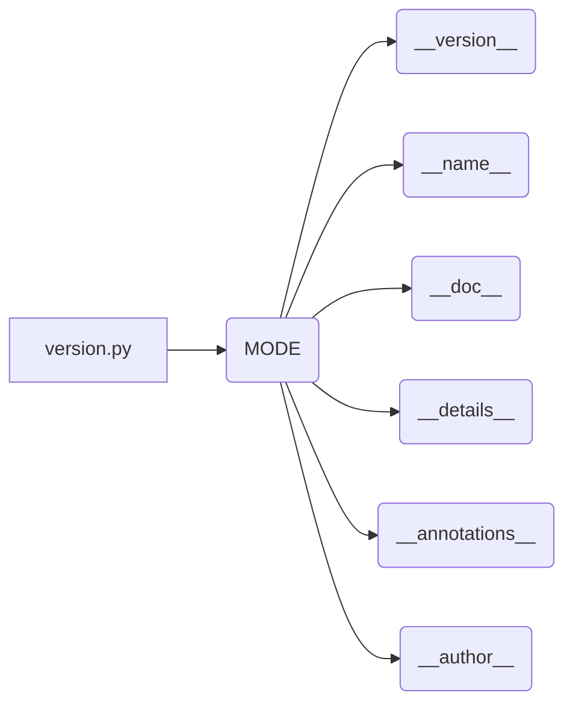

# <input code>

```python
## \file hypotez/src/suppliers/hb/scenarios/version.py
# -*- coding: utf-8 -*-\
#! venv/Scripts/python.exe
#! venv/bin/python/python3.12

"""
.. module: src.suppliers.hb.scenarios 
	:platform: Windows, Unix
	:synopsis:

"""
MODE = 'dev'

"""
	:platform: Windows, Unix
	:synopsis:

"""


"""
	:platform: Windows, Unix
	:synopsis:

"""


"""
  :platform: Windows, Unix

"""
"""
  :platform: Windows, Unix
  :platform: Windows, Unix
  :synopsis:
"""MODE = 'dev'
  
""" module: src.suppliers.hb.scenarios """


"""
- `__version__`: This variable holds the version of the module or package.
- `__name__`: Contains the name of the module. If the script is being run directly, the value will be `"__main__"`.
- `__doc__`: The module's documentation string.
- `__details__`: This variable likely contains additional details about the module, but the exact purpose depends on the specific module or package.
- `__annotations__`: Contains type annotations for variables and functions in the module.
- `__author__`: The name(s) of the author(s) of the module.
"""
__name__:str
__version__="3.12.0.0.0.4"
__doc__:str
__details__:str="Details about version for module or class"
__annotations__

__author__='hypotez '
```

# <algorithm>

Этот код не содержит алгоритма в привычном понимании. Он представляет собой файл с документацией и определениями переменных, связанных с версией модуля или пакета. Нет циклов, условных операторов или вызовов функций, которые описывали бы последовательность действий.  Данные не перемещаются между функциями или классами.

# <mermaid>



# <explanation>

Этот файл `version.py` в папке `hypotez/src/suppliers/hb/scenarios` содержит константы, предназначенные для определения версии и информации о модуле. Он не содержит функций или классов, но инициализирует переменные, которые, вероятно, будут использоваться в других частях проекта для управления версиями, документацией и метаданными.

**Импорты:** В файле нет импорта других модулей.  Это самостоятельный модуль, содержащий метаданные о себе.

**Классы:** Нет определений классов.

**Функции:** Нет определений функций.

**Переменные:**
- `MODE = 'dev'`:  Эта переменная определяет режим работы (например, "dev" - для разработки, "prod" - для производства).  Она может использоваться в другом коде для выбора поведения.

- `__version__ = "3.12.0.0.0.4"`: Переменная, содержащая версию модуля.  Важный элемент для отслеживания версий и управления зависимостями.

- `__name__`: Переменная, содержащая имя модуля.  Значение `"__main__"` будет, если скрипт запускается напрямую.

- `__doc__`: Строковая переменная, которая содержит строку документации.  Это текстовое описание модуля, его целей и поведения.

- `__details__`: Переменная, содержащая дополнительные детали о версии или модуле.

- `__annotations__`: Переменная, которая может содержать аннотации типов для функций и переменных (например, `:str`).  В данном случае она пустая.

- `__author__`:  Строковая переменная, содержащая имя автора или авторов модуля.

**Возможные ошибки или улучшения:**

- Нет обработки ошибок.  В случае, если другие части проекта пытаются использовать переменные с недопустимыми значениями (например, `__details__` с неправильным типом), это может привести к ошибкам.
- Отсутствует явное назначение переменным типа, что может создавать проблемы в процессе разработки.


**Взаимосвязи с другими частями проекта:**

Этот файл служит для обеспечения метаданных о модуле `src.suppliers.hb.scenarios`.  Возможно, этот модуль будет использоваться в других частях проекта (например, для определения совместимости или выбора функций в зависимости от версии), но сам по себе не является компонентом, который активно взаимодействует с другими частями проекта через вызовы функций или передачу данных.