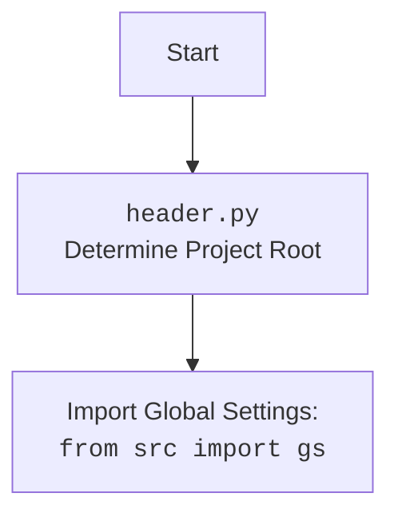

## АНАЛИЗ КОДА `hypotez/src/suppliers/header.py`

### 1. <алгоритм>

**`set_project_root(marker_files)`**

1.  **Начало**: Функция принимает кортеж `marker_files` (по умолчанию `('__root__',)`), содержащий имена файлов или директорий для поиска корневой директории проекта.
2.  **Определение текущего пути**: Получает абсолютный путь к директории, содержащей текущий файл (`header.py`).
    *   _Пример:_ Если `header.py` находится в `/path/to/hypotez/src/suppliers`, то `current_path` будет `/path/to/hypotez/src/suppliers`.
3.  **Инициализация корня проекта**: Изначально устанавливает `__root__` равным `current_path`.
4.  **Поиск родительских директорий**: Перебирает текущую директорию и ее родительские директории.
    *   _Пример_: Если `current_path`  `/path/to/hypotez/src/suppliers`, перебираются `/path/to/hypotez/src/suppliers`, `/path/to/hypotez/src`, `/path/to/hypotez`, `/path/to`, `/path`, `/`.
5.  **Проверка на маркерные файлы**: Для каждой родительской директории проверяет, существует ли любой из маркерных файлов/директорий.
    *   _Пример_:  Для `marker_files = ('__root__',)`  проверяется существование файла/директории с именем `__root__` в каждой родительской директории.
6.  **Найдена корневая директория**: Если маркерный файл найден, устанавливает `__root__` равным этой родительской директории и завершает поиск.
    *   _Пример:_ Если файл `__root__` найден в `/path/to/hypotez`,  то `__root__` становится `/path/to/hypotez`.
7.  **Добавление корня проекта в `sys.path`**: Если `__root__` нет в `sys.path`, то путь к корню проекта добавляется в начало списка путей для поиска модулей.
    *   _Пример:_  Если `'/path/to/hypotez'` не в `sys.path`, то он будет добавлен в список для импорта.
8.  **Возврат корня проекта**: Функция возвращает `__root__` (путь к корневой директории).

**После вызова `set_project_root()`**
1.  **Присвоение значения `__root__`**: Возвращенный путь сохраняется в глобальной переменной `__root__`.
2.  **Импорт `gs`**: Импортируется модуль `gs` из `src`.
3.  **Загрузка `settings.json`**: Попытка загрузить `settings.json` из `<root>/src/settings.json` и сохранение в переменной `settings`. В случае ошибки `settings` остаётся `None`.
    *   _Пример:_ Если `__root__`  `/path/to/hypotez`, то файл будет искаться в `/path/to/hypotez/src/settings.json`.
4. **Загрузка `README.MD`**: Попытка загрузить `README.MD` из `<root>/src/README.MD` и сохранение в переменной `doc_str`. В случае ошибки `doc_str` остаётся `None`.
   * _Пример:_ Если `__root__`  `/path/to/hypotez`, то файл будет искаться в `/path/to/hypotez/src/README.MD`.
5.  **Инициализация глобальных переменных**: Загрузка данных из `settings` в глобальные переменные, такие как `__project_name__`, `__version__`, `__doc__`, `__author__`, `__copyright__` , `__cofee__`  с дефолтными значениями, если `settings` или ключи отсутствуют.

### 2. <mermaid>

```mermaid
flowchart TD
    Start[Начало] --> SetCurrentPath[Определение текущего пути: <br><code>Path(__file__).resolve().parent</code>]
    SetCurrentPath --> InitRoot[Инициализация корня проекта:<br><code>__root__ = current_path</code>]
    InitRoot --> LoopStart[Начало цикла по родительским директориям]
    LoopStart --> CheckMarker[Проверка наличия маркерных файлов/директорий <br> в текущей директории]
    CheckMarker --"Маркер найден"--> SetRoot[Установка корня проекта:<br><code>__root__ = parent</code>]
    SetRoot --> BreakLoop[Выход из цикла]
    CheckMarker --"Маркер не найден"--> LoopEnd[Конец цикла]
    LoopEnd --> CheckMoreParents{Есть еще родительские директории?}
    CheckMoreParents --"Да"--> LoopStart
     CheckMoreParents --"Нет"--> CheckSysPath[Проверка наличия корня проекта в sys.path]
    BreakLoop --> CheckSysPath
    CheckSysPath --"Не в sys.path"--> InsertSysPath[Добавление корня проекта в sys.path]
    CheckSysPath --"В sys.path"--> ReturnRoot[Возврат корня проекта:<br><code>return __root__</code>]
    InsertSysPath --> ReturnRoot
    ReturnRoot --> SetGlobalRoot[Присвоение значения переменной __root__]
    SetGlobalRoot --> ImportGS[Импорт модуля gs из src]
    ImportGS --> LoadSettings[Попытка загрузить settings.json]
    LoadSettings --> LoadDoc[Попытка загрузить README.MD]
    LoadDoc --> SetGlobalVariables[Инициализация глобальных переменных из settings или дефолтных значений]
    SetGlobalVariables --> End[Конец]
  
  
    classDef file_node fill:#f9f,stroke:#333,stroke-width:2px;
    classDef code_node fill:#ccf,stroke:#333,stroke-width:2px;
    classDef decision_node fill:#fff5cc,stroke:#333,stroke-width:2px;
    class Start,End file_node
    class SetCurrentPath,InitRoot, SetRoot, InsertSysPath,ReturnRoot,ImportGS,LoadSettings,LoadDoc,SetGlobalVariables code_node
    class CheckMarker,CheckSysPath,CheckMoreParents  decision_node
```



**Объяснение `mermaid` диаграмм:**

*   **Первая диаграмма (flowchart):**
    *   Описывает работу функции `set_project_root()` в деталях.
    *   **`Start`**: Начало выполнения функции.
    *   **`SetCurrentPath`**: Определение абсолютного пути к директории, содержащей текущий файл (`header.py`).
    *   **`InitRoot`**: Инициализация переменной `__root__` текущим путем.
    *   **`LoopStart`**: Начало цикла по родительским директориям.
    *   **`CheckMarker`**: Проверка наличия маркерных файлов или директорий в текущей директории.
    *   **`SetRoot`**: Если маркер найден, устанавливается корень проекта.
    *   **`BreakLoop`**: Выход из цикла после нахождения корня.
    *   **`LoopEnd`**: Конец цикла, если маркер не найден.
    *   **`CheckMoreParents`**: Проверка, есть ли еще родительские директории для проверки.
    *   **`CheckSysPath`**: Проверка наличия корня проекта в `sys.path`.
    *   **`InsertSysPath`**: Добавление корня проекта в `sys.path`.
    *   **`ReturnRoot`**: Возврат корня проекта.
    *   **`SetGlobalRoot`**: Присвоение значения глобальной переменной `__root__`.
    *    **`ImportGS`**: Импорт `gs` из `src`.
    *   **`LoadSettings`**: Попытка загрузить `settings.json`.
    *   **`LoadDoc`**: Попытка загрузить `README.MD`.
    *   **`SetGlobalVariables`**: Инициализация глобальных переменных.
    *   **`End`**: Конец выполнения скрипта.
*    **Вторая диаграмма (flowchart):**
    *   Показывает взаимодействие `header.py` с остальными частями проекта, а именно с `gs` (Global Settings).
     *   `Start`: начало
     *   `Header`: Скрипт `header.py`, определяющий корень проекта.
    *   `import`: импорт глобальных настроек из `src.gs`.

### 3. <объяснение>

**Импорты:**

*   `sys`: Модуль `sys` используется для работы с системными параметрами и функциями, включая `sys.path` для изменения путей поиска модулей.
*   `json`: Модуль `json` используется для работы с данными в формате JSON (загрузки настроек из `settings.json`).
*   `packaging.version`: Модуль `packaging.version` используется для сравнения версий. Не используется непосредственно в данном коде, возможно, задел на будущее.
*   `pathlib.Path`: Класс `Path` из модуля `pathlib` предоставляет удобный способ работы с путями к файлам и директориям.
*   `src`: Импортируется модуль `gs`, предположительно, содержащий глобальные настройки.

**Функция `set_project_root(marker_files)`:**

*   **Аргументы:**
    *   `marker_files` (tuple): Кортеж имен файлов или директорий для определения корня проекта (по умолчанию `('__root__',)`).
*   **Возвращаемое значение:**
    *   `Path`: Объект `Path`, представляющий путь к корневой директории проекта.
*   **Назначение:**
    *   Находит корневую директорию проекта путем поиска вверх по дереву директорий, начиная с директории, где находится текущий файл.  Поиск останавливается, когда найден один из маркерных файлов.
    *   Добавляет найденную корневую директорию в `sys.path`, если ее там нет, что позволяет импортировать модули из корневого каталога.
*   **Пример:**
    ```python
    project_root = set_project_root(marker_files=('__root__', '.git'))
    print(project_root)  # Выведет путь к корневой директории проекта
    ```

**Глобальные переменные:**

*   `__root__` (Path): Путь к корневой директории проекта, определенный функцией `set_project_root()`.
*   `settings` (dict): Словарь, содержащий настройки проекта, загруженные из `settings.json`.  `None`, если файл не найден или ошибка JSON.
*   `doc_str` (str): Строка, содержащая содержимое файла `README.MD`. `None`, если файл не найден.
*   `__project_name__` (str): Название проекта, загруженное из `settings.json` или дефолтное значение.
*   `__version__` (str): Версия проекта, загруженная из `settings.json` или дефолтное значение.
*   `__doc__` (str): Описание проекта, загруженное из `README.MD` или дефолтное значение.
*   `__details__` (str): Строка с дополнительной информацией. Пока пустая.
*   `__author__` (str): Автор проекта, загруженный из `settings.json` или дефолтное значение.
*   `__copyright__` (str): Информация об авторских правах, загруженная из `settings.json` или дефолтное значение.
*    `__cofee__` (str): Призыв поддержать разработчика, загруженный из `settings.json` или дефолтное значение.
*   `MODE` (str):  Текущий режим работы приложения (`dev` - разработка)

**Потенциальные ошибки и области для улучшения:**

*   **Обработка исключений**: В коде есть `try-except` блоки для обработки ошибок при открытии и чтении `settings.json` и  `README.MD`, но обработка  очень минимальная.  Возможно, стоит добавить логирование ошибок или вывод предупреждений.
*   **`packaging.version`**: Импорт `packaging.version`, но нигде не используется. Его использование можно добавить в будущих релизах.
*   **Дополнительные проверки:** Можно добавить проверки на наличие необходимых полей в `settings.json`.
*   **Расширение функциональности:**
    *   Можно добавить возможность поиска `settings.json` и `README.MD` в других каталогах.
    *   Можно добавить возможность загрузки настроек из других форматов (например, YAML).

**Взаимосвязь с другими частями проекта:**

*   **`src.gs`**: Модуль `src.gs`, который импортируется, предположительно, содержит глобальные настройки и пути к файлам проекта, используемые для определения местоположения `settings.json` и `README.MD`.
*   **Другие модули**: Другие модули проекта могут использовать глобальные переменные, определенные в этом файле, такие как `__root__`, `__project_name__`, `__version__` и др.

**Общая картина:**

Файл `header.py` играет важную роль в инициализации проекта, определяя его корневую директорию, загружая настройки и документацию. Это позволяет другим модулям проекта получить доступ к общим настройкам и данным.  Использование маркерных файлов делает проект более гибким, так как корень проекта не привязан к конкретному имени папки.