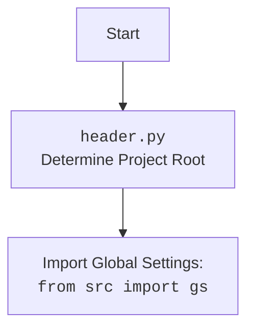

## <алгоритм>

1.  **`set_project_root(marker_files)` Функция**:
    *   **Начало**: Функция вызывается с кортежем `marker_files`, который по умолчанию содержит `("__root__", ".git")`.
    *   **Определение текущего пути**: Определяется абсолютный путь к директории, содержащей файл `header.py`.
        *   Пример: Если файл `header.py` находится в `/home/user/hypotez/src/suppliers`, `current_path` будет `/home/user/hypotez/src/suppliers`.
    *   **Поиск корневой директории**:
        *   Начинается итерация по текущей директории и её родительским директориям.
        *   Для каждой директории проверяется, существует ли в ней хотя бы один из `marker_files`.
        *   Пример: Если `.git` файл существует в `/home/user/hypotez`, то `/home/user/hypotez` будет определена как корневая директория.
        *   Если маркерный файл найден, цикл прекращается.
    *   **Добавление корневой директории в `sys.path`**: Если корневая директория не содержится в `sys.path`, она добавляется в начало.
    *   **Возврат**: Функция возвращает объект `Path`, представляющий корневую директорию проекта.
2.  **Определение `__root__`**:
    *   Вызывается функция `set_project_root()` и полученный путь присваивается глобальной переменной `__root__`.
3.  **Импорт `src.gs`**:
    *   Импортируется модуль `gs` из пакета `src`.  Модуль предположительно содержит глобальные настройки проекта, включая доступ к корневой директории.
4.  **Загрузка настроек из `settings.json`**:
    *   Пытается открыть файл `settings.json`, расположенный в поддиректории `src` корневой директории.
        *   Пример: Если `__root__` это `/home/user/hypotez`, то файл будет искаться по пути `/home/user/hypotez/src/settings.json`.
    *   Если файл существует, и он валиден JSON, то содержимое загружается в словарь `settings`.
    *   Если файл не найден или содержит невалидный JSON, то исключение обрабатывается, и `settings` остаётся `None`.
5.  **Чтение `README.MD`**:
    *   Пытается открыть файл `README.MD`, расположенный в поддиректории `src` корневой директории.
        *   Пример: Если `__root__` это `/home/user/hypotez`, то файл будет искаться по пути `/home/user/hypotez/src/README.MD`.
    *   Если файл существует, то его содержимое считывается и сохраняется в `doc_str`.
    *   Если файл не найден, то исключение обрабатывается, и `doc_str` остаётся `None`.
6.  **Инициализация глобальных переменных**:
    *   `__project_name__` устанавливается из `settings['project_name']` или в значение по умолчанию 'hypotez' если `settings` не удалось прочитать или ключ отсутствует.
    *   `__version__` устанавливается из `settings['version']` или в пустую строку если `settings` не удалось прочитать или ключ отсутствует.
    *   `__doc__` устанавливается значение `doc_str` или пустая строка если `doc_str` не удалось прочитать
    *    `__details__` устанавливается пустая строка.
    *   `__author__` устанавливается из `settings['author']` или в пустую строку если `settings` не удалось прочитать или ключ отсутствует.
    *  `__copyright__` устанавливается из `settings['copyright']` или в пустую строку если `settings` не удалось прочитать или ключ отсутствует.
    *  `__cofee__` устанавливается из `settings['cofee']` или строка по умолчанию если `settings` не удалось прочитать или ключ отсутствует.

## <mermaid>

```mermaid
flowchart TD
    Start[Начало] --> SetCurrentPath[Определение текущего пути: <br> `Path(__file__).resolve().parent`]
    SetCurrentPath --> InitializeRoot[Инициализация `__root__` : <br> `__root__ = current_path`]
    InitializeRoot --> FindRoot[Поиск корневой директории]
    FindRoot --> CheckMarker[Проверка наличия маркеров: <br> `any((parent / marker).exists() for marker in marker_files)`]
    CheckMarker -- Marker Found --> SetRoot[Установка `__root__` = `parent` ]
    SetRoot --> Break[Выход из цикла]
    CheckMarker -- Marker Not Found --> NextParent[Переход к следующей родительской директории]
    NextParent --> FindRoot
    Break --> AddRootToPath[Добавление `__root__` в `sys.path`]
    AddRootToPath --> ReturnRoot[Возврат `__root__`]
    ReturnRoot --> DefineGlobalRoot[Определение глобального `__root__` : <br> `__root__: Path = set_project_root()` ]
	DefineGlobalRoot --> ImportGS[Импорт `from src import gs`]
    ImportGS --> ReadSettings[Чтение `settings.json`]
    ReadSettings --> ReadReadme[Чтение `README.MD`]
	ReadSettings -- Settings Found --> SetProjectName[Установка  `__project_name__` из settings]
	ReadSettings -- Settings Not Found --> SetDefaultProjectName[Установка `__project_name__`  по умолчанию: 'hypotez']
    ReadReadme -- Readme Found --> SetDocStr[Установка  `__doc__` из `doc_str`]
    ReadReadme -- Readme Not Found --> SetDefaultDocStr[Установка `__doc__`  по умолчанию: '']
    SetProjectName --> SetVersion[Установка  `__version__` из settings]
    SetDefaultProjectName --> SetVersion
    SetDocStr --> SetDetails[Установка `__details__` по умолчанию: '']
    SetDefaultDocStr --> SetDetails
    SetVersion -- Version Found --> SetAuthor[Установка  `__author__` из settings]
     SetVersion -- Version Not Found --> SetDefaultAuthor[Установка `__author__`  по умолчанию: '']
    SetDetails --> SetAuthor
	SetAuthor  -- Author Found --> SetCopyright[Установка  `__copyright__` из settings]
    SetAuthor  -- Author Not Found --> SetDefaultCopyright[Установка `__copyright__`  по умолчанию: '']
    SetCopyright --> SetCofee[Установка  `__cofee__` из settings]
    SetDefaultCopyright --> SetCofee
    SetCofee -- Cofee Found --> End[Конец]
    SetCofee -- Cofee Not Found --> End

```



## <объяснение>

**Импорты**:

*   `sys`: Модуль `sys` используется для доступа к некоторым переменным и функциям, взаимодействующим с интерпретатором Python. Здесь он используется для добавления пути к корневой директории проекта в `sys.path`, что позволяет импортировать модули из этого каталога.
*   `json`: Модуль `json` используется для работы с JSON-данными. В коде он используется для загрузки настроек проекта из файла `settings.json`.
*   `packaging.version.Version`: Импортируется для работы с версиями пакетов (хотя в коде не используется напрямую).
*   `pathlib.Path`: Модуль `pathlib` используется для работы с путями к файлам и директориям в объектно-ориентированном стиле. `Path` используется для определения путей к файлам и директориям и манипулирования ими.

**Функция**:

*   `set_project_root(marker_files)`:
    *   **Аргументы**:
        *   `marker_files` (tuple): Кортеж, содержащий имена файлов или директорий, которые используются для идентификации корневой директории проекта. По умолчанию это `("__root__", ".git")`.
    *   **Возвращаемое значение**: `Path` - объект, представляющий путь к корневой директории проекта или текущий путь файла если корневая директория не найдена.
    *   **Назначение**: Функция находит корневую директорию проекта, поднимаясь вверх по дереву каталогов от местоположения скрипта, пока не найдет маркерный файл.  Это обеспечивает динамическое определение корня проекта, не зависящее от конкретного расположения файла `header.py`.
    *   **Примеры**:
        *   Вызов `set_project_root()` без аргументов:  Находит корневую директорию, используя маркеры `__root__` и `.git`.
        *   Вызов `set_project_root(marker_files=(".project", ".env"))`: Находит корневую директорию, используя маркеры `.project` и `.env`.

**Глобальные переменные**:

*   `__root__` (Path): Абсолютный путь к корневой директории проекта, определенный функцией `set_project_root()`. Используется для доступа к файлам проекта относительно его корня.
*  `settings` (dict | None): Словарь, содержащий настройки проекта, загруженные из `settings.json`. Может быть `None`, если файл не найден или содержит некорректный JSON.
* `doc_str`(str | None): Строка содержащая контент файла `README.MD`
*   `__project_name__` (str): Название проекта, считанное из `settings.json` или по умолчанию `hypotez`, если настройки не загружены или ключ отсутствует.
*   `__version__` (str): Версия проекта, считанная из `settings.json` или пустая строка, если настройки не загружены или ключ отсутствует.
*   `__doc__` (str): Содержимое файла `README.MD` или пустая строка, если  не загружен или не найден.
*   `__details__` (str): Пустая строка.
*   `__author__` (str): Имя автора проекта, считанное из `settings.json` или пустая строка, если настройки не загружены или ключ отсутствует.
*   `__copyright__` (str): Права проекта, считанные из `settings.json` или пустая строка, если настройки не загружены или ключ отсутствует.
*  `__cofee__`(str): Текст для поддержки проекта, считанный из `settings.json` или строка по умолчанию, если настройки не загружены или ключ отсутствует.

**Объяснение**:

*   Файл `header.py` предназначен для определения корневой директории проекта и загрузки основных настроек.  Он используется для предоставления доступа к общим параметрам и метаданным проекта, таким как название, версия и автор.
*   Функция `set_project_root` играет ключевую роль в обеспечении гибкости проекта, позволяя запускать скрипты из любой точки файловой системы. Поиск маркеров позволяет определить корень проекта даже если структура файловой системы изменилась.
*   Загрузка настроек из `settings.json` позволяет централизованно управлять конфигурацией проекта. В случае отсутствия файла `settings.json` или проблем с его чтением, используются значения по умолчанию.
*   Глобальные переменные, такие как `__project_name__`, `__version__`, и другие, предоставляют удобный способ доступа к метаданным проекта из любого модуля.
*   Импорт `from src import gs` позволяет использовать общие настройки проекта (предположительно, определенные в модуле `src.gs`) в других модулях, что способствует модульности и повторному использованию кода.
*   Чтение файла `README.MD` позволяет получить описание проекта.

**Потенциальные ошибки и области для улучшения**:

*   Обработка исключений при чтении `settings.json` и `README.MD` является минимальной. Можно добавить логирование ошибок.
*   Отсутствует проверка типов данных в `settings.json`. Можно добавить валидацию, чтобы гарантировать, что значения имеют ожидаемый тип.
*   Код зависит от наличия маркеров корневой директории. Если маркеры не заданы или отсутствуют, то корневой директорией будет текущая директория файла.
*  Необходимо добавить обработку ошибок если файл `settings.json` не имеет нужных ключей.
*   Название переменной `__cofee__` может быть не интуитивным.

**Взаимосвязи с другими частями проекта**:

*   `header.py` используется в качестве центрального модуля для определения корневой директории и загрузки основных настроек.
*   Модуль `src.gs` является зависимостью для доступа к общим глобальным настройкам проекта.
*   Другие модули проекта могут импортировать `header.py` для доступа к метаданным проекта и общим настройкам.