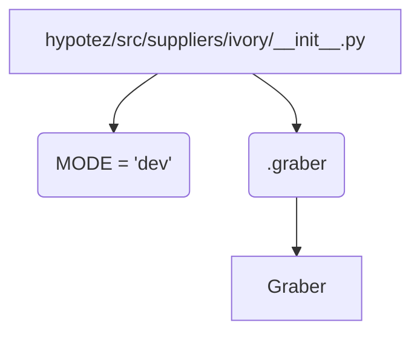

# <input code>

```python
## \file hypotez/src/suppliers/ivory/__init__.py
# -*- coding: utf-8 -*-
#! venv/Scripts/python.exe
#! venv/bin/python/python3.12

"""
.. module: src.suppliers.ivory 
	:platform: Windows, Unix
	:synopsis:

"""
MODE = 'dev'

from .graber import Graber
```

# <algorithm>

Этот код представляет собой начальную часть модуля `ivory` в пакете `suppliers` проекта `hypotez`. Он импортирует класс `Graber` из модуля `graber`.  

Поскольку это `__init__.py` файл, он играет роль в инициализации пакета.

**Пошаговая блок-схема:**

1. **Импорт:** Модуль `__init__.py` импортирует класс `Graber` из подпапки `.graber`.  Этот шаг подготавливает доступ к функциональности `Graber` внутри пакета `ivory`.
2. **Константа:** Определяется константа `MODE` со значением `'dev'`. Это, вероятно, для определения режима работы (например, разработки или производства).
   
**Пример:**

Если в другом модуле проекта необходимо использовать класс `Graber` из пакета `ivory`, можно будет импортировать его из `hypotez.src.suppliers.ivory`:

```python
from hypotez.src.suppliers.ivory import Graber
```

**Передача данных (в данном случае отсутствует):**

В этом коде нет прямой передачи данных между функциями.  Данные передаются и обрабатываются в `Graber`, если его код предусматривает обработку данных.


# <mermaid>



**Объяснение диаграммы:**

* **A:** Модуль `__init__.py` пакета `ivory`.
* **B:**  Переменная `MODE`, хранящая строку 'dev'.
* **C:** Модуль `graber` внутри пакета `ivory`.
* **D:** Класс `Graber` из модуля `graber`.
Стрелки указывают на зависимость - `__init__.py` использует `graber`, который содержит `Graber`.


# <explanation>

* **Импорты:**
    `from .graber import Graber`:  Импортирует класс `Graber` из подпапки `.graber` текущего пакета `ivory`. Значок `.` в начале импорта указывает на поиск в текущем пакете, что является стандартной практикой в Python для импорта из вложенных модулей. Это означает, что `Graber` скорее всего содержит логику, связанную с получением данных (например, из базы данных или API).  В `graber.py` определяется класс, который, вероятно, будет реализовывать логику сбора данных.


* **Классы:**
    `Graber`: Класс `Graber` из модуля `graber` отвечает за сбор данных, но в этом файле нет информации о его реализации. Подробнее о классе нужно смотреть в файле `hypotez/src/suppliers/ivory/graber.py`.


* **Функции:**
    Нет определенных функций в данном `__init__.py` файле.  Функциональность будет определяться в классах и других модулях, которые он импортирует.

* **Переменные:**
    `MODE`: Константа, хранящая строку 'dev'. Предназначена для выбора режима работы. Вероятно используется для переключения конфигураций или параметров работы.

* **Возможные ошибки или области для улучшений:**
   - Не указано назначение константы MODE. Нужно добавить комментарии, объясняющие ее роль в проекте.
   - Код `graber.py` не предоставлен, что мешает понять, как будет использоваться класс `Graber`.
   - Отсутствуют документация docstrings (в частности, у константы MODE).
   - Отсутствует описание `graber` модуля и класса.

**Взаимосвязи с другими частями проекта:**

Файл `__init__.py` отвечает за инициализацию пакета `ivory`.  Он создает связь с модулем `graber`, который, в свою очередь, содержит класс `Graber`. Этот класс предполагается использовать в других частях проекта для работы с источником данных.  Подробные взаимосвязи можно проанализировать только после изучения кода  `graber.py`.