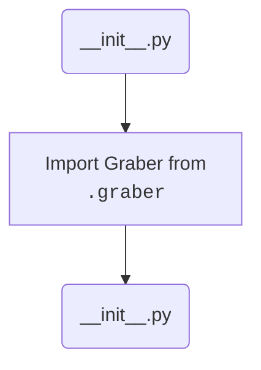

## Анализ кода `hypotez/src/suppliers/ivory/__init__.py`

### 1. <алгоритм>

1. **Импорт `Graber`**: 
   - Импортируется класс `Graber` из модуля `.graber`.
   - **Пример:** `from .graber import Graber`
   - *Поток данных:* Модуль `__init__.py` получает доступ к классу `Graber` для использования в пакете `ivory`.

### 2. <mermaid>

**Описание зависимостей:**

- **`Start(__init__.py)`:**  Начало выполнения файла `__init__.py` пакета `ivory`.
- **`ImportGraber`:**  Импортируется класс `Graber` из модуля `graber.py`, находящегося в той же директории, что и `__init__.py`. Это позволяет использовать класс `Graber` в пакете `ivory`.
- **`End(__init__.py)`:** Конец выполнения `__init__.py`.

### 3. <объяснение>

**Импорты:**

- `from .graber import Graber`: Этот импорт делает класс `Graber`, определенный в файле `graber.py`, доступным в пакете `ivory`. Точка (`.`) перед `graber` означает, что модуль `graber` находится в той же директории, что и `__init__.py`. Таким образом, `Graber` может быть использован другими модулями, которые импортируют пакет `ivory`.
**Классы:**

- **`Graber`**: Это класс, который, предположительно, занимается сбором данных. Он импортируется из модуля `graber.py`, но детали его реализации здесь не видны.

**Функции:**

- В данном коде нет явных функций, `__init__.py` в основном используется для инициализации пакетов и импорта необходимых модулей и классов.

**Переменные:**

- В данном коде нет явных переменных, кроме импортированного класса `Graber`.
**Потенциальные ошибки и области для улучшения:**

- На данный момент сложно оценить ошибки, так как код очень простой и является лишь точкой входа для пакета. 
- Более детальный анализ необходим, когда будет рассмотрен код модуля `graber.py`, чтобы увидеть, как используется класс `Graber` и какие могут быть проблемы.
- Дополнительно, можно добавить описание модуля, например, в виде docstring, чтобы лучше понимать назначение пакета `ivory`.

**Цепочка взаимосвязей:**
1.  `__init__.py`  является точкой входа в пакет `ivory`
2.  Импортирует класс `Graber` из `graber.py` для использования его в пакете `ivory`. 
3.  Другие модули проекта (из `src`) могут импортировать пакет `ivory` и использовать класс `Graber` для своих целей, что создает связь между пакетом `ivory` и другими частями проекта.