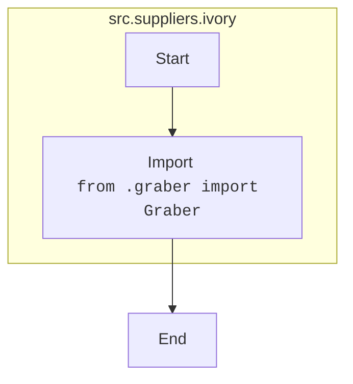

## Анализ кода `src/suppliers/ivory/__init__.py`

### <алгоритм>

1.  **Импорт:**
    *   Импортируется класс `Graber` из модуля `graber.py`, расположенного в той же директории (`.`).
    *   Пример: `from .graber import Graber`
2.  **Инициализация:**
    *   Файл `__init__.py` в Python пакете `ivory` делает директорию `ivory` Python-пакетом.
    *   В данном случае, явно не происходит никакой инициализации, кроме импорта.
    *   Пример: При обращении к пакету `ivory` (например, `from src.suppliers import ivory`), этот файл будет исполнен, позволяя импортировать `Graber` как `ivory.Graber`.

### <mermaid>

### <объяснение>

**Импорты:**

*   `from .graber import Graber`:  Этот импорт извлекает класс `Graber` из модуля `graber.py`, находящегося в той же директории, что и файл `__init__.py`. Это позволяет использовать класс `Graber` в контексте пакета `ivory`.
*   Назначение:
    *   `__init__.py` помечает каталог как пакет Python.
    *   Импорт `Graber` из `graber.py` делает класс `Graber` доступным при импорте пакета `ivory`. Например, `from src.suppliers.ivory import Graber`.

**Классы:**

*   `Graber`:
    *   Класс `Graber` (подробности в `graber.py`) отвечает за некоторую логику, скорее всего, по сбору или обработке данных.
    *   Отношения с другими частями проекта: Этот класс, вероятно, взаимодействует с другими компонентами, например, модулями для хранения данных или модулями для обработки запросов.

**Функции:**

*   В данном коде отсутствуют функции, но в `graber.py` они могут присутствовать (этого кода нет).

**Переменные:**

*   Переменные не объявлены в данном файле.

**Дополнительно:**

*   Этот файл - начальная точка пакета `ivory`, который, вероятно, является частью более крупного модуля обработки данных поставщиков.
*   Потенциальные области для улучшения: Добавление документации внутри `__init__.py` (например, docstring) может помочь понять назначение пакета `ivory`.
*   Цепочка взаимосвязей: 
    *   Пакет `ivory`  находится в  `src/suppliers`, что подразумевает, что другие поставщики будут находиться в той же директории (`src/suppliers`).
    *   Класс `Graber` является частью пакета `ivory` и может взаимодействовать с классами или функциями в других модулях проекта.