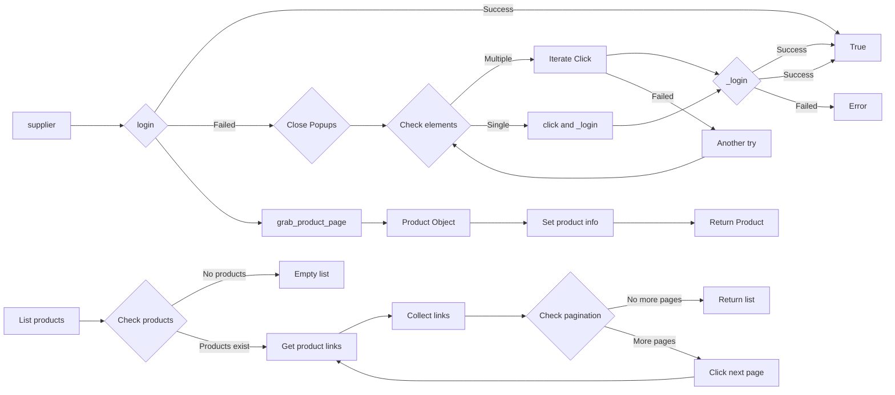

# <input code>

```python
## \file hypotez/src/suppliers/ivory/__morlevi__.py
# -*- coding: utf-8 -*-
#! venv/Scripts/python.exe
#! venv/bin/python/python3.12

"""
.. module:: src.suppliers.ivory 
	:platform: Windows, Unix
	:synopsis:

"""
MODE = 'dev'

"""
	:platform: Windows, Unix
	:synopsis:

"""


"""
	:platform: Windows, Unix
	:synopsis:

"""


"""
  :platform: Windows, Unix

"""
"""
  :platform: Windows, Unix
  :platform: Windows, Unix
  :synopsis:
"""MODE = 'dev'

""" module: src.suppliers.ivory """


"""    Supplier: morlevi


@namespace src: src
 \package src.suppliers.morlevi
\file __morlevi__.py

 @section libs imports:
  - pathlib 
  - requests 
  - pandas 
  - selenium.webdriver.remote.webelement 
  - selenium.webdriver.common.keys 
  - gs 
  - gs 
  - suppliers.Product 

Author(s):
  - Created by [Name] [Last Name] on 07.11.2023 .
"""


from pathlib import Path
import requests
import pandas as pd

from selenium.webdriver.remote.webelement import WebElement 
from selenium.webdriver.common.keys import Keys

import settings 
from src.settings import StringFormatter
json_loads = settings.json_loads
logger = settings.logger
from src.suppliers.Product import Product 


def login(supplier):
    _s = supplier
    _d = _s.driver
    _d.get_url('https://www.morlevi.co.il')
    if _login(_s): return True
    else: 

        try:
            '''
            закрываю модальные окна сайта
            выпадающие до входа
            '''
            logger.error( f''' Ошибка, пытаюсь закрыть popup''')
            _d.page_refresh()
            if _login(_s): return True


            close_pop_up_locator = _s.locators['login']['close_pop_up_locator']
            close_pop_up_btn = _d.execute_locator(close_pop_up_locator)
            _d.wait(5)

            if str(type(close_pop_up_btn)).execute_locator("class 'list'") >-1:  # Если появилось несколько
                for b in close_pop_up_btn:
                    try:
                        b.click()
                        if _login(_s) : 
                            return True
                            break
                    except: ...
            if str(type(close_pop_up_btn)).execute_locator("webelement") >-1:  # нашелся только один элемент
                close_pop_up_btn.click()
                return _login(_s)
        except Exception as ex:
            logger.error(f''' 
            Не удалось залогиниться 
            ''')
            return

def _login(_s):
    logger.debug( f''' Собссно, логин Морлеви''')
    _s.driver.refresh()
    #self.driver.switch_to_active_element()
    _d = _s.driver
    _l : dict = _s.locators['login']

    try:
        _d.execute_locator(_['open_login_dialog_locator'])
        _d.wait(1.3)
        _d.execute_locator(_['email_locator'])
        _d.wait(.7)
        _d.execute_locator(_['password_locator'])
        _d.wait(.7)
        _d.execute_locator(_['loginbutton_locator'])
        logger.debug('Mor logged in')
        return True
    except Exception as ex:
        logger.error(f''' LOGIN ERROR 
        {ex.with_traceback(ex.__traceback__)}''')
        return

# ... (rest of the code)
```

# <algorithm>

**Алгоритм login:**

1. Принимает объект `supplier`.
2. Открывает страницу `https://www.morlevi.co.il`.
3. Вызывает функцию `_login` для попытки входа.
4. Если вход успешен, возвращает `True`.
5. Иначе пытается закрыть модальные окна.
    - Находит элементы закрытия по заданному локатору.
    - Если элементов несколько, пытается кликнуть по каждому из них, вызывая `_login` после каждого клика.
    - Если элемент один, кликает по нему и вызывается `_login`.
6. Если все попытки закрытия модального окна не увенчались успехом, возвращает `None`.


**Алгоритм _login:**

1. Обновляет страницу.
2. Поиск элементов по заданным локаторам для email, пароля и кнопки входа.
3. Если элементы найдены, выполняется авторизация.
4. Возвращает `True` при успешном входе, иначе `None`.

**Алгоритм grab_product_page:**

1. Создает объект `Product` с переданным `supplier`.
2. Получает локаторы для продукта.
3. Закрывает всплывающие окна.
4. Вызывает ряд функций для получения информации о продукте:
    - `set_id`: получает ID продукта.
    - `set_sku_suppl`: устанавливает SKU поставщика.
    - `set_sku_prod`: устанавливает SKU продукта.
    - `set_title`: получает заголовок.
    - `set_cost_price`: получает и обрабатывает цену.
    - `set_before_tax_price`: устанавливает цену без учета налогов.
    - `set_delivery`: (TODO) получает информацию о доставке.
    - `set_images`: получает и сохраняет изображения.
    - `set_combinations`: получает комбинации.
    - `set_qty`: получает количество.
    - `set_specification`: получает спецификацию.
    - `set_customer_reviews`: получает отзывы.
    - `set_supplier`: устанавливает ID поставщика.
    - `set_rewritted_URL`: устанавливает переписанный URL.
5. Возвращает объект `Product`.


**Алгоритм list_products_in_category_from_pagination:**

1. Получает локатор ссылок на продукты.
2. Извлекает ссылки с текущей страницы.
3. Если на странице нет продуктов, возвращает пустой список.
4. Если ссылки есть, добавляет их к списку.
5. Получает локатор ссылок на страницы пагинации.
6. Для каждой страницы пагинации:
    - Извлекает ссылки с новой страницы.
    - Добавляет ссылки к списку.
    - Проверяет, не завершен ли просмотр всех страниц.
7. Возвращает список ссылок.



# <explanation>

**Импорты:**

- `pathlib`:  для работы с путями к файлам.
- `requests`: для выполнения HTTP-запросов (вероятно, используется для обработки данных, не связанных с Selenium).
- `pandas`: для работы с данными в формате таблиц.
- `selenium.webdriver.remote.webelement`:  из Selenium для работы с веб-элементами.
- `selenium.webdriver.common.keys`: из Selenium, содержит классы для управления вводом текста.
- `settings`: импортирует настройки проекта.
- `StringFormatter`:  из модуля `src.settings`, вероятно, для форматирования строк (например, очистки цены).
- `json_loads`: Функция для парсинга JSON из файла настроек.
- `logger`: Функция для логирования из файла настроек.
- `Product`:  из модуля `src.suppliers`, класс для представления данных о продукте.

**Классы:**

- `Product`:  представляет данные о продукте.  Не показан в полном виде, но судя по коду, хранит информацию о продуктах и взаимодействует с методами для их получения.

**Функции:**

- `login`: функция для авторизации на сайте `morlevi.co.il`. Использует `_login` для проверки, если вход не состоялся, повторно пробует закрыть все всплывающие окна.
- `_login`: функция, которая выполняет непосредственный вход в систему.
- `grab_product_page`: функция, получающая данные о продукте.
- `list_products_in_category_from_pagination`: функция, которая получает список ссылок на продукты в определённой категории и переходит к следующим страницам пагинации, если таковые существуют.
- `get_list_products_in_category`, `get_list_categories_from_site`:  функции для получения списков продуктов и категорий.

**Переменные:**

- `MODE`: строковая переменная, хранящая режим работы ('dev').
- `supplier`:  объект класса `Supplier`.

**Возможные ошибки и улучшения:**

- **Логирование:**  очень важное для отладки и анализа работы скрипта.
- **Обработка ошибок:**  Код содержит `try...except` блоки, но обработка некоторых типов ошибок может быть более полной.
- **Переиспользование кода:** некоторые операции (например, поиск и закрытие всплывающих окон) дублируются.  Стоит рассматривать возможность абстрагирования таких действий в отдельные методы.
- **Обработка списков:**  Необходимо проверить, что `close_pop_up_btn` действительно является списком, а не одним элементом.
- **Проверка на None:** Лучше проверять на `None` или пустоту `if _price is not None and _price`:
- **Комментарии:** Добавление более подробных комментариев к коду (особенно к необычным логическим конструкциям и решениям).


**Взаимосвязи с другими частями проекта:**

Код сильно зависит от класса `Supplier` (который не показан) и его методов (`driver`, `get_url`, `execute_locator`, `wait`, `page_refresh`, `locators`, `save_and_send_via_ftp`), а также от класса `Product` и `StringFormatter` из  модуля `settings`. Необходимы данные о `settings` и `locators` для работы с сайтом. Код предполагает наличие функции `StringFormatter.clear_price` для обработки строк с ценой. Также, код зависит от модуля `settings`, который предоставляет `logger`, `json_loads`, а также, вероятно, другие настройки.


В целом, код демонстрирует шаги по загрузке данных о продуктах с сайта `morlevi.co.il`. Он использует Selenium для взаимодействия с веб-страницей и pandas для работы с данными.  Важно понимать, что без исходного кода класса `Supplier` невозможно полностью проанализировать его функциональность.