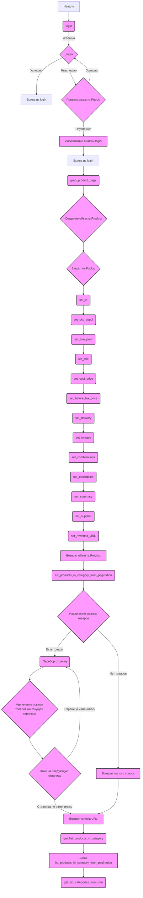

## Анализ кода `hypotez/src/suppliers/ivory/__morlevi__.py`

### 1. <алгоритм>

**Общий рабочий процесс:**

1.  **Инициализация:**
    *   Импортируются необходимые библиотеки и модули (`pathlib`, `requests`, `pandas`, `selenium`, `settings`, `src.suppliers.Product`).
    *   Устанавливается режим работы ``.
    *   Инициализируется логгер.

2.  **`login(supplier)`:**
    *   Получает объект `supplier` (вероятно, содержащий драйвер браузера и локаторы).
    *   Открывает страницу логина (`https://www.morlevi.co.il`).
    *   Вызывает функцию `_login(supplier)` для попытки логина.
        *   Если `_login` возвращает `True`, то `login` возвращает `True`.
        *   Если `_login` возвращает `False`, то пытается закрыть всплывающие окна и модальные диалоги.
            *   Если закрытие успешно, то повторно вызывает `_login(supplier)`.
            *   Если возникают исключения, то логирует ошибку и завершает работу.

3.  **`_login(_s)`:**
    *   Обновляет текущую страницу.
    *   Получает локаторы для элементов формы логина (`email`, `password`, `loginButton`).
    *   Использует локаторы для заполнения полей и нажатия кнопки логина.
    *   Если логин успешен, возвращает `True`, иначе логирует ошибку и возвращает `None`.

4.  **`grab_product_page(s)`:**
    *   Создает объект `Product`, связанный с `supplier`.
    *   Получает локаторы для элементов страницы продукта.
    *   Закрывает всплывающие окна.
    *   Определяет внутренние функции для установки различных полей продукта:
        *   `set_id()`: Извлекает идентификатор и URL.
        *   `set_sku_suppl()`: Устанавливает артикул поставщика.
        *   `set_sku_prod()`: Устанавливает артикул продукта.
        *   `set_title()`: Устанавливает заголовок.
        *   `set_summary()`: Устанавливает краткое описание.
        *   `set_description()`: Устанавливает полное описание.
        *   `set_cost_price()`: Извлекает цену товара и применяет правила.
        *   `set_before_tax_price()`: Устанавливает цену без налога.
        *   `set_delivery()`:  **TODO** - необходимо перенести в комбинации.
        *   `set_images()`: Извлекает URL изображений.
        *   `set_combinations()`: **TODO** - логика не реализована.
        *   `set_qty()`: **TODO** - логика не реализована.
        *   `set_specification()`:  Устанавливает характеристики.
        *   `set_customer_reviews()`: **TODO** - логика не реализована.
        *    `set_supplier()`: Устанавливает идентификатор поставщика.
        *   `set_rewritted_URL()`: **TODO**  - логика не реализована.
    *   Вызывает функции установки полей.
    *   Возвращает объект `Product`.

5.  **`list_products_in_category_from_pagination(supplier)`:**
    *   Получает локаторы для ссылок на товары в категории.
    *   Извлекает список ссылок на товары с текущей страницы.
        *   Если список пустой, то возвращает пустой список.
    *   Извлекает список страниц пагинации.
    *   Перебирает страницы пагинации.
        *   Для каждой страницы извлекает список ссылок на товары и добавляет в общий список.
        *   Если переходит на туже страницу - значит пагинация закончилась.
    *   Возвращает уникальный список URL-ов товаров.

6.  **`get_list_products_in_category(s, scenario, presath)`:**
    *   Вызывает `list_products_in_category_from_pagination`
    *   **TODO** - логика не реализована.

7.   **`get_list_categories_from_site(s,scenario_file,brand='')`:**
     *   **TODO** - логика не реализована.

**Примеры:**

*   **`login(supplier)`:**
    *   Входные данные: `supplier` (объект с драйвером и локаторами).
    *   Выходные данные: `True` (если логин успешен), `None` (если неуспешен).
*   **`grab_product_page(s)`:**
    *   Входные данные: `s` (объект поставщика с настройками и драйвером).
    *   Выходные данные: `p` (объект `Product` с заполненными полями).
*   **`list_products_in_category_from_pagination(supplier)`:**
    *   Входные данные: `supplier` (объект поставщика с драйвером и локаторами).
    *   Выходные данные: `list` (список URL товаров в категории).

**Поток данных:**

1.  `login(supplier)` вызывает `_login(supplier)`.
2.  `grab_product_page(s)` создает объект `Product` и заполняет его поля, используя данные из `driver` и `locators`.
3.  `list_products_in_category_from_pagination(supplier)` использует `driver` для получения списка ссылок на товары на страницах категорий.
4.  `get_list_products_in_category(s, scenario, presath)` вызывает `list_products_in_category_from_pagination`.

### 2. <mermaid>

**Объяснение `mermaid`:**

*   **`A` - `Начало`**: Начальная точка процесса.
*  **`B` - `login`**: Функция, которая осуществляет вход в систему поставщика.
*  **`C` - `_login`**: Внутренняя функция `login` для выполнения непосредственно процедуры входа.
*  **`E` - `Попытка закрыть PopUp`**: Блок обработки всплывающих окон, которые мешают логину.
*  **`F` - `Логирование ошибки login`**: В случае ошибки логин, сообщение об ошибке записывается в журнал.
* **`G` - `Выход из login`**: Завершение функции login.
*   **`H` - `grab_product_page`**: Функция, которая извлекает данные о продукте со страницы.
*   **`I` - `Создание объекта Product`**: Создание объекта для хранения данных о продукте.
*   **`J` - `Закрытие PopUp`**: Закрытие всплывающих окон, которые могут мешать парсингу страницы.
*   **`K` - `set_id` - `W` - `set_rewritted_URL`**: Функции для установки различных атрибутов продукта, таких как ID, артикул, заголовок, цены и т.д.
*   **`X` - `Возврат объекта Product`**: Возвращение объекта `Product` с заполненными данными.
*   **`Y` - `list_products_in_category_from_pagination`**: Функция, которая получает список URL-ов товаров из категории, включая пагинацию.
*   **`Z` - `Извлечение ссылок товаров`**: Извлечение ссылок на товары с текущей страницы.
*   **`AA` - `Перебор страниц`**: Цикл перебора страниц пагинации.
*   **`AB` - `Возврат пустого списка`**: Возвращает пустой список URL-ов, если товаров нет.
*   **`AC` - `Извлечение ссылок товаров на текущей странице`**: Извлекает ссылки на товары со следующей страницы.
*   **`AD` - `Клик на следующую страницу`**: Клик по ссылке следующей страницы.
*   **`AE` - `Возврат списка URL`**: Возвращает список всех URL-ов товаров в категории.
*   **`AF` - `get_list_products_in_category`**: Функция, вызывающая `list_products_in_category_from_pagination`.
*  **`AG` - `Вызов list_products_in_category_from_pagination`**: Вызов функции `list_products_in_category_from_pagination` для получения списка продуктов.
* **`AH` - `get_list_categories_from_site`**: Функция, которая должна получать список категорий с сайта.
*   **`classDef func`**: Определяет стиль для блоков функций.

**Зависимости:**

Диаграмма показывает поток выполнения и зависимости между функциями. Каждая функция зависит от предыдущей в логическом порядке. Например, `grab_product_page` зависит от успешного входа в систему (`login`) и использует данные, полученные драйвером.
`get_list_products_in_category` вызывает `list_products_in_category_from_pagination` для получения списка продуктов.

### 3. <объяснение>

**Импорты:**

*   `pathlib.Path`: Для работы с путями к файлам.
*   `requests`: Для выполнения HTTP-запросов (не используется непосредственно в этом коде, но может использоваться в других частях проекта).
*   `pandas`: Для работы с данными в табличном виде (не используется непосредственно в этом коде, но может использоваться в других частях проекта).
*   `selenium.webdriver.remote.webelement.WebElement`: Тип данных, представляющий HTML-элемент на странице.
*   `selenium.webdriver.common.keys.Keys`: Для имитации нажатий клавиш (например, Enter).
*   `settings`: Вероятно, пользовательский модуль для хранения настроек приложения.
*   `src.settings.StringFormatter`: Класс для форматирования строк (например, для очистки цены).
*   `src.suppliers.Product.Product`: Класс для представления продукта (с атрибутами, такими как `id`, `title`, `price` и т.д.).

**Классы:**

*   `Product`:
    *   Роль: Представляет данные о продукте.
    *   Атрибуты: `fields` (словарь для хранения данных о продукте), `supplier` (ссылка на объект поставщика).
    *   Методы: (не показаны в этом коде, но предположительно есть методы для доступа к полям и их изменения).
*   `StringFormatter`:
    *   Роль: Представляет статические методы форматирования строк, например для приведения цены к нужному формату.

**Функции:**

*   **`login(supplier)`:**
    *   Аргументы: `supplier` (объект поставщика).
    *   Возвращаемое значение: `True` (если логин успешен), `None` (если нет).
    *   Назначение: Выполняет логин на сайте поставщика, обрабатывая возможные ошибки и закрывая модальные окна.
*   **`_login(_s)`:**
    *   Аргументы: `_s` (объект поставщика).
    *   Возвращаемое значение: `True` (если логин успешен), `None` (если нет).
    *   Назначение: Непосредственно выполняет действия по логину, используя локаторы.
*  **`grab_product_page(s)`:**
    *   Аргументы: `s` (объект поставщика).
    *   Возвращаемое значение: `p` (объект `Product`).
    *   Назначение: Извлекает данные о продукте со страницы и создает объект `Product`.
*   **`list_products_in_category_from_pagination(supplier)`:**
    *   Аргументы: `supplier` (объект поставщика).
    *   Возвращаемое значение: `list` (список URL-ов товаров в категории).
    *   Назначение: Получает список всех товаров на страницах категории, обрабатывая пагинацию.
*   **`get_list_products_in_category(s, scenario, presath)`:**
    *   Аргументы: `s` (объект поставщика), `scenario` (JSON), `presath` (словарь).
    *   Возвращаемое значение: `None` (логика не доработана)
    *   Назначение: Функция для получения списка продуктов в категории. **TODO**
*   **`get_list_categories_from_site(s,scenario_file,brand='')`:**
    *   Аргументы: `s` (объект поставщика), `scenario_file` (путь к файлу сценария), `brand` (строка).
    *    Возвращаемое значение: `None` (логика не доработана).
    *   Назначение: Функция для получения списка категорий. **TODO**

**Переменные:**

*   `MODE`: Глобальная переменная, определяющая режим работы (`'dev'`).
*   `logger`: Объект логгера для записи сообщений.
*   `_s`, `_d`, `_l`, `_field`, `_price`, `_id`, `_images`:  Временные переменные внутри функций.
*   `list_products_in_category`: Список для хранения URL-ов товаров.
*   `pages`: Список элементов пагинации.
*   `_product_list_from_page` : Список элементов товаров на странице.

**Потенциальные ошибки и области для улучшения:**

*   **Обработка исключений:**
    *   Используется `try...except Exception` без конкретизации типов исключений. Это может затруднить отладку.
    *   Обработка исключений в `login` и `_login` может быть более подробной.
*   **Логирование:**
    *   Логирование ошибок выполняется, но  можно добавить больше подробностей в сообщения.
*   **`TODO`:**
    *   Много мест помечено как `TODO`, что указывает на незаконченность кода.
    *   `set_delivery`, `set_combinations`, `set_qty`, `set_customer_reviews` и `set_rewritted_URL` не реализованы.
*   **Извлечение данных:**
    *   Извлечение цены использует `eval`, что небезопасно.
    *   Извлечение данных может быть более устойчивым к изменениям HTML-структуры сайта.
*   **Совместимость:**
    *   Код полагается на конкретные локаторы, которые могут измениться на сайте поставщика.
*   **Объект `settings`:**
    *   Предполагается, что существует модуль `settings`, который не показан в коде. Необходимо учесть все его зависимости.
*  **`get_list_products_in_category` и `get_list_categories_from_site`**
    *   Не реализована логика работы этих функций.

**Взаимосвязи с другими частями проекта:**

*   Модуль `src.suppliers.Product` используется для создания и заполнения объектов `Product`.
*   Модуль `src.settings` используется для получения настроек приложения и форматирования строк.
*   Модули `selenium` и `requests` вероятно, используются для взаимодействия с сайтом поставщика.
*   Работа с файлами вероятно происходит через модуль `pathlib` (неявно)

Этот код представляет собой парсер для сайта поставщика "morlevi". Он выполняет логин, извлекает данные о продуктах и их список в категории, а так же обрабатывает пагинацию.
Необходима дальнейшая доработка для завершения функционала `TODO`.