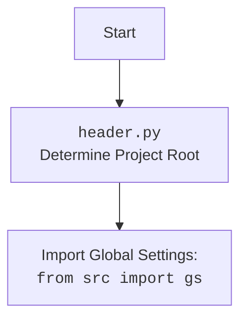

## <алгоритм>

1.  **Импорт модулей:** Импортируются необходимые модули: `typing`, `header`, `src.suppliers.graber`, `src.webdriver.driver`, `src.logger.logger`.
    *   _Пример_: `from src.suppliers.graber import Graber as Grbr, Context, close_pop_up` - импортирует класс `Graber` (переименованный в `Grbr`), класс `Context` и функцию `close_pop_up` из модуля `src.suppliers.graber`.
2.  **Определение класса `Graber`:** Создается класс `Graber`, наследующий от `Grbr` (который, в свою очередь, импортируется из `src.suppliers.graber`).
    *   _Пример_: `class Graber(Grbr):` - определяет класс `Graber`, являющийся подклассом `Grbr`.
3.  **Инициализация `__init__`:** При инициализации экземпляра класса `Graber` устанавливается префикс поставщика (`supplier_prefix`) как `'ivory'` и вызывается конструктор родительского класса `Grbr`, передавая префикс и объект драйвера. Также устанавливается `Context.locator_for_decorator` в `None`.
    *   _Пример_:
        ```python
        def __init__(self, driver: Driver):
            self.supplier_prefix = 'ivory'
            super().__init__(supplier_prefix=self.supplier_prefix, driver=driver)
            Context.locator_for_decorator = None
        ```
4.  **Декоратор (закомментирован):** Присутствует закомментированный шаблон декоратора `close_pop_up`, который предназначен для закрытия всплывающих окон перед выполнением основной логики функции. Этот декоратор не используется в коде явно, но может быть активирован путем раскомментирования и дальнейшей настройки.
    *   _Пример_:
        ```python
        # def close_pop_up(value: Any = None) -> Callable:
        #     def decorator(func: Callable) -> Callable:
        #         @wraps(func)
        #         async def wrapper(*args, **kwargs):
        #             try:
        #                 # await Context.driver.execute_locator(Context.locator.close_pop_up)
        #                 ...
        #             except ExecuteLocatorException as e:
        #                 logger.debug(f'Ошибка выполнения локатора: {e}')
        #             return await func(*args, **kwargs)
        #         return wrapper
        #     return decorator
        ```

## <mermaid>

```mermaid
flowchart TD
    Start(Start) --> ImportModules[Импорт модулей: <br><code>typing, header, src.suppliers.graber, src.webdriver.driver, src.logger.logger</code>]
    ImportModules --> DefineGraberClass[Определение класса <code>Graber</code> (наследует от <code>Grbr</code>)]
    DefineGraberClass --> InitMethod[Инициализация <code>__init__</code>:<br>Установка <code>supplier_prefix</code>, вызов родительского конструктора, <br> <code>Context.locator_for_decorator = None</code>]
    InitMethod --> DecoratorTemplate[Декоратор <code>close_pop_up</code> (закомментирован)]
     DecoratorTemplate --> End(End)
    
    
    classDef blue fill:#f9f,stroke:#333,stroke-width:2px
    class ImportModules,DefineGraberClass,InitMethod,DecoratorTemplate blue
    
```



## <объяснение>

### Импорты:

*   `typing`: Используется для аннотации типов, в данном случае `Any` для обозначения любого типа данных.
*   `header`: Модуль, вероятно, отвечающий за настройку окружения или получение общих параметров, как показано в `mermaid` диаграмме для `header.py` - определяет корень проекта.
*   `src.suppliers.graber`: Импортирует класс `Graber` (переименованный в `Grbr`), который, по-видимому, является базовым классом для грабберов,  а также класс `Context` и функцию `close_pop_up`, возможно, для управления контекстом выполнения и закрытия всплывающих окон.
*   `src.webdriver.driver`: Импортирует класс `Driver`, который, вероятно, отвечает за управление веб-драйвером для взаимодействия с веб-страницами.
*   `src.logger.logger`: Импортирует объект `logger` для записи логов, используется для отладки и логирования ошибок.

### Классы:

*   `Graber(Grbr)`: Класс `Graber`, предназначенный для сбора данных с веб-страниц конкретного поставщика (в данном случае, 'ivory').
    *   **Атрибуты:**
        *   `supplier_prefix` (str): Устанавливается как `'ivory'` для идентификации поставщика.
    *   **Методы:**
        *   `__init__(self, driver: Driver)`: Инициализатор класса, устанавливает `supplier_prefix` и вызывает конструктор родительского класса `Grbr`, передавая ему префикс и объект `driver`. Также устанавливает `Context.locator_for_decorator = None` для отключения выполнения декоратора по умолчанию.
    *   **Взаимодействие:** Наследует функциональность от `src.suppliers.graber.Graber` (обозначенного как `Grbr`), использует `src.webdriver.driver.Driver` для управления браузером и `src.logger.logger` для логирования.

### Функции:

*   `close_pop_up`: Закомментированная функция - шаблон декоратора для закрытия всплывающих окон.
    *   **Аргументы:**
        *   `value` (Any): Дополнительное значение, которое можно передать декоратору.
    *   **Возвращаемое значение:** Декоратор `decorator` - функция, которая обертывает другую функцию.
    *   **Назначение:** Предназначен для выполнения действий перед вызовом декорируемой функции, например, закрытие всплывающих окон.
    *   **Пример:** В текущем состоянии не используется. При раскомментировании будет использоваться для выполнения пользовательских операций перед вызовом функции сбора данных.
    *   Если `Context.locator_for_decorator` будет установлен в конкретное значение, то декоратор вызовет функцию `Context.driver.execute_locator(Context.locator_for_decorator)`.

### Переменные:

*   `supplier_prefix` (str): Атрибут экземпляра класса `Graber`, устанавливается как `'ivory'` для идентификации поставщика.
*   `Context.locator_for_decorator` (Any): Устанавливается в `None` в инициализаторе класса `Graber` для отключения выполнения декоратора по умолчанию.

### Потенциальные ошибки и области для улучшения:

*   Декоратор `close_pop_up` закомментирован и в текущем виде не используется.
*   В закомментированном коде декоратора есть обработка исключения `ExecuteLocatorException`, но нет определения этого исключения, возможно потребуется добавить обработку этой ошибки.
*   В закомментированном коде декоратора отсутствует импорт  `wraps` из `functools`,  и класса исключения `ExecuteLocatorException` - его необходимо добавить если код будет раскомментирован.

### Взаимосвязи с другими частями проекта:

*   Зависит от `src.suppliers.graber` для базовой функциональности граббера.
*   Использует `src.webdriver.driver` для управления веб-драйвером.
*   Использует `src.logger.logger` для логирования.
*   Использует `header` для определения корневой директории проекта и импорта глобальных настроек.
*   Использует `Context` для передачи данных между функциями и классами.