## Анализ кода `hypotez/src/suppliers/ivory/graber.py`

### <алгоритм>

1.  **Инициализация:**
    *   Создается экземпляр класса `Graber`, который наследуется от `Graber` (импортированного как `Grbr`).
    *   В конструкторе `__init__` устанавливается префикс поставщика (`supplier_prefix`) как `'ivory'`.
    *   Вызывается конструктор родительского класса `Grbr` с префиксом и экземпляром драйвера браузера (`driver`).
    *   Устанавливается `Context.locator_for_decorator` в `None`, что означает отсутствие действия по умолчанию для декоратора `@close_pop_up`.

2.  **Обработка полей товара:**
    *   Класс `Graber` предназначен для сбора данных со страницы товара на сайте `ivory.co.il`.
    *   Родительский класс `Graber` (который импортируется как `Grbr`) содержит базовую логику обработки полей.
    *   Если требуется нестандартная обработка какого-либо поля, метод обработки этого поля должен быть переопределен в классе `Graber`.
    *   Пример: если метод `get_title` в родительском классе возвращает заголовок товара, но для `ivory.co.il` требуется иная логика, то метод `get_title` переопределяется в классе `Graber`.

3.  **Декоратор `@close_pop_up`:**
    *   В коде предоставлен закомментированный пример реализации декоратора `@close_pop_up`.
    *   Этот декоратор предназначен для выполнения действий до или после вызова основной функции (например, для закрытия всплывающих окон).
    *   Декоратор принимает `value` как аргумент, но не использует его напрямую.
    *   Внутри декоратора `wrapper` вызывается `Context.driver.execute_locator(Context.locator.close_pop_up)`, что предназначено для выполнения действия по локатору для закрытия всплывающего окна, если `Context.locator_for_decorator` установлен. Если нет `Context.locator_for_decorator`, тогда ничего не происходит.
    *   Обработка исключения `ExecuteLocatorException` позволяет продолжить выполнение даже при ошибке локатора.
    *   `wrapper` вызывает основную функцию и возвращает результат.
    *   Если требуется использовать данный декоратор:
        *   Нужно раскомментировать код декоратора.
        *   Установить `Context.locator_for_decorator` в нужный локатор перед вызовом функции, которая использует этот декоратор.
        *   Или реализовать свой декоратор, который будет выполнять необходимую предварительную работу.

4.  **Поток данных:**
    *   Экземпляр `Driver` передается при создании `Graber`.
    *   `supplier_prefix` устанавливается как `'ivory'` и используется для дальнейшей работы, например, в методах родительского класса.
    *   `Context.locator_for_decorator` используется для настройки декоратора `@close_pop_up`, если его использовать, указывая локатор для закрытия всплывающих окон.

```mermaid
graph LR
    A[Driver] --> B(Graber)
    B --> C[Grbr]
    C --> D{Context}
    D --> E[locator_for_decorator]
    E --> F(close_pop_up)
    F --> G{decorated_function}
    G --> H[execute_locator]
    H --> I{Context.driver}
    I --> J[locator]
     J-->K[ExecuteLocatorException]
     K-->G
   
    style A fill:#f9f,stroke:#333,stroke-width:2px
    style B fill:#ccf,stroke:#333,stroke-width:2px
    style C fill:#aaf,stroke:#333,stroke-width:2px
    style D fill:#afa,stroke:#333,stroke-width:2px
    style E fill:#afa,stroke:#333,stroke-width:2px
    style F fill:#aaf,stroke:#333,stroke-width:2px
        style G fill:#afa,stroke:#333,stroke-width:2px
        style H fill:#afa,stroke:#333,stroke-width:2px
            style I fill:#afa,stroke:#333,stroke-width:2px
                style J fill:#afa,stroke:#333,stroke-width:2px
                    style K fill:#f9f,stroke:#333,stroke-width:2px

    
    classDef classStyle fill:#f9f,stroke:#333,stroke-width:2px

    class A classStyle
        class B classStyle
        class C classStyle
            class D classStyle
                class E classStyle
                     class F classStyle
                      class G classStyle
                      class H classStyle
                       class I classStyle
                         class J classStyle
                             class K classStyle
```

### <mermaid>



**Описание диаграммы:**

*   `Driver` (A): Представляет экземпляр драйвера браузера, который передается в `Graber`.
*   `Graber` (B): Класс `Graber` (из текущего файла), который наследуется от `Grbr`.
*   `Grbr` (C): Родительский класс `Graber`, содержащий базовую логику.
*   `Context` (D): Класс `Context`, используемый для хранения глобальных настроек.
*  `locator_for_decorator` (E): Атрибут класса `Context` для определения локатора для закрытия всплывающих окон.
*   `close_pop_up` (F): Декоратор для закрытия всплывающих окон перед выполнением функции.
* `decorated_function` (G): Функция, которая оборачивается декоратором `close_pop_up`.
* `execute_locator` (H):  Метод, вызывающий выполнение локатора для закрытия всплывающего окна.
*  `Context.driver` (I): Драйвер браузера из `Context`
*  `locator` (J): Локатор, который используется для поиска элемента.
*  `ExecuteLocatorException` (K): Ошибка при исполнении локатора.

**Зависимости:**

1.  Класс `Graber` зависит от `Driver` (передается в конструктор).
2.  `Graber` наследуется от `Grbr`.
3.  `Graber` использует `Context` для работы с декоратором.
4.  Декоратор `close_pop_up` (если он используется) обращается к `Context.driver` и `Context.locator_for_decorator` для выполнения действий по закрытию всплывающих окон.

### <объяснение>

**Импорты:**

*   `typing.Any`: Импортируется для аннотации типов, в данном случае используется для указания, что переменная может быть любого типа.
*   `header`: Импортируется какой-то `header` файл, но в данном коде он не используется. Возможно, его использует родительский класс.
*   `src.suppliers.graber.Graber as Grbr`: Импортирует родительский класс `Graber` из модуля `src.suppliers.graber` и переименовывает его в `Grbr`. Это делается для предотвращения конфликта имен с текущим классом `Graber`.
*    `src.suppliers.graber.Context`: Импортирует класс `Context` из модуля `src.suppliers.graber`, используемый для передачи данных между функциями и классами.
*  `src.suppliers.graber.close_pop_up`: Импортирует функцию close_pop_up для использования в качестве декоратора для закрытия всплывающих окон
*   `src.webdriver.driver.Driver`: Импортирует класс `Driver` из модуля `src.webdriver.driver`, представляющий драйвер браузера для управления веб-страницами.
*   `src.logger.logger`: Импортирует логгер для записи отладочной информации.

**Классы:**

*   `Graber`:
    *   **Роль:**  Класс `Graber` предназначен для сбора данных со страниц товаров сайта `ivory.co.il`. Он наследуется от класса `Grbr` (родительский `Graber`) и может переопределять его методы для кастомизации сбора данных.
    *   **Атрибуты:**
        *   `supplier_prefix` (str): Устанавливается в `'ivory'` и используется для идентификации поставщика данных.
    *   **Методы:**
        *   `__init__(self, driver: Driver)`: Конструктор класса. Инициализирует `supplier_prefix` и вызывает конструктор родительского класса. Устанавливает `Context.locator_for_decorator` в `None` по умолчанию, указывая на то, что декоратор по умолчанию не выполняется.

**Функции:**

*   `close_pop_up(value: Any = None)`:
    *   **Аргументы:**
        *   `value` (Any, опционально): Дополнительное значение для декоратора (не используется в текущей реализации).
    *   **Возвращает:**
        *   `Callable`: Декоратор, который можно применить к функциям.
    *   **Назначение:**  Создает декоратор для закрытия всплывающих окон перед выполнением основной логики функции. Применяется к методам класса.
    *   **Пример:**
        ```python
        # раскоментировать для использования
        # @close_pop_up()
        # async def some_function(self):
        #     pass
        ```
        Здесь `some_function` будет вызвана после попытки закрыть всплывающее окно (если указан локатор через `Context.locator_for_decorator`).

**Переменные:**

*   `MODE`:  Константа, установленная в `'dev'`, вероятно, указывающая на режим разработки. Не используется в представленном коде, возможно используется в других частях проекта.

**Потенциальные ошибки и области для улучшения:**

1.  **Закомментированный декоратор:** Код декоратора `close_pop_up` закомментирован, поэтому он не используется. Для его использования требуется раскомментировать код и настроить  `Context.locator_for_decorator`.
2.  **Неиспользуемый `header`:** Импорт `header` есть, но не используется в данном коде.
3.  **Жестко заданный префикс:** Префикс поставщика `'ivory'` жестко задан в классе. Можно сделать его более гибким, например, передавая его как параметр в конструктор.
4. **Дублирование декоратора:** Код декоратора дублируется, что не является хорошей практикой. Можно вынести в отдельный модуль.
5. **Отсутствие реализации:** Внутри декоратора есть многоточие `...` - это указывает на недоработанный код, который требуется реализовать для нужного функционала.
6.  **Обработка исключений:** Обработка `ExecuteLocatorException` просто записывает отладочную информацию, но не производит дальнейших действий, возможно стоит обрабатывать ошибки более детально.

**Взаимосвязи с другими частями проекта:**

*   **`src.suppliers.graber`**:  Этот модуль предоставляет базовый класс `Graber` (`Grbr`) и класс `Context`, которые используются для организации процесса сбора данных.
*   **`src.webdriver.driver`**: Модуль `Driver` используется для управления браузером и выполнения действий на веб-странице.
*   **`src.logger.logger`**:  Модуль используется для логирования информации.

**Цепочка взаимосвязей:**

1.  Экземпляр `Driver` создается в другом месте проекта.
2.  `Driver` передается в конструктор `Graber` при его создании.
3.  `Graber` наследует и использует функциональность `Grbr` (родительского `Graber`).
4.  `Graber` может использовать `Context` для доступа к общим настройкам, в том числе  `Context.locator_for_decorator` для закрытия всплывающих окон.
5.  `Graber` вызывает методы `Driver` для взаимодействия с браузером и сбора данных со страницы товара.
6.  Результаты работы `Graber` используются далее для других частей проекта.