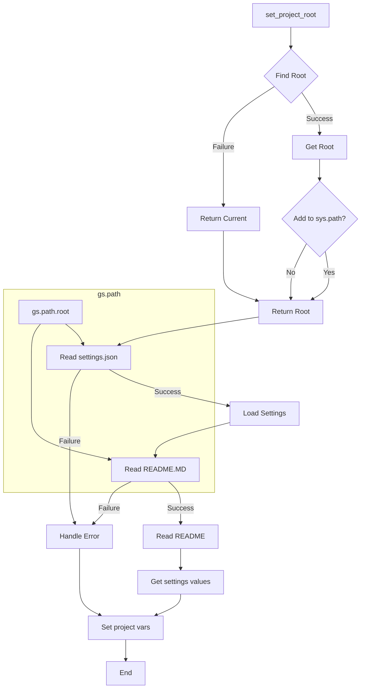

# <input code>

```python
## \file hypotez/src/suppliers/ivory/header.py
# -*- coding: utf-8 -*-\
#! venv/Scripts/python.exe
#! venv/bin/python/python3.12

"""
.. module: src.suppliers.ivory 
	:platform: Windows, Unix
	:synopsis:

"""
MODE = 'dev'

import sys
import json
from packaging.version import Version

from pathlib import Path
def set_project_root(marker_files=('pyproject.toml', 'requirements.txt', '.git')) -> Path:
    """
    Finds the root directory of the project starting from the current file's directory,
    searching upwards and stopping at the first directory containing any of the marker files.

    Args:
        marker_files (tuple): Filenames or directory names to identify the project root.
    
    Returns:
        Path: Path to the root directory if found, otherwise the directory where the script is located.
    """
    __root__:Path
    current_path:Path = Path(__file__).resolve().parent
    __root__ = current_path
    for parent in [current_path] + list(current_path.parents):
        if any((parent / marker).exists() for marker in marker_files):
            __root__ = parent
            break
    if __root__ not in sys.path:
        sys.path.insert(0, str(__root__))
    return __root__


# Get the root directory of the project
__root__ = set_project_root()
"""__root__ (Path): Path to the root directory of the project"""

from src import gs

settings:dict = None
try:
    with open(gs.path.root / 'src' / 'settings.json', 'r') as settings_file:
        settings = json.load(settings_file)
except (FileNotFoundError, json.JSONDecodeError):
    ...

doc_str:str = None
try:
    with open(gs.path.root / 'src' / 'README.MD', 'r') as settings_file:
        doc_str = settings_file.read()
except (FileNotFoundError, json.JSONDecodeError):
    ...


__project_name__ = settings.get("project_name", 'hypotez') if settings  else 'hypotez'
__version__: str = settings.get("version", '')  if settings  else ''
__doc__: str = doc_str if doc_str else ''
__details__: str = ''
__author__: str = settings.get("author", '')  if settings else ''
__copyright__: str = settings.get("copyrihgnt", '')  if settings else ''
__cofee__: str = settings.get("cofee", "Treat the developer to a cup of coffee for boosting enthusiasm in development: https://boosty.to/hypo69")  if settings else "Treat the developer to a cup of coffee for boosting enthusiasm in development: https://boosty.to/hypo69"
```

# <algorithm>

**Шаг 1:** Функция `set_project_root` ищет корневую директорию проекта.

* **Вход:** кортеж `marker_files` с именами файлов/директорий, которые должны присутствовать в проекте.
* **Обработка:** Функция начинает поиск с текущей директории файла и поднимается по цепочке родительских директорий. Для каждой родительской директории она проверяет, существуют ли файлы/директории из `marker_files`.
* **Выход:** Путь к корневой директории проекта (`Path`). Если корневая директория не найдена, возвращается текущая директория. Если корневая директория не в `sys.path`, она добавляется в него.


**Шаг 2:** Получение корневой директории.
* **Вход:** Вызов `set_project_root()`.
* **Обработка:** Вызов функции `set_project_root`. Результат сохраняется в переменную `__root__`.
* **Выход:**  Переменная `__root__` со значением Path к корневой директории.


**Шаг 3:** Чтение файла `settings.json`.

* **Вход:** Путь к файлу `settings.json`.
* **Обработка:** Используя `gs.path.root`, строится полный путь к файлу `settings.json`. Файл открывается в режиме чтения. `json.load` загружает данные из файла.
* **Выход:** Словарь `settings` со значениями из `settings.json` или None, если файл не найден или имеет некорректный формат.


**Шаг 4:** Чтение файла `README.MD`.

* **Вход:** Путь к файлу `README.MD`.
* **Обработка:** Используя `gs.path.root`, строится полный путь к файлу `README.MD`. Файл открывается в режиме чтения. `settings_file.read()` читает весь файл.
* **Выход:** Строка `doc_str` со содержимым `README.MD` или None, если файл не найден или имеет некорректный формат.


**Шаг 5:**  Получение данных из `settings`.

* **Вход:** Словарь `settings` и значения по умолчанию для переменных.
* **Обработка:** Функции `get` извлекают значения из словаря `settings` по заданным ключам. Если ключ не найден, возвращается значение по умолчанию.
* **Выход:** Переменные: `__project_name__`, `__version__`, `__doc__`, `__details__`, `__author__`, `__copyright__`, `__cofee__` с соответствующими значениями.


# <mermaid>




# <explanation>

**Импорты:**

* `sys`:  Модуль `sys` предоставляет доступ к параметрам интерпретатора Python, в частности, к пути поиска модулей (`sys.path`).  Используется в функции `set_project_root` для добавления корневой директории в `sys.path`.
* `json`: Модуль для работы с JSON-данными. Используется для чтения настроек из файла `settings.json`.
* `packaging.version`: Модуль для работы с версиями пакетов. Этот импорт, однако, не используется в предоставленном коде.
* `pathlib`: Модуль для работы с путями к файлам.
* `src.gs`: Подключает пакет `gs`, вероятно, содержащий вспомогательные функции для работы с путями к ресурсам проекта.


**Классы:**

В коде нет определенных классов.


**Функции:**

* `set_project_root(marker_files)`: Ищет корневую директорию проекта, поднимаясь по родительским каталогам, пока не найдет директорию, содержащую файлы из `marker_files`. Возвращает путь к корневой директории.
    *  Аргументы: `marker_files` (кортеж строк) - имена файлов или директорий, по которым определяется корень проекта.
    * Возвращаемое значение: `Path` - путь к корневой директории.


**Переменные:**

* `MODE`: Строковая константа со значением 'dev'.
* `__root__`: Переменная типа `Path`, хранящая путь к корневой директории проекта.
* `settings`: Словарь, содержащий настройки из `settings.json`.
* `doc_str`: Строка, содержащая содержимое файла `README.MD`.
* `__project_name__`, `__version__`, `__doc__`, `__details__`, `__author__`, `__copyright__`, `__cofee__`: Переменные, содержащие информацию о проекте, полученные из файла `settings.json`.

**Возможные ошибки и улучшения:**

* **Обработка исключений:**  Блоки `try...except` для чтения `settings.json` и `README.MD` обрабатывают `FileNotFoundError` и `json.JSONDecodeError`. Это хорошо, но можно добавить более подробные сообщения об ошибках.
* **Использование `gs`:**  Предполагается, что `gs` из `src` предоставляет функцию для получения пути к корню проекта. Должна быть определена переменная `gs.path.root`. Необходимо документировать `gs`.
* **Взаимосвязь с другими частями проекта:** Код зависит от `gs.path.root` и  `settings.json` в директории `src`, предполагая их существование. Необходимо, чтобы `gs` был должным образом импортирован и использован.
* **Документация:**  Документация (`"""..."""`) присутствует, но могла бы быть более полной, особенно для функции `set_project_root`. Добавьте описание типов аргументов и возвращаемых значений.


**Цепочка взаимосвязей:**

Код в `hypotez/src/suppliers/ivory/header.py` зависит от файлов `settings.json` и `README.MD` в директории `src`, а также от модуля `gs` из пакета `src`. Этот код задает переменные, которые, вероятно, используются в других частях проекта для конфигурации и отображения информации о проекте.