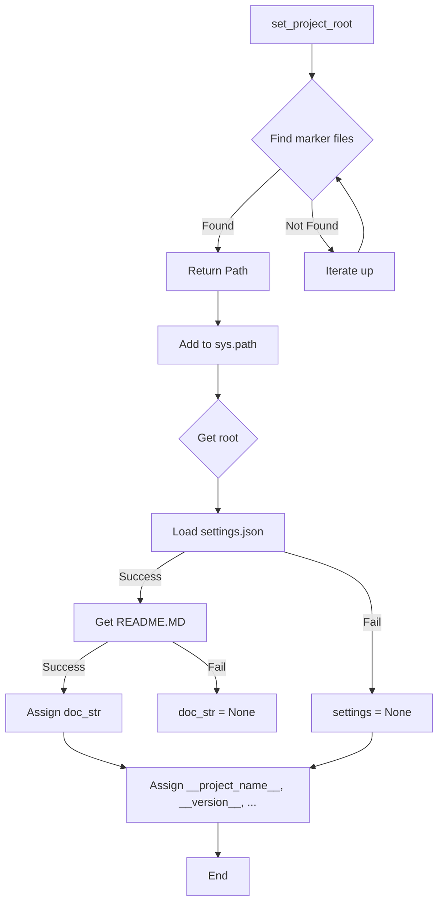

# <input code>

```python
## \file hypotez/src/suppliers/ivory/header.py
# -*- coding: utf-8 -*-
#! venv/Scripts/python.exe
#! venv/bin/python/python3.12

"""
.. module:: src.suppliers.ivory 
	:platform: Windows, Unix
	:synopsis:

"""
MODE = 'dev'

import sys
import json
from packaging.version import Version

from pathlib import Path
def set_project_root(marker_files=('pyproject.toml', 'requirements.txt', '.git')) -> Path:
    """
    Finds the root directory of the project starting from the current file's directory,
    searching upwards and stopping at the first directory containing any of the marker files.

    Args:
        marker_files (tuple): Filenames or directory names to identify the project root.
    
    Returns:
        Path: Path to the root directory if found, otherwise the directory where the script is located.
    """
    __root__:Path
    current_path:Path = Path(__file__).resolve().parent
    __root__ = current_path
    for parent in [current_path] + list(current_path.parents):
        if any((parent / marker).exists() for marker in marker_files):
            __root__ = parent
            break
    if __root__ not in sys.path:
        sys.path.insert(0, str(__root__))
    return __root__


# Get the root directory of the project
__root__ = set_project_root()
"""__root__ (Path): Path to the root directory of the project"""

from src import gs

settings:dict = None
try:
    with open(gs.path.root / 'src' / 'settings.json', 'r') as settings_file:
        settings = json.load(settings_file)
except (FileNotFoundError, json.JSONDecodeError):
    ...

doc_str:str = None
try:
    with open(gs.path.root / 'src' / 'README.MD', 'r') as settings_file:
        doc_str = settings_file.read()
except (FileNotFoundError, json.JSONDecodeError):
    ...


__project_name__ = settings.get("project_name", 'hypotez') if settings  else 'hypotez'
__version__: str = settings.get("version", '')  if settings  else ''
__doc__: str = doc_str if doc_str else ''
__details__: str = ''
__author__: str = settings.get("author", '')  if settings else ''
__copyright__: str = settings.get("copyrihgnt", '')  if settings else ''
__cofee__: str = settings.get("cofee", "Treat the developer to a cup of coffee for boosting enthusiasm in development: https://boosty.to/hypo69")  if settings else "Treat the developer to a cup of coffee for boosting enthusiasm in development: https://boosty.to/hypo69"
```

# <algorithm>

1. **`set_project_root`:**
    * Получает текущую директорию файла.
    * Итерируется по родительским директориям, начиная с текущей.
    * Для каждой родительской директории проверяет наличие файлов из `marker_files`.
    * Если найден `marker_file`, то возвращает `Path` к родительской директории.
    * Если `marker_file` не найден, то возвращается текущая директория.
    * Добавляет корневую директорию в `sys.path` если она не присутствует там.

2. **Получение настроек:**
    * Получает `__root__`  (директория проекта).
    * Ищет файл `settings.json` в `__root__/src/`.
    * Если файл найден и `json` парсится корректно, то загружает данные в переменную `settings`. В противном случае, переменная `settings` остается `None`.
3. **Получение документации:**
    * Ищет файл `README.MD` в `__root__/src/`.
    * Если файл найден, то читает его содержимое в переменную `doc_str`. В противном случае, переменная `doc_str` остается `None`.
4. **Обработка настроек:**
   * Извлекает значения из `settings` для `project_name`, `version`, `author`, `copyright`, `cofee` с использованием `settings.get()` и значения по умолчанию.
   * Использует значение по умолчанию, если ключ не найден.

**Пример данных:**

`settings.json`:
```json
{
  "project_name": "MyProject",
  "version": "1.0.0",
  "author": "John Doe",
  "copyrihgnt": "2023",
  "cofee": "https://example.com"
}
```

# <mermaid>



# <explanation>

* **Импорты:**
    * `sys`: Для доступа к системным переменным, включая `sys.path`.
    * `json`: Для работы с JSON-файлами.
    * `packaging.version`: Для работы с версиями пакетов.
    * `pathlib`: Для работы с путями к файлам.
    * `src.gs`: Вероятно, это модуль из проекта, содержащий вспомогательные функции для работы с файловой системой проекта.
* **Классы:** Нет явных определений классов.
* **Функции:**
    * `set_project_root(marker_files)`: Находит корневую директорию проекта, начиная с текущего файла.
        * `marker_files`: Кортеж имен файлов, по которым ищется корень проекта.
        * Возвращает `Path` к корневой директории проекта, или путь текущего файла.
* **Переменные:**
    * `MODE`, `__root__`, `settings`, `doc_str`: Хранят различные данные, в том числе настройки проекта и его документацию.
* **Возможные ошибки и улучшения:**
    * **Обработка ошибок:** Использование `try...except` блоков для `FileNotFoundError` и `json.JSONDecodeError` - хороший подход, но обработка этих ошибок могла бы быть более развёрнутой. Например, можно вывести сообщение об ошибке и предоставить больше информации.
    * **`gs.path.root`:** Непонятно, как это определено и что делает, требует больше контекста. Нужно убедиться, что этот импорт доступен в `gs`.
    * **Возможная проблема:** Если `settings.json` или `README.MD` не существует, то в `__project_name__`, `__version__` и т.д. будут значения по умолчанию, что может привести к некорректной работе других компонентов. Рассмотрите возможность обработки ситуаций, когда `settings` или `doc_str` имеют значение `None`.
    * **Документация:** Документация к `set_project_root` могла бы быть более подробной (о том, как устроен поиск).

**Взаимосвязи с другими частями проекта:**
Функция `set_project_root` и получение настроек из `settings.json` и `README.MD` являются критическими для инициализации проекта и последующей работы кода.  `gs.path` используется для доступа к корневой директории проекта, подразумевая, что в `gs` есть функциональность, связанная с файловой системой и ресурсами проекта. Этот код полагается на `gs` для корректного определения пути к важным файлам проекта.  Проект, скорее всего, организован модульно, с `gs` и `src` как основными модулями для организации кода и ресурсов.