## <алгоритм>

**1. `set_project_root(marker_files)`:**
   - **Вход:** Список `marker_files` (например, `('pyproject.toml', 'requirements.txt', '.git')`).
   - **Действие:**
     - Получить абсолютный путь к директории текущего файла.
     - Инициализировать переменную `__root__` текущей директорией.
     - Пройтись по текущей директории и всем ее родительским директориям:
       - Проверить, существует ли в текущей директории хотя бы один из файлов `marker_files`.
       - Если да:
         - Обновить `__root__` на текущую директорию.
         - Прервать цикл.
     - Если путь к корневой директории (`__root__`) не содержится в `sys.path`, то добавить его в начало.
   - **Выход:** Путь к корневой директории проекта (`Path` object).
   - **Пример:**
     - Если текущий файл находится в `hypotez/src/suppliers/ivory/header.py`, а `.git` находится в `hypotez`, то `__root__` станет `hypotez`.
     - Если ни один из файлов `marker_files` не найден, то `__root__` останется директорией где лежит `header.py`.

**2.  `__root__ = set_project_root()`:**
   - **Действие:** Вызывает `set_project_root()` для определения корневой директории проекта.
   - **Результат:** Значение `__root__` - это Path объект корневой директории.

**3. Загрузка `settings.json`:**
   - **Действие:**
     - Пытается открыть и прочитать файл `settings.json`, расположенный в поддиректории `src` относительно корневой директории проекта.
     - Если открытие или парсинг файла прошел успешно:
       - Загружает данные из `settings.json` в словарь `settings`.
     - Если возникает `FileNotFoundError` или `json.JSONDecodeError`:
       - Пропускает исключение.
   - **Результат:** `settings` либо словарь с настройками, либо `None`.
   - **Пример:** Если файл `settings.json` существует и содержит `{"project_name": "hypotez", "version": "1.0.0"}`, то `settings` будет равен этому словарю.

**4. Загрузка `README.MD`:**
   - **Действие:**
     - Пытается открыть и прочитать файл `README.MD`, расположенный в поддиректории `src` относительно корневой директории проекта.
     - Если открытие или чтение файла прошло успешно:
       - Сохраняет содержимое `README.MD` в строку `doc_str`.
     - Если возникает `FileNotFoundError` или `json.JSONDecodeError`:
       - Пропускает исключение.
   - **Результат:** `doc_str` либо строка с содержимым файла, либо `None`.
   - **Пример:** Если файл `README.MD` существует и содержит текст, то `doc_str` будет равен этому тексту.

**5. Инициализация глобальных переменных:**
   - **Действие:** Инициализирует глобальные переменные, используя данные из `settings`, если они были успешно загружены. Если `settings` не был загружен, использует значения по умолчанию.
     - `__project_name__`: Название проекта (из `settings` или 'hypotez').
     - `__version__`: Версия проекта (из `settings` или '').
     - `__doc__`: Содержимое README.MD (из `doc_str` или '').
     - `__details__`: Пустая строка.
     - `__author__`: Автор проекта (из `settings` или '').
     - `__copyright__`: Авторские права проекта (из `settings` или '').
     - `__cofee__`: Сообщение про кофе (из `settings` или дефолтное сообщение).
   - **Результат:** Глобальные переменные получают соответствующие значения.

```mermaid
graph LR
    A[Начало] --> B{Получение пути к файлу header.py};
    B --> C{Установка __root__ как родительской директории};
    C --> D{Перебор родительских директорий};
    D -- Найдена маркерный файл --> E{Обновить __root__};
    D -- Нет маркерного файла --> F{Проверка __root__ в sys.path};
    E --> F;
    F -- __root__ не в sys.path --> G{Добавить __root__ в sys.path};
    F -- __root__ в sys.path --> H{Получить путь к settings.json};
    G --> H;
    H --> I{Чтение settings.json};
     I -- Успешно прочитан --> J{Получение данных из settings};
     I -- Ошибка чтения --> K{ settings = None };
     J --> L{Получение пути к README.MD};
     K --> L;
     L --> M{Чтение README.MD};
     M -- Успешно прочитан --> N{Получение текста из README.MD};
     M -- Ошибка чтения --> O{ doc_str = None};
     N --> P{Инициализация переменных};
     O --> P;
    P --> Q[Конец];

    style A fill:#f9f,stroke:#333,stroke-width:2px
    style Q fill:#f9f,stroke:#333,stroke-width:2px
    style B fill:#ccf,stroke:#333,stroke-width:2px
    style C fill:#ccf,stroke:#333,stroke-width:2px
    style D fill:#ccf,stroke:#333,stroke-width:2px
    style E fill:#ccf,stroke:#333,stroke-width:2px
    style F fill:#ccf,stroke:#333,stroke-width:2px
    style G fill:#ccf,stroke:#333,stroke-width:2px
    style H fill:#ccf,stroke:#333,stroke-width:2px
    style I fill:#ccf,stroke:#333,stroke-width:2px
    style J fill:#ccf,stroke:#333,stroke-width:2px
    style K fill:#ccf,stroke:#333,stroke-width:2px
    style L fill:#ccf,stroke:#333,stroke-width:2px
    style M fill:#ccf,stroke:#333,stroke-width:2px
    style N fill:#ccf,stroke:#333,stroke-width:2px
    style O fill:#ccf,stroke:#333,stroke-width:2px
    style P fill:#ccf,stroke:#333,stroke-width:2px

```

## <mermaid>



**Объяснение зависимостей `mermaid`:**

-   **`A` (Начало):**  Начало выполнения скрипта.
-   **`B` (Получение пути к файлу `header.py`):** Получение пути к текущему файлу.
-   **`C` (Установка `__root__` как родительской директории):** Инициализация `__root__` как директории, содержащей `header.py`.
-   **`D` (Перебор родительских директорий):** Цикл, который проходит по родительским директориям, пока не будет найден маркерный файл или не достигнута корневая директория.
-   **`E` (Обновить `__root__`):**  Обновление переменной `__root__` на директорию где был найден маркерный файл.
-   **`F` (Проверка `__root__` в `sys.path`):**  Проверка, присутствует ли `__root__` в списке путей поиска модулей.
-    **`G` (Добавить `__root__` в `sys.path`):** Добавление `__root__` в список путей поиска модулей, если его там нет.
-   **`H` (Получить путь к `settings.json`):** Определение пути к файлу `settings.json`.
-   **`I` (Чтение `settings.json`):** Попытка загрузить данные из файла `settings.json`.
-   **`J` (Получение данных из `settings`):** Извлечение данных из словаря `settings`.
-   **`K` (`settings = None`):** Присвоение `None` переменной `settings`, если произошла ошибка при загрузке `settings.json`.
-   **`L` (Получение пути к `README.MD`):** Определение пути к файлу `README.MD`.
-   **`M` (Чтение `README.MD`):** Попытка загрузить данные из файла `README.MD`.
-   **`N` (Получение текста из `README.MD`):** Сохранение текста из файла `README.MD` в переменную `doc_str`.
-   **`O` (`doc_str = None`):** Присвоение `None` переменной `doc_str`, если произошла ошибка при загрузке `README.MD`.
-   **`P` (Инициализация переменных):** Инициализация глобальных переменных на основе данных из `settings` и `doc_str`.
-   **`Q` (Конец):** Конец выполнения скрипта.

## <объяснение>

**Импорты:**

-   `sys`: Модуль `sys` используется для работы с системными переменными, такими как `sys.path`, который определяет пути поиска модулей в Python. В данном случае используется для добавления корневой директории проекта в список путей поиска.
-   `json`:  Модуль `json` используется для работы с данными в формате JSON. В данном коде используется для загрузки данных из `settings.json`.
-   `packaging.version.Version`: Класс `Version` используется для работы с версиями пакетов и их сравнения. Не используется в данном коде, хотя импортируется. Возможно, предполагалось использование в будущем.
-   `pathlib.Path`: Класс `Path` из модуля `pathlib` используется для работы с путями к файлам и директориям в кроссплатформенном стиле. Он заменяет более старый и платформозависимый подход к работе с путями через строки.

**Классы:**

-   Классов нет.

**Функции:**

-   `set_project_root(marker_files: tuple) -> Path`:
    -   **Аргументы**:
        -   `marker_files`: Кортеж со строками имен файлов или каталогов, которые используются для определения корневого каталога проекта.
    -   **Возвращаемое значение**: Объект `pathlib.Path`, представляющий корневой каталог проекта.
    -   **Назначение**: Функция находит корневой каталог проекта, поднимаясь вверх по дереву каталогов от текущего файла, пока не найдет один из маркерных файлов. Если ни один из маркерных файлов не найден, возвращается каталог, в котором находится скрипт. Если каталог не входит в `sys.path` он добавляется.
    -   **Пример**:
        ```python
        root_path = set_project_root(marker_files=('pyproject.toml', '.git'))
        print(root_path) # Output: Путь к корневой директории проекта
        ```

**Переменные:**

-   `MODE`: Глобальная переменная, указывающая режим работы приложения. В данном случае установлено значение `'dev'`.
-   `__root__`: Глобальная переменная типа `pathlib.Path`, хранящая путь к корневому каталогу проекта. Она определяется путем вызова функции `set_project_root`.
-   `settings`: Глобальная переменная типа `dict` или `None`, которая хранит данные, загруженные из файла `settings.json`. Если файл не найден или его не удалось прочитать, переменная принимает значение `None`.
-   `doc_str`: Глобальная переменная типа `str` или `None`, которая хранит текст, загруженный из файла `README.MD`. Если файл не найден или его не удалось прочитать, переменная принимает значение `None`.
-    `__project_name__`: Название проекта, если есть в `settings` или по умолчанию `hypotez`.
-   `__version__`: Версия проекта, если есть в `settings` или по умолчанию пустая строка.
-    `__doc__`: Содержимое `README.MD`, если есть или по умолчанию пустая строка.
-   `__details__`: Пустая строка.
-   `__author__`: Автор проекта, если есть в `settings` или по умолчанию пустая строка.
-   `__copyright__`: Информация об авторских правах, если есть в `settings` или по умолчанию пустая строка.
-   `__cofee__`: Сообщение с предложением поддержать разработчика, если есть в `settings` или дефолтный вариант.

**Цепочка взаимосвязей:**

1.  Функция `set_project_root` определяет корневой каталог проекта и модифицирует `sys.path` добавляя путь к корню.
2.  Переменная `__root__` сохраняет этот путь для дальнейшего использования.
3.  Затем используются `__root__`  для построения пути к `settings.json` и `README.MD`, которые затем загружаются в переменные `settings` и `doc_str`.
4.  Глобальные переменные `__project_name__`, `__version__`, `__doc__`, `__details__`, `__author__`, `__copyright__`, `__cofee__` инициализируются на основе данных в `settings` и `doc_str`.

**Потенциальные ошибки и области для улучшения:**

-   **Обработка исключений:** В блоках `try-except` используется `...` (ellipsis), что не является хорошей практикой. Лучше явно обрабатывать исключения, возможно, добавляя логирование ошибок.
-   **Неиспользуемый импорт:** Импорт `packaging.version.Version` не используется в коде и может быть удален.
-    **`cofee`**:  орфографическая ошибка `copyrihgnt` -> `copyright`
-    **Конфигурация:** Лучше вынести настройки по умолчанию в отдельную константу, чтобы их было легче поддерживать.
-    **Логирование**: Добавить логирование, чтобы отслеживать ошибки и ход выполнения программы, особенно при загрузке настроек и README.
-   **Отсутствие проверок**: Не выполняется проверка что `settings` и `doc_str` это словари и строки.

**Дополнительные замечания:**

-   Файл `header.py` служит для определения основных настроек и метаданных проекта, которые затем могут использоваться в других модулях.
-   Использование `pathlib.Path` делает код более переносимым между разными операционными системами.
-   Поиск корневой директории проекта с помощью маркерных файлов является хорошей практикой для гибкой организации проекта.