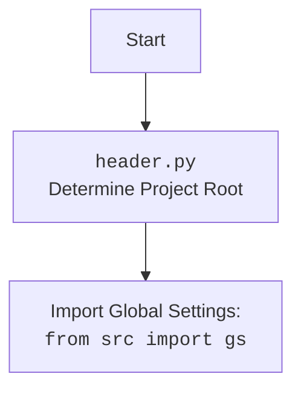

## <алгоритм>

1. **`set_project_root(marker_files)`**:
   - **Начало**: Функция принимает кортеж `marker_files` (по умолчанию `('__root__', '.git')`).
   - **Инициализация**:
     - Определяется путь к текущему файлу (`__file__`) и его родительская директория как `current_path`.
     - Изначально `__root__` устанавливается равным `current_path`.
   - **Поиск корневой директории**:
     - Перебираются все родительские директории `current_path`.
     - **Пример**: Если `current_path` это `/home/user/project/src/suppliers/ivory`, то будут рассмотрены: `/home/user/project/src/suppliers/ivory`, `/home/user/project/src/suppliers`, `/home/user/project/src`, `/home/user/project`, `/home/user`, `/home`, `/`.
     - Для каждой `parent` проверяется, существует ли хотя бы один файл или директория, указанный в `marker_files`.
     - **Пример**: Если `marker_files` это `('__root__', '.git')`, то проверяется наличие `/home/user/project/src/suppliers/ivory/__root__` или `/home/user/project/src/suppliers/ivory/.git`.
     - Если один из маркеров найден в `parent`, то `__root__` присваивается `parent` и цикл прерывается.
   - **Добавление в `sys.path`**:
     - Если `__root__` отсутствует в `sys.path`, то `__root__` добавляется в начало списка путей для импорта.
   - **Возврат**: Функция возвращает `__root__` (путь к корневой директории).

2. **Инициализация `__root__`**:
   - Вызывается функция `set_project_root()` для определения корневой директории проекта.
   - Результат сохраняется в глобальной переменной `__root__`.

3. **Импорт `gs`**:
   -  Импортируется модуль `gs` из `src`, предположительно содержащий глобальные настройки (пути, переменные).

4. **Загрузка `settings` из `settings.json`**:
   - Инициализация переменной `settings` как `None`.
   - Попытка открыть файл `settings.json`, расположенный в `gs.path.root / 'src' / 'settings.json'`.
   - Если файл успешно открыт, его содержимое загружается в переменную `settings` (как словарь) с помощью `json.load`.
   - Если возникает ошибка `FileNotFoundError` или `json.JSONDecodeError`, блок `try` пропускается.

5. **Загрузка `doc_str` из `README.MD`**:
   - Инициализация переменной `doc_str` как `None`.
    - Попытка открыть файл `README.MD`, расположенный в `gs.path.root / 'src' / 'README.MD'`.
    - Если файл успешно открыт, его содержимое считывается в переменную `doc_str`.
    - Если возникает ошибка `FileNotFoundError` или `json.JSONDecodeError`, блок `try` пропускается.
6. **Инициализация глобальных переменных проекта**:
   - `__project_name__`: Если `settings` не `None` и содержит ключ `"project_name"`, то используется его значение, иначе `'hypotez'`.
   - `__version__`: Если `settings` не `None` и содержит ключ `"version"`, то используется его значение, иначе `''`.
   - `__doc__`: Присваивается значение переменной `doc_str`, если оно не `None`, иначе `''`.
   - `__details__`: Устанавливается в `''`.
   - `__author__`: Если `settings` не `None` и содержит ключ `"author"`, то используется его значение, иначе `''`.
   - `__copyright__`: Если `settings` не `None` и содержит ключ `"copyrihgnt"`, то используется его значение, иначе `''`.
    - `__cofee__`: Если `settings` не `None` и содержит ключ `"cofee"`, то используется его значение, иначе `"Treat the developer to a cup of coffee for boosting enthusiasm in development: https://boosty.to/hypo69"`.

## <mermaid>

```mermaid
flowchart TD
    Start --> FindRoot[<code>set_project_root()</code><br> Find Project Root];
    FindRoot --> CheckMarkers[Check for marker files in parents];
    CheckMarkers -- Found Marker --> SetRoot[Set project root];
    CheckMarkers -- No Marker --> UseCurrentPath[Use current directory as root];
    SetRoot --> AddPath[Add root to sys.path];
    UseCurrentPath --> AddPath
    AddPath --> ReturnRoot[Return project root];
    ReturnRoot --> SetGlobalRoot[Set <code>__root__</code>];

    SetGlobalRoot --> ImportGS[Import Global Settings: <br><code>from src import gs</code>];
    ImportGS --> LoadSettings[Load <code>settings.json</code>];
    LoadSettings -- Success --> SetSettings[Set <code>settings</code>];
    LoadSettings -- Error --> SkipSettings[Skip Loading <code>settings</code>];

    SetSettings --> LoadDocStr[Load <code>README.MD</code>];
    SkipSettings --> LoadDocStr;

    LoadDocStr -- Success --> SetDocStr[Set <code>doc_str</code>];
    LoadDocStr -- Error --> SkipDocStr[Skip Loading <code>doc_str</code>];
    SetDocStr --> SetProjectVars[Set Project Variables];
    SkipDocStr --> SetProjectVars;

    SetProjectVars --> End;
    

    style FindRoot fill:#f9f,stroke:#333,stroke-width:2px
     style SetGlobalRoot fill:#ccf,stroke:#333,stroke-width:2px
     style ImportGS fill:#cff,stroke:#333,stroke-width:2px
    style LoadSettings fill:#ccf,stroke:#333,stroke-width:2px
    style LoadDocStr fill:#ccf,stroke:#333,stroke-width:2px
    style SetProjectVars fill:#cfc,stroke:#333,stroke-width:2px
```



**Описание зависимостей:**

- **`sys`**: Модуль `sys` используется для модификации `sys.path`, чтобы обеспечить правильный импорт модулей из корневой директории проекта.
- **`json`**: Модуль `json` используется для загрузки настроек из файла `settings.json`.
- **`packaging.version.Version`**: Модуль `packaging` используется для работы с версиями, но в данном файле не используется, что указывает на неиспользуемую зависимость. 
- **`pathlib.Path`**: Модуль `pathlib` используется для работы с путями файловой системы в кросс-платформенном стиле.
- **`src.gs`**: Модуль `gs` (предположительно сокращение от "global settings") импортируется из пакета `src` и, как предполагает имя, предоставляет доступ к глобальным настройкам проекта.

## <объяснение>

### Импорты

-   **`import sys`**: Модуль `sys` обеспечивает доступ к некоторым переменным и функциям, взаимодействующим с интерпретатором Python. В данном коде он используется для добавления пути к корневой директории проекта в список путей поиска модулей (`sys.path`), что позволяет импортировать модули из корневой директории, даже если текущий файл находится в подпапке.
-   **`import json`**: Модуль `json` предназначен для работы с данными в формате JSON. В данном случае используется для чтения данных из файла `settings.json`, который предположительно содержит настройки проекта.
-   **`from packaging.version import Version`**: Импортирует класс `Version` из модуля `packaging.version`. Этот класс предназначен для сравнения и работы с версиями программного обеспечения. В данном коде фактически не используется.
-   **`from pathlib import Path`**: Импортирует класс `Path` из модуля `pathlib`, который предоставляет объектно-ориентированный способ работы с файловыми путями. Это делает код более читаемым и кросс-платформенным.
-   **`from src import gs`**: Импортирует модуль `gs` из пакета `src`. Модуль `gs` (предположительно от "global settings") предоставляет доступ к глобальным настройкам проекта. Данный импорт устанавливает зависимость этого модуля от других модулей в `src`.

### Классы

В данном коде нет явно определенных классов. Однако используется класс `Path` из модуля `pathlib`.

### Функции

-   **`set_project_root(marker_files: tuple = ('__root__', '.git')) -> Path`**:
    -   **Аргументы**:
        -   `marker_files`: кортеж строк, представляющих имена файлов или папок, которые отмечают корневую директорию проекта. По умолчанию: `('__root__', '.git')`.
    -   **Возвращает**:
        -   `Path`: объект `Path` из `pathlib`, представляющий корневую директорию проекта.
    -   **Назначение**:
        -   Функция ищет корневую директорию проекта, поднимаясь вверх по дереву каталогов от текущего файла, до тех пор, пока не найдет хотя бы один из файлов или папок, указанных в `marker_files`. Это позволяет динамически определять корневую директорию проекта независимо от того, где был запущен скрипт.
        -   После нахождения корневой директории добавляет ее в начало `sys.path`, для корректной работы импортов.
    -   **Пример**: Если скрипт находится в `/home/user/project/src/suppliers/ivory/header.py`, а файл `__root__` находится в `/home/user/project`, то функция вернет `/home/user/project` и добавит этот путь в `sys.path`.

### Переменные

-   **`__root__`**: Переменная типа `Path`, хранящая путь к корневой директории проекта. Она вычисляется при помощи `set_project_root()`.
-   **`settings`**: Словарь (тип `dict`), содержащий настройки проекта, загруженные из файла `settings.json`. Если файл не найден или не может быть проанализирован, то `settings` будет `None`.
-   **`doc_str`**: Строка (тип `str`), содержащая содержимое файла `README.MD`. Если файл не найден или не может быть прочитан, то `doc_str` будет `None`.
-   **`__project_name__`**: Строка (тип `str`), представляющая имя проекта, считанное из `settings`, если `settings` не `None`, иначе `'hypotez'`.
-   **`__version__`**: Строка (тип `str`), представляющая версию проекта, считанную из `settings`, если `settings` не `None`, иначе `''`.
-   **`__doc__`**: Строка (тип `str`), представляющая документацию проекта, взятую из `doc_str`, если `doc_str` не `None`, иначе `''`.
-   **`__details__`**: Строка (тип `str`), не использующаяся, установлена в `''`.
-   **`__author__`**: Строка (тип `str`), представляющая автора проекта, считанная из `settings`, если `settings` не `None`, иначе `''`.
-   **`__copyright__`**: Строка (тип `str`), представляющая копирайт проекта, считанный из `settings`, если `settings` не `None`, иначе `''`.
-   **`__cofee__`**: Строка (тип `str`), представляющая сообщение о кофе, считанное из `settings`, если `settings` не `None`, иначе `"Treat the developer to a cup of coffee for boosting enthusiasm in development: https://boosty.to/hypo69"`.

### Потенциальные ошибки и области для улучшения

1.  **Неиспользуемый импорт**: Импорт `from packaging.version import Version` не используется в коде и должен быть удален, чтобы избежать ненужных зависимостей.
2.  **Обработка ошибок**: В блоках `try...except`  пустой `...`  в  `except (FileNotFoundError, json.JSONDecodeError): ...`  не дает никакого сообщения об ошибке, что может затруднить отладку. Было бы лучше логировать эти ошибки или устанавливать значения по умолчанию.
3.  **Опечатка**: Возможно, опечатка в `__copyright__` (скорее всего, должно быть `copyright`), стоит проверить.
4.  **Неоднозначность глобальных переменных**: Наличие большого количества глобальных переменных, таких как `__project_name__`, `__version__` и т. д., может сделать код сложным для понимания и поддержки. Возможно, стоило бы объединить их в отдельный объект или класс.
5.  **Зависимость от `gs`**: Модуль `gs` является внешней зависимостью и может создавать проблемы, если его структура изменится. Стоит убедиться в надежности и стабильности этого модуля.

### Взаимосвязи с другими частями проекта

-   **`src.gs`**: Данный модуль использует глобальные настройки, определенные в модуле `src.gs`.
-   **`settings.json`**: Код загружает настройки из файла `settings.json`, что предполагает, что этот файл является частью проекта.
-   **`README.MD`**: Код считывает информацию о проекте из файла `README.MD`.

Этот модуль является одним из ключевых компонентов проекта, так как он определяет корневую директорию проекта и загружает основные настройки, которые используются в дальнейшем другими модулями проекта.