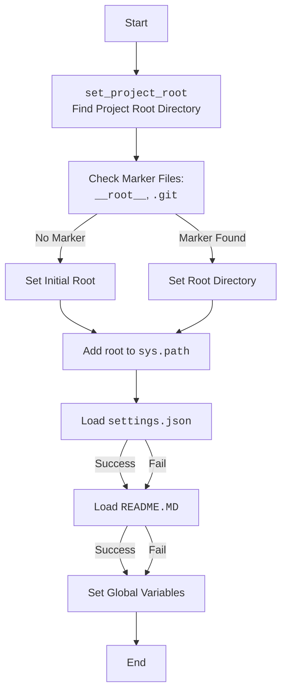
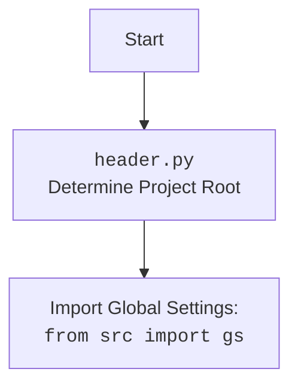

## <алгоритм>

1.  **`set_project_root(marker_files)`**:
    *   **Начало**: Функция принимает на вход кортеж `marker_files`, содержащий имена файлов или директорий, которые будут использоваться для определения корня проекта. По умолчанию `marker_files` = (`'__root__'`, `'.git'`).
    *   **Получение текущего пути**: Определяется абсолютный путь к директории, в которой находится текущий файл (`header.py`).
        *   *Пример*: Если `header.py` находится в `/home/user/project/src/suppliers/ivory`, то `current_path` будет `/home/user/project/src/suppliers/ivory`.
    *   **Установка начального значения __root__**:  Переменной `__root__` присваивается значение `current_path`.
    *   **Обход родительских директорий**: Проходится по текущей и всем родительским директориям, начиная от текущей директории.
        *   *Пример*: Если `current_path`  это `/home/user/project/src/suppliers/ivory`, то будут рассмотрены `/home/user/project/src/suppliers/ivory`, `/home/user/project/src/suppliers`, `/home/user/project/src`, `/home/user/project`, `/home/user`, `/home` и `/`.
    *   **Проверка маркеров**: Для каждой родительской директории проверяется, существует ли в ней хотя бы один из файлов или директорий из `marker_files`.
    *   **Обновление __root__**: Если маркер найден, значение `__root__` обновляется на путь этой родительской директории, и цикл прерывается.
        *   *Пример*: Если в `/home/user/project/` существует `.git`, то `__root__` станет `/home/user/project/`.
    *   **Добавление __root__ в sys.path**: Если `__root__` нет в путях поиска Python (`sys.path`), то добавляется в начало.
    *   **Возврат __root__**: Функция возвращает путь к корневой директории проекта.

2.  **Загрузка `settings.json`**:
    *   **Определение пути**: Собирается путь к файлу `settings.json` относительно корневой директории проекта (`__root__`).
    *   **Чтение файла**: Попытка открыть и загрузить файл `settings.json` как JSON-объект.
    *   **Обработка ошибок**: Если файл не найден или JSON-формат не корректен, то ничего не происходит (используется `...`).

3.  **Загрузка `README.MD`**:
    *   **Определение пути**: Собирается путь к файлу `README.MD` относительно корневой директории проекта (`__root__`).
    *   **Чтение файла**: Попытка открыть и прочитать содержимое файла `README.MD`.
    *   **Обработка ошибок**: Если файл не найден или возникли ошибки при чтении, то ничего не происходит (используется `...`).

4.  **Инициализация глобальных переменных**:
    *   **`__project_name__`**: Извлекается имя проекта из `settings.json`, если файл прочитан успешно, иначе устанавливается значение по умолчанию `'hypotez'`.
    *   **`__version__`**: Извлекается версия проекта из `settings.json`, если файл прочитан успешно, иначе устанавливается пустая строка `''`.
    *   **`__doc__`**: Присваивается содержимое `README.MD`, если файл прочитан успешно, иначе устанавливается пустая строка `''`.
    *   **`__details__`**: Присваивается пустая строка `''`.
    *   **`__author__`**: Извлекается автор проекта из `settings.json`, если файл прочитан успешно, иначе устанавливается пустая строка `''`.
    *   **`__copyright__`**: Извлекается авторское право из `settings.json`, если файл прочитан успешно, иначе устанавливается пустая строка `''`.
    *   **`__cofee__`**: Извлекается строка с предложением угостить разработчика кофе из `settings.json`, если файл прочитан успешно, иначе устанавливается строка по умолчанию.

## <mermaid>

**Анализ зависимостей `mermaid`:**

*   **`flowchart TD`**:  Объявляет диаграмму типа "flowchart" с направлением "top to bottom".
*   **`Start[Start]`**: Начало процесса.
*   **`FindRoot[<code>set_project_root</code> Find Project Root Directory]`**: Блок, представляющий вызов функции `set_project_root()`, которая ищет корень проекта.
*   **`CheckMarkers[Check Marker Files:  <code>__root__</code>, <code>.git</code>]`**:  Блок, представляющий проверку существования маркерных файлов/директорий.
*   **`SetRoot[Set Root Directory]`**: Блок, представляющий установку корня проекта.
*    **`SetInitialRoot[Set Initial Root]`**: Блок, представляющий установку первоначального корня проекта.
*   **`AddRootToPath[Add root to <code>sys.path</code>]`**: Блок, представляющий добавление пути корня проекта в `sys.path`.
*   **`LoadSettings[Load <code>settings.json</code>]`**: Блок, представляющий загрузку файла `settings.json`.
*    **`LoadDoc[Load <code>README.MD</code>]`**: Блок, представляющий загрузку файла `README.MD`.
*   **`SetProjectInfo[Set Global Variables]`**: Блок, представляющий установку глобальных переменных, таких как имя проекта, версия и т. д.
*   **`End[End]`**: Конец процесса.
*   `-->`:  Обозначает направленную связь между блоками.
*   `-- Marker Found -->`, `-- No Marker -->`, `-- Success -->`, `-- Fail -->`: Обозначают условные переходы.

## <объяснение>

**Импорты:**

*   `import sys`:  Используется для модификации `sys.path`, что позволяет Python находить модули проекта, даже если они не находятся в стандартных местах поиска модулей.
*   `import json`: Используется для загрузки данных из файла `settings.json`, который должен быть в формате JSON.
*   `from packaging.version import Version`: Импортирует класс `Version` для работы с версиями, хотя в текущем коде он не используется, что является потенциальной областью для улучшения или удаления.
*   `from pathlib import Path`:  Используется для удобной работы с путями файловой системы, что повышает переносимость кода между разными операционными системами.
*   `from src import gs`: Импортирует глобальные настройки проекта из модуля `gs` пакета `src`. Предполагается, что `gs` содержит пути, константы и другие общие настройки проекта.

**Функция `set_project_root`:**

*   **Аргументы**: `marker_files` - кортеж строк, представляющих имена файлов или директорий, которые используются для определения корня проекта.
*   **Возвращаемое значение**: `Path` - объект пути к корневой директории проекта.
*   **Назначение**: Определяет корень проекта путем поиска родительских директорий, содержащих маркерные файлы. Это позволяет запускать скрипты из любой поддиректории проекта.
*   **Пример**:
    *   Если `marker_files` = `('__root__', '.git')` и файл `.git` находится в `/home/user/project/`, то функция вернет `/home/user/project/`, даже если `header.py` находится глубже в структуре директорий, например, в `/home/user/project/src/suppliers/ivory`.

**Глобальные переменные:**

*   **`__root__`**: Объект `Path`, представляющий путь к корневой директории проекта. Определяется при вызове функции `set_project_root`.
*   **`settings`**:  Словарь, содержащий настройки проекта, прочитанные из файла `settings.json`. Инициализируется в `None` и может остаться `None`, если загрузка не удалась.
*   **`doc_str`**: Строка, содержащая текст из файла `README.MD`, если загрузка удалась, иначе `None`.
*   **`__project_name__`**: Имя проекта, извлекается из `settings.json` или по умолчанию 'hypotez'.
*   **`__version__`**:  Версия проекта, извлекается из `settings.json` или пустая строка ''.
*    **`__doc__`**:  Описание проекта, равно содержимому файла `README.MD` или пустая строка ''.
*   **`__details__`**:  Строка, в текущем коде равна пустой строке, возможно, зарезервировано для будущего использования.
*   **`__author__`**: Автор проекта, извлекается из `settings.json` или пустая строка ''.
*   **`__copyright__`**:  Авторское право проекта, извлекается из `settings.json` или пустая строка ''.
*   **`__cofee__`**:  Строка с предложением угостить разработчика кофе, извлекается из `settings.json` или значение по умолчанию.

**Взаимосвязь с другими частями проекта:**

*   **`src.gs`**: Этот модуль содержит общие настройки, необходимые для работы проекта, включая пути к файлам и общие константы. `header.py` использует его для определения пути к файлу `settings.json` и `README.MD`.
*   **`settings.json`**: Содержит метаданные проекта, такие как имя, версия, автор и т.д. Используется для инициализации глобальных переменных.
*   **`README.MD`**: Содержит документацию проекта, используемую для инициализации переменной `__doc__`.

**Потенциальные ошибки и области для улучшения:**

*   Обработка ошибок загрузки `settings.json` и `README.MD`:  Используется `...` что не даёт точной информации о возникших ошибках, рекомендуется логировать ошибки или  выбрасывать исключения.
*   Использование `Version` из `packaging.version`:  Не используется в коде и является лишним импортом.
*   Обработка ошибок при чтении `settings.json` и `README.MD`: Использование `...` может привести к молчаливому пропуску ошибок. Стоит добавить обработку и, возможно, логирование ошибок для отладки.
*   `__details__`  не используется и имеет значение пустой строки, следует или убрать переменную или добавить функционал.

**Цепочка взаимосвязей с другими частями проекта:**

1.  `header.py` определяет корень проекта и инициализирует глобальные переменные.
2.  `header.py` импортирует `gs` для получения путей к файлам настроек и документации.
3.  `settings.json` предоставляет метаданные проекта.
4.  `README.MD` предоставляет основную документацию.
5.  Другие модули в проекте могут импортировать глобальные переменные из `header.py` для получения информации о проекте и его настройках.