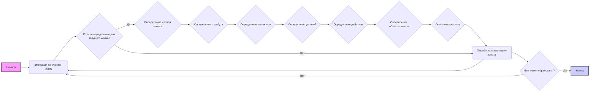

## ИНСТРУКЦИЯ:

Анализируй предоставленный код подробно и объясни его функциональность. Ответ должен включать три раздела:  

1. **<алгоритм>**: Опиши рабочий процесс в виде пошаговой блок-схемы, включая примеры для каждого логического блока, и проиллюстрируй поток данных между функциями, классами или методами.  
2. **<mermaid>**: Напиши код для диаграммы в формате `mermaid`, проанализируй и объясни все зависимости, 
    которые импортируются при создании диаграммы. 
    **ВАЖНО!** Убедитесь, что все имена переменных, используемые в диаграмме `mermaid`, 
    имеют осмысленные и описательные имена. Имена переменных вроде `A`, `B`, `C`, и т.д., не допускаются!  
    
    **Дополнительно**: Если в коде есть импорт `import header`, добавьте блок `mermaid` flowchart, объясняющий `header.py`:
    ```mermaid
    flowchart TD
        Start --> Header[<code>header.py</code><br> Determine Project Root]
    
        Header --> import[Import Global Settings: <br><code>from src import gs</code>] 
    ```

3. **<объяснение>**: Предоставьте подробные объяснения:  
   - **Импорты**: Их назначение и взаимосвязь с другими пакетами `src.`.  
   - **Классы**: Их роль, атрибуты, методы и взаимодействие с другими компонентами проекта.  
   - **Функции**: Их аргументы, возвращаемые значения, назначение и примеры.  
   - **Переменные**: Их типы и использование.  
   - Выделите потенциальные ошибки или области для улучшения.  

Дополнительно, постройте цепочку взаимосвязей с другими частями проекта (если применимо).  

Это обеспечивает всесторонний и структурированный анализ кода.
## Формат ответа: `.md` (markdown)
**КОНЕЦ ИНСТРУКЦИИ**

## 1. <алгоритм>

Этот JSON-файл определяет локаторы и действия для извлечения данных о продуктах на веб-странице.
Файл представляет собой словарь, где ключами являются названия полей продукта (например, "id", "name", "price"), а значениями - словари, содержащие инструкции о том, как найти и извлечь нужные данные на странице.

**Блок-схема:**



**Примеры:**

*   **`close_pop_up`**:
    *   **Метод поиска**: XPATH
    *   **Атрибут**: `null`
    *   **Селектор**: `//button[@class='close']`
    *   **Условия**: `if_list: "first"`
    *   **Действие**:  `click()`
    *  **Обязательность**: `mandatory: true`
    *   **Описание**: `Закрыти попап окна`

    *   Это определение указывает, что нужно найти первый элемент по XPATH `//button[@class='close']` и кликнуть по нему.
*   **`id_product`**:
    *   **Метод поиска**: XPATH
    *   **Атрибут**: `innerText`
    *   **Селектор**: `//span[@class = 'barcode-specific-area']`
    *    **Условия**: `if_list: "first"`
        *    **Действие**: `null`
    *  **Обязательность**: `mandatory: true`
    *   **Описание**: `SKU ivory`

    *   Это определение указывает, что нужно найти первый элемент по XPATH `//span[@class = 'barcode-specific-area']`, извлечь его текстовое содержимое и сохранить.

*  **`default_image_url`**:
    *   **Метод поиска**: XPATH
    *   **Атрибут**: `src`
    *   **Селектор**: `//img[@id = 'img_zoom_inout']`
    *    **Условия**: `if_list: "first"`
        *   **Действие**: `null`
    *  **Обязательность**: `mandatory: true`
    *  **Описание**: `URL картинки`
    *   Это определение указывает, что нужно найти первый элемент по XPATH `//img[@id = 'img_zoom_inout']`, извлечь значение атрибута `src` (URL картинки) и сохранить.
* **`affiliate_short_link`**:
    *  **Метод поиска**: XPATH
    *   **Атрибут**: `[null, "value"]`
    *   **Селектор**: `["//li[contains(@id,'amzn-ss-text-link')]", "//textarea[contains(@id,'amzn-ss-text-shortlink-textarea')]"]`
    *   **Условия**: `if_list: "first"`
    *   **Действие**: `["wait(click(),2,after)", null]`
    *  **Обязательность**: `mandatory: true`
    *   **Описание**: отсутствует

    *   Это определение указывает, что нужно найти первый элемент по XPATH `//li[contains(@id,'amzn-ss-text-link')]`, кликнуть по нему. Затем надо найти элемент по XPATH `//textarea[contains(@id,'amzn-ss-text-shortlink-textarea')]` и извлечь его значение `value`.
    
**Поток данных:**
Данные загружаются из JSON-файла. При парсинге веб-страницы,  для каждого поля товара будет использоватся соответсвующее определение из этого файла, и данные будут извлекаться согласно предоставленному селектору и атрибуту.

## 2. <mermaid>
```mermaid
graph LR
    A[Start: Загрузка JSON] --> B{Обход всех ключей объекта JSON};
    B --> C{Проверка наличия селектора};
     C -- Да --> D[Определение метода поиска(by)];
    D --> E{Определение атрибута(attribute)};
    E --> F{Определение селектора(selector)};
   F --> G{Определение условия (if_list)};
   G --> H{Определение действия (event)};
   H --> I{Определение обязательности(mandatory)};
   I --> J{Описание локатора(locator_description)};
   J --> K{Извлечение данных с веб-страницы};
    K --> L{Сохранение данных};
    L --> M(Следующий ключ);
    M --> B;
    C -- Нет --> M;
    B --> N{Все ключи обработаны?};
    N -- Да --> O[End: Завершение сбора данных];
    N -- Нет --> B;


    style A fill:#f9f,stroke:#333,stroke-width:2px
    style O fill:#ccf,stroke:#333,stroke-width:2px
    classDef key fill:#f0f0f0,stroke:#333,stroke-width:1px
    classDef value fill:#ffffff,stroke:#333,stroke-width:1px

    class B,C,D,E,F,G,H,I,J,K,L,M key
    class N,O value
```

**Описание зависимостей:**
Диаграмма `mermaid` показывает процесс обработки JSON-файла, описывающего локаторы веб-страницы для извлечения информации о продуктах.

*   **Start: Загрузка JSON:** Начальная точка, представляющая загрузку JSON-файла с локаторами.
*   **Обход всех ключей объекта JSON:** Цикл, который проходит по всем ключам JSON-объекта.
*   **Проверка наличия селектора:** Условие, проверяющее, есть ли селектор для текущего ключа, если селектора нет, то пропускаем данный ключ.
*   **Определение метода поиска(by)**: Указывается метод поиска элемента (XPATH, CSS, ID и т.д.).
*   **Определение атрибута(attribute)**: Указывается атрибут, который нужно извлечь.
*   **Определение селектора(selector)**: Указывается CSS, XPATH или другой селектор для поиска элемента на странице.
*   **Определение условия (if_list)**: Указывается, если нужно извлечь первый или все элементы из списка.
*   **Определение действия (event)**: Указывается действие, которое нужно выполнить (например, `click()`, `screenshot()`).
*    **Определение обязательности(mandatory)**: Указывается, является ли обязательным данный элемент.
*   **Описание локатора(locator_description)**: Указывается описание для локатора.
*   **Извлечение данных с веб-страницы**: Процесс, при котором, используя заданные методы поиска, атрибуты, селекторы, и действия, данные извлекаются с веб-страницы.
*   **Сохранение данных**: Этап, на котором извлеченные данные сохраняются для дальнейшего использования.
*   **Следующий ключ**: Переход к следующему ключу в JSON-объекте.
*   **Все ключи обработаны?**: Условие, проверяющее, все ли ключи JSON-объекта были обработаны.
*   **End: Завершение сбора данных:** Конечная точка процесса.

## 3. <объяснение>

**Импорты:**

В данном коде нет импортов, это JSON-файл, а не файл с кодом Python.

**Классы:**

В данном коде нет классов, так как это JSON-файл.

**Функции:**

В данном коде нет функций, так как это JSON-файл.

**Переменные:**

В данном JSON-файле представлены переменные в виде ключей словаря, описывающие поля продукта и параметры их поиска на веб-странице:

*   **`close_pop_up`**: Описание локатора для закрытия всплывающего окна.
*   **`id`**: Описание локатора для идентификатора продукта (значение не указано, вероятно, подставляется динамически).
*  **`id_manufacturer`**: Описание локатора для идентификатора производителя продукта.
*   **`id_supplier`**: Описание локатора для идентификатора поставщика продукта.
*   **`id_product`**: Описание локатора для идентификатора продукта.
*  **`id_category_default`**: Описание локатора для идентификатора дефолтной категории продукта.
*   **`new`**: Описание локатора для отметки нового продукта.
*   **`cache_default_attribute`**: Описание локатора для кешированного дефолтного атрибута.
*   **`id_default_image`**: Описание локатора для идентификатора дефолтного изображения продукта.
*   **`default_image_url`**: Описание локатора для URL дефолтного изображения продукта.
*   **`id_default_combination`**: Описание локатора для идентификатора дефолтной комбинации продукта.
*  **`id_tax`**: Описание локатора для идентификатора налога продукта.
*  **`position_in_category`**: Описание локатора для позиции продукта в категории.
*  **`type`**: Описание локатора для типа продукта.
*  **`id_shop_default`**: Описание локатора для идентификатора дефолтного магазина.
*  **`reference`**: Описание локатора для референса продукта.
*   **`supplier_reference`**: Описание локатора для референса поставщика продукта.
*   **`location`**: Описание локатора для местоположения продукта.
*   **`width`**: Описание локатора для ширины продукта.
*   **`height`**: Описание локатора для высоты продукта.
*   **`depth`**: Описание локатора для глубины продукта.
*   **`weight`**: Описание локатора для веса продукта.
*   **`quantity_discount`**: Описание локатора для скидки на количество продукта.
*   **`ean13`**: Описание локатора для штрихкода EAN13 продукта.
*   **`isbn`**: Описание локатора для ISBN продукта.
*   **`upc`**: Описание локатора для штрихкода UPC продукта.
*   **`mpn`**: Описание локатора для MPN продукта.
*   **`cache_is_pack`**: Описание локатора для отметки продукта как "пак".
*  **`cache_has_attachments`**: Описание локатора для отметки продукта как имеющий прикрепления.
*   **`is_virtual`**: Описание локатора для отметки виртуального продукта.
*   **`state`**: Описание локатора для состояния продукта.
*    **`additional_delivery_times`**: Описание локатора для дополнительного времени доставки.
*    **`delivery_in_stock`**: Описание локатора для времени доставки товара в наличии.
*    **`delivery_out_stock`**: Описание локатора для времени доставки товара не в наличии.
*   **`product_type`**: Описание локатора для типа продукта.
*   **`on_sale`**: Описание локатора для отметки продукта как "на распродаже".
*   **`online_only`**: Описание локатора для отметки товара "только онлайн".
*   **`ecotax`**: Описание локатора для эко налога продукта.
*   **`minimal_quantity`**: Описание локатора для минимального количества продукта.
*  **`low_stock_threshold`**: Описание локатора для порога низкого количества продукта.
*   **`low_stock_alert`**: Описание локатора для отметки об оповещении о низком уровне запаса продукта.
*    **`price`**: Описание локатора для цены продукта.
*   **`wholesale_price`**: Описание локатора для оптовой цены продукта.
*    **`unity`**: Описание локатора для единицы измерения продукта.
*   **`unit_price_ratio`**: Описание локатора для отношения цены за единицу.
*   **`additional_shipping_cost`**: Описание локатора для дополнительной стоимости доставки.
*   **`customizable`**: Описание локатора для отметки о кастомизируемом товаре.
*  **`text_fields`**: Описание локатора для отметки о наличии текстовых полей.
*   **`uploadable_files`**: Описание локатора для отметки о возможности загрузки файлов.
*   **`active`**: Описание локатора для отметки активного товара.
*   **`redirect_type`**: Описание локатора для типа редиректа.
*   **`id_type_redirected`**: Описание локатора для идентификатора типа редиректа.
*   **`available_for_order`**: Описание локатора для отметки о доступности товара для заказа.
*   **`available_date`**: Описание локатора для даты доступности продукта.
*  **`show_condition`**: Описание локатора для отметки о показе состояния продукта.
*   **`condition`**: Описание локатора для состояния продукта.
*   **`show_price`**: Описание локатора для отметки о показе цены.
*  **`indexed`**: Описание локатора для отметки об индексации продукта.
*   **`visibility`**: Описание локатора для видимости товара.
*   **`advanced_stock_management`**: Описание локатора для расширенного управления запасами.
*   **`date_add`**: Описание локатора для даты добавления товара.
*   **`date_upd`**: Описание локатора для даты обновления товара.
*  **`pack_stock_type`**: Описание локатора для типа запаса для "пака" товара.
*  **`meta_description`**: Описание локатора для мета описания товара.
*  **`meta_keywords`**: Описание локатора для мета ключевых слов товара.
*   **`meta_title`**: Описание локатора для мета заголовка товара.
*   **`link_rewrite`**: Описание локатора для переписанной ссылки продукта.
*  **`name`**: Описание локатора для имени товара.
*   **`description_short`**: Описание локатора для краткого описания товара.
*   **`description`**: Описание локатора для полного описания товара.
*  **`specification`**: Описание локатора для технических характеристик товара.
*   **`affiliate_short_link`**: Описание локатора для сокращенной партнерской ссылки.
*    **`affiliate_text`**: Описание локатора для партнерского текста.
*    **`affiliate_summary`**: Описание локатора для партнерского резюме.
*    **`affiliate_summary_2`**: Описание локатора для второго партнерского резюме.
*   **`available_now`**: Описание локатора для отметки о доступности товара сейчас.
*   **`available_later`**: Описание локатора для отметки о доступности товара позже.
*  **`associations`**: Описание локатора для ассоциаций товара.
*   **`ASIN`**: Описание локатора для ASIN товара.
*   **`Active (0/1)`**: Описание локатора для статуса активности товара (0 или 1).
*   **`Name*`**: Описание локатора для названия товара.
*   **`Categories (x,y,z...)`**: Описание локатора для категорий товара.
*   **`Price tax excluded`**: Описание локатора для цены товара без налога.
*   **`Price tax included`**: Описание локатора для цены товара с налогом.
*   **`Tax rule ID`**: Описание локатора для идентификатора налогового правила.
*   **`Cost price`**: Описание локатора для себестоимости товара.
*   **`On sale (0/1)`**: Описание локатора для статуса "на распродаже" (0 или 1).
*   **`Discount amount`**: Описание локатора для суммы скидки.
*   **`Discount percent`**: Описание локатора для процента скидки.
*   **`Discount from (yyyy-mm-dd)`**: Описание локатора для даты начала скидки.
*  **`Discount to (yyyy-mm-dd)`**: Описание локатора для даты окончания скидки.
*   **`reference #`**: Описание локатора для номера референса.
*   **`Supplier reference #`**: Описание локатора для номера референса поставщика.
*   **`Supplier`**: Описание локатора для поставщика.
*   **`Brand`**: Описание локатора для бренда.
*   **`EAN13`**: Описание локатора для штрихкода EAN13.
*   **`UPC`**: Описание локатора для штрихкода UPC.
*   **`MPN`**: Описание локатора для MPN товара.
*   **`Ecotax`**: Описание локатора для эко налога.
*   **`Width`**: Описание локатора для ширины.
*   **`Height`**: Описание локатора для высоты.
*   **`Depth`**: Описание локатора для глубины.
*  **`Weight`**: Описание локатора для веса.
*  **`Delivery time of in-stock products:`**: Описание локатора для времени доставки товара в наличии.
*    **`Delivery time of out-of-stock products with allowed orders:`**: Описание локатора для времени доставки товара не в наличии (с возможностью предзаказа).
*   **`Quantity`**: Описание локатора для количества товара.
*  **`Minimal quantity`**: Описание локатора для минимального количества.
*    **`Low stock level`**: Описание локатора для низкого уровня запасов.
*    **`Send me an email when the quantity is under this level`**: Описание локатора для оповещения о низком уровне запаса.
*   **`Visibility`**: Описание локатора для видимости.
*   **`Additional shipping cost`**: Описание локатора для дополнительной стоимости доставки.
*   **`Unit for base price`**: Описание локатора для единицы измерения для базовой цены.
*  **`Base price`**: Описание локатора для базовой цены.
*   **`Summary`**: Описание локатора для краткого описания.
*   **`Description`**: Описание локатора для полного описания.
*   **`Tags (x,y,z...)`**: Описание локатора для тегов.
*   **`Meta title`**: Описание локатора для мета заголовка.
*   **`Meta keywords`**: Описание локатора для мета ключевых слов.
*   **`Meta description`**: Описание локатора для мета описания.
*   **`Rewritten URL`**: Описание локатора для переписанного URL.
*   **`Label when in stock`**: Описание локатора для метки, когда товар в наличии.
*   **`Label when backorder allowed`**: Описание локатора для метки, когда предзаказ разрешен.
*   **`Available for order (0 = No, 1 = Yes)`**: Описание локатора для статуса доступности для заказа (0 или 1).
*   **`Product availability date`**: Описание локатора для даты доступности товара.
*   **`Product creation date`**: Описание локатора для даты создания товара.
*  **`Show price (0 = No, 1 = Yes)`**: Описание локатора для статуса отображения цены (0 или 1).
*  **`Screenshot`**: Описание локатора для скриншота изображения.
*   **`images_urls`**: Описание локатора для ссылок на изображения.
*  **`additional_images_urls`**: Описание локатора для дополнительных ссылок на изображения.
*  **`additional_images_alts`**: Описание локатора для альтернативного текста для дополнительных изображений.
*  **`Delete existing images (0 = No, 1 = Yes)`**: Описание локатора для удаления существующих изображений (0 или 1).
*   **`Feature (Name:Value:Position:Customized)`**: Описание локатора для характеристик товара.
*  **`Available online only (0 = No, 1 = Yes)`**: Описание локатора для статуса доступности только онлайн (0 или 1).
*  **`Condition`**: Описание локатора для состояния товара.
*   **`Customizable (0 = No, 1 = Yes)`**: Описание локатора для статуса кастомизируемости товара (0 или 1).
*   **`Uploadable files (0 = No, 1 = Yes)`**: Описание локатора для статуса загружаемых файлов (0 или 1).
*  **`Text fields (0 = No, 1 = Yes)`**: Описание локатора для статуса текстовых полей (0 или 1).
*    **`Action when out of stock`**: Описание локатора для действий при отсутствии на складе.
*    **`Virtual product (0 = No, 1 = Yes)`**: Описание локатора для статуса виртуального продукта (0 или 1).
*   **`File URL`**: Описание локатора для URL файла.
*   **`Number of allowed downloads`**: Описание локатора для количества разрешенных загрузок.
*  **`Expiration date (yyyy-mm-dd)`**: Описание локатора для даты истечения срока действия.
*  **`Number of days`**: Описание локатора для количества дней.
*    **`ID / Name of shop`**: Описание локатора для идентификатора или названия магазина.
*    **`Advanced Stock Management`**: Описание локатора для расширенного управления запасами.
*    **`Depends on stock`**: Описание локатора для зависимости от запаса.
*    **`Warehouse`**: Описание локатора для склада.
*   **`Accessories (x,y,z...)`**: Описание локатора для аксессуаров.
*   **`Open AI Product Description`**: Описание локатора для описания товара с помощью OpenAI.
*   **`Byer protection`**: Описание локатора для защиты покупателя.
*  **`Specification`**: Описание локатора для технических характеристик товара.
*   **`Refirbished product description`**: Описание локатора для описания восстановленного товара.
*   **`Additional shipping details`**: Описание локатора для дополнительных деталей доставки.
    
    
Каждый ключ представляет собой уникальное поле продукта, а его значение - словарь, определяющий способ его извлечения.
Основные ключи, используемые в этих словарях:

*   **`attribute`**: Какой атрибут элемента нужно извлечь (например, `innerText`, `src`, `value` или `null`, если нужно получить весь элемент).
*   **`by`**: Метод поиска элемента (например, `XPATH`, `CSS`, `VALUE` или `null`).
*   **`selector`**: Строка, представляющая селектор для поиска элемента (например, XPATH, CSS).
*   **`if_list`**: Указывает, нужно ли получить первый или все элементы, найденные по селектору (например, "first", "all").
*    **`use_mouse`**:  Указывает, нужно ли использовать мышь для взаимодействия с элементом (например, `true` or `false`).
*    **`timeout`**:  Время ожидания элемента (например, `0` - стандартное).
*    **`timeout_for_event`**:  Время ожидания события (например, `presence_of_element_located`).
*   **`event`**: Какое действие нужно выполнить с элементом (например, `click()`, `screenshot()` или `null`).
*  **`mandatory`**: Указывает, является ли обязательным данный элемент.
*    **`locator_description`**: Описание локатора.
*    **`logic for attribue[AND|OR|XOR|VALUE|null]`**: Логика обработки атрибута, по умолчанию null
*     **`logic for action[AND|OR|XOR|VALUE|null]`**: Логика обработки действия, по умолчанию null

**Потенциальные ошибки и области для улучшения:**

*   **Жестко закодированные селекторы**: Использование жестко закодированных XPATH-селекторов делает код уязвимым к изменениям в структуре HTML веб-страницы.
*   **Отсутствие обработки ошибок**:  В коде не предусмотрена обработка ошибок, если элемент не найден,  что может привести к сбою.
*   **Повторяющиеся значения**: Многие поля имеют значение `null`, что может потребовать дополнительной проверки.
*   **Сложная логика для аффилированных ссылок**: Логика для получения аффилированных ссылок немного сложная, требует развернутого объяснения.
*    **Не все значения обязательные**: В коде много не обязательных параметров, которые лучше убирать если они не нужны, чтобы не засорять код.
*   **Нет единого стандарта**: Некоторые параметры описывают одно и тоже разными словами (например, `Description`, `Summary`, `Specification`), лучше придерживаться единого стиля.

**Цепочка взаимосвязей:**

Данный файл является частью системы парсинга веб-страниц, используемой для сбора данных о продуктах. Он напрямую связан с модулями, которые используют этот JSON для определения локаторов и извлечения информации с веб-страниц. Скорее всего, этот файл используется в модуле, который обрабатывает данные от поставщика `ivory`.

В целом, этот JSON-файл является важной частью системы, которая занимается сбором данных о продуктах для поставщика `ivory`. Его структура и содержание играют важную роль в правильном и эффективном извлечении данных с веб-страницы.