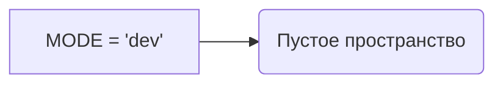

# Анализ кода файла `hypotez/src/suppliers/ivory/login.py`

## <input code>

```python
## \file hypotez/src/suppliers/ivory/login.py
# -*- coding: utf-8 -*-\
#! venv/Scripts/python.exe
#! venv/bin/python/python3.12

"""
.. module: src.suppliers.ivory 
	:platform: Windows, Unix
	:synopsis:

"""
MODE = 'dev'

"""
	:platform: Windows, Unix
	:synopsis:

"""


"""
	:platform: Windows, Unix
	:synopsis:

"""


"""
  :platform: Windows, Unix

"""
"""
  :platform: Windows, Unix
  :platform: Windows, Unix
  :synopsis:
"""MODE = 'dev'
  
""" module: src.suppliers.ivory """


""" supplier: IVORY """
```

## <algorithm>

Алгоритм в данном коде отсутствует.  Файл содержит только комментарии и константу `MODE`.  Поскольку в нём нет операторов, циклов и функций, нет смысла строить блок-схему.

## <mermaid>



## <explanation>

Этот файл `login.py` представляет собой, скорее всего, фрагмент проекта, связанный с системой авторизации для поставщика услуг под названием "Ivory". Он находится внутри иерархии папок `hypotez/src/suppliers/ivory/`.  Ключевые моменты:

* **Комментарии**: Файл заполнен многострочными документационными строками (`"""Docstring"""`).  Они содержат информацию о модуле, платформе и предполагаемой функциональности. В данном случае они бесполезны, поскольку не поддерживают работу кода.  Они скорее служат для документации, но в таком виде не приносят никакой пользы.
* **Константа `MODE`**:  Определена глобальная константа `MODE` со значением `'dev'`. Вероятно, она определяет режим работы (например, "разработка" или "производство"). Такая переменная будет использоваться где-то ещё в кодовой базе.

**Связи с другими частями проекта:**

Значение `MODE = 'dev'` в данном модуле должно использоваться другими модулями или функциями проекта для выбора различных настроек, поведения или данных в зависимости от стадии разработки.  Например, в модулях, отвечающих за логику работы с базой данных, могут быть разные способы конфигурации подключения для режимов разработки и релиз.  Без остального кода проекта сложно говорить о точном назначении этой константы.

**Возможные ошибки и улучшения:**

* **Избыточные комментарии**:  Комментарии не описывают какой-либо код.
* **Отсутствие функциональности**: Файл не содержит функциональности, кроме определения константы.
* **Несоответствующая структура**: Не должно быть стольких пустых комментариев в файле.  Комментарии должны соответствовать содержимому модуля.

В целом, код не выполняет никаких действий, кроме определения переменной, и нуждается в значительном развитии, чтобы стать функциональным модулем авторизации.