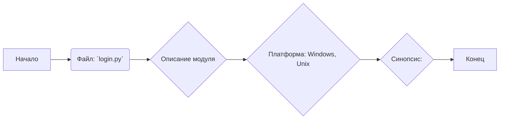
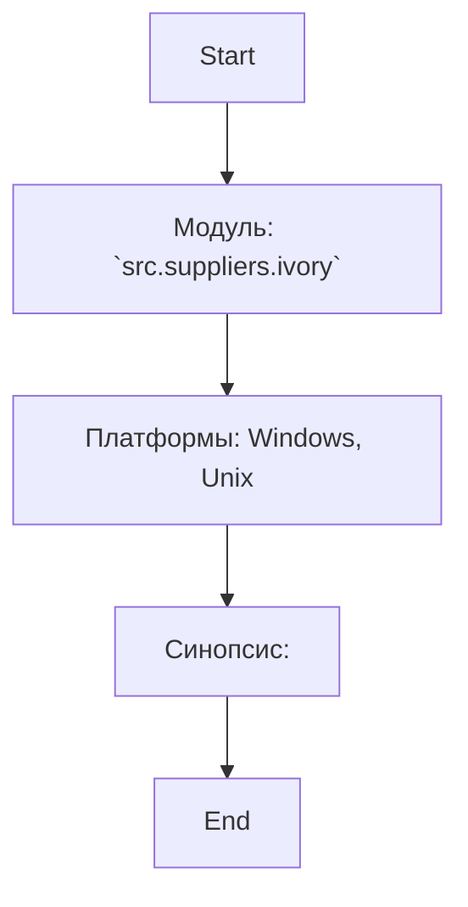

## Анализ кода `hypotez/src/suppliers/ivory/login.py`

### 1. <алгоритм>

Код в файле `hypotez/src/suppliers/ivory/login.py` представляет собой заголовочный файл с информацией о модуле, платформе и синопсисе. Он не содержит исполняемого кода, функций или классов.

**Блок-схема:**

**Пример:**

Файл начинается с комментариев, указывающих на расположение файла, кодировку, пути к интерпретаторам Python, за которыми следует описание модуля, платформы и синопсиса.

### 2. <mermaid>

**Объяснение зависимостей:**

В данном коде не используются импорты или зависимости, поэтому диаграмма `mermaid` отражает только описание самого файла. 

### 3. <объяснение>

**Импорты:**

В данном файле нет импортов.

**Классы:**

В данном файле не определены классы.

**Функции:**

В данном файле не определены функции.

**Переменные:**

В данном файле нет переменных.

**Объяснение:**

Файл `login.py` в текущей версии содержит только комментарии, которые предоставляют информацию о модуле `src.suppliers.ivory`, указывая, что он предназначен для работы на платформах Windows и Unix. Синопсис не содержит дополнительной информации.

**Потенциальные ошибки и области для улучшения:**

-   **Отсутствие функциональности:** На данный момент файл не выполняет никаких действий и не содержит кода, который бы выполнял какую-либо логику.
-   **Неопределенный синопсис:** Синопсис пуст, что не предоставляет никакой информации о назначении файла.
-   **Повторяющиеся комментарии:** Комментарии о платформе и синопсисе повторяются без явной причины, что выглядит избыточно.

**Цепочка взаимосвязей с другими частями проекта:**

Так как файл `login.py` в текущем состоянии не содержит исполняемого кода, он не взаимодействует с другими частями проекта. Однако, исходя из его расположения в `src/suppliers/ivory`, можно предположить, что в будущем он будет связан с модулями, отвечающими за авторизацию или получение доступа к ресурсам поставщика `IVORY`. Взаимодействие с другими частями проекта будет зависеть от реализации функциональности в этом файле и других модулях в дальнейшем.

**Рекомендации:**

-   Добавить функциональность для логина, используя, например, API поставщика `IVORY`.
-   Добавить синопсис с описанием назначения файла.
-   Удалить избыточные комментарии.