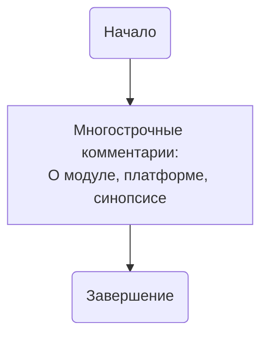

## Анализ кода `hypotez/src/suppliers/ivory/login.py`

### <алгоритм>

1. **Начало**: Запуск скрипта `login.py`.
2. **Импорт**: Отсутствуют явные импорты библиотек или модулей.
3. **Комментарии**: Присутствуют многострочные комментарии, содержащие информацию о модуле, платформе и синопсисе, но не содержащие фактического кода.
4. **Завершение**: Скрипт завершает выполнение без каких-либо действий.

**Примеры:**

-   **Начало**: Скрипт запускается интерпретатором Python.
-   **Импорт**: Нет операций импорта, что означает, что код не использует внешние модули.
-   **Комментарии**: Комментарии описывают модуль, платформы и синопсис, не оказывая влияния на выполнение программы.
-   **Завершение**: После анализа комментариев скрипт завершается, не выполняя каких-либо действий.

### <mermaid>

### <объяснение>

**Импорты**:

-   В коде нет явных импортов. Это означает, что скрипт `login.py` в текущем виде не использует внешние модули или библиотеки. Отсутствие импортов указывает на то, что данный файл может быть либо заготовкой, либо файлом, который предназначен для реализации функциональности в будущем.

**Классы**:

-   В данном коде отсутствуют объявления классов. Это может быть связано с тем, что код предназначен для выполнения простых операций или является частью большего модуля, где классы определены в других файлах.

**Функции**:

-   В коде нет объявлений функций. Скрипт не выполняет никаких явных действий, кроме чтения многострочных комментариев.

**Переменные**:

-   В коде отсутствуют объявления переменных. Это говорит о том, что скрипт не манипулирует никакими данными.

**Потенциальные ошибки или области для улучшения**:

-   **Отсутствие функциональности:** В текущем состоянии скрипт не выполняет никаких действий. Это основная проблема, которую следует исправить.
-   **Отсутствие импортов:**  Необходимо импортировать необходимые модули для дальнейшей разработки.
-   **Отсутствие логики:** Отсутствует логика аутентификации или работы с поставщиком IVORY.
-   **Комментарии:** Хотя комментарии полезны, они не заменяют фактического кода. Необходимо добавить код, который будет соответствовать назначению файла `login.py`.

**Цепочка взаимосвязей с другими частями проекта**:

-   Предположительно, `login.py` должен обрабатывать логику входа для поставщика IVORY. Он должен взаимодействовать с другими модулями, которые обрабатывают запросы API, сохраняют данные сессии и т.д.
-   Из-за отсутствия импортов и функциональности, сейчас не ясно, какие модули `src` будут задействованы.

В целом, файл `hypotez/src/suppliers/ivory/login.py` является заготовкой, не содержащей функционального кода. Требуется дополнить его логикой аутентификации, импортировать необходимые модули и добавить обработку необходимых данных.