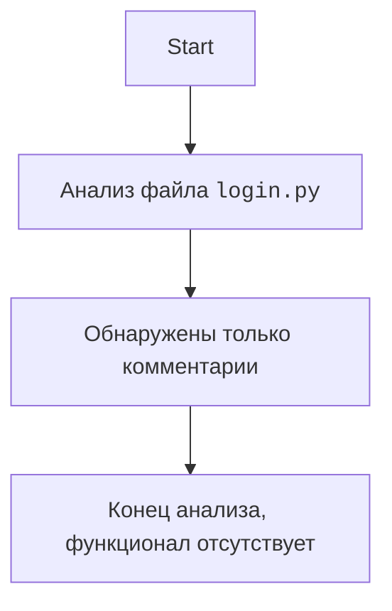

## ИНСТРУКЦИЯ:

Анализируй предоставленный код подробно и объясни его функциональность. Ответ должен включать три раздела:

1. **<алгоритм>**: Опиши рабочий процесс в виде пошаговой блок-схемы, включая примеры для каждого логического блока, и проиллюстрируй поток данных между функциями, классами или методами.
2. **<mermaid>**: Напиши код для диаграммы в формате `mermaid`, проанализируй и объясни все зависимости,
    которые импортируются при создании диаграммы.
    **ВАЖНО!** Убедитесь, что все имена переменных, используемые в диаграмме `mermaid`,
    имеют осмысленные и описательные имена. Имена переменных вроде `A`, `B`, `C`, и т.д., не допускаются!

    **Дополнительно**: Если в коде есть импорт `import header`, добавьте блок `mermaid` flowchart, объясняющий `header.py`:
    ```mermaid
    flowchart TD
        Start --> Header[<code>header.py</code><br> Determine Project Root]

        Header --> import[Import Global Settings: <br><code>from src import gs</code>]
    ```

3. **<объяснение>**: Предоставьте подробные объяснения:
   - **Импорты**: Их назначение и взаимосвязь с другими пакетами `src.`.
   - **Классы**: Их роль, атрибуты, методы и взаимодействие с другими компонентами проекта.
   - **Функции**: Их аргументы, возвращаемые значения, назначение и примеры.
   - **Переменные**: Их типы и использование.
   - Выделите потенциальные ошибки или области для улучшения.

Дополнительно, постройте цепочку взаимосвязей с другими частями проекта (если применимо).

Это обеспечивает всесторонний и структурированный анализ кода.
## Формат ответа: `.md` (markdown)
**КОНЕЦ ИНСТРУКЦИИ**
## Анализ кода `hypotez/src/suppliers/ivory/login.py`

### <алгоритм>

Поскольку предоставленный код состоит только из комментариев и заголовка файла,  алгоритм будет крайне простым:

1.  **Начало**: Запуск скрипта `login.py`.
2.  **Комментарии**: Скрипт не выполняет никаких действий, кроме объявления метаданных через комментарии.
3.  **Завершение**: Скрипт завершает свою работу, не выполняя никаких функциональных операций.

**Пример:**

```
Начало --> Комментарии --> Завершение
```

### <mermaid>


**Объяснение `mermaid` диаграммы:**

1.  **`Start`**: Начало процесса анализа.
2.  **`FileAnalysis`**: Блок, представляющий процесс анализа содержимого файла `login.py`.
3.  **`Comments`**: Блок, указывающий, что в файле обнаружены только комментарии.
4.  **`End`**: Конец анализа, вывод: функционал отсутствует.

### <объяснение>

**Импорты:**

Код не содержит импортов. Это указывает на то, что данный файл в текущем состоянии не использует никаких внешних модулей или пакетов.

**Классы:**

Код не содержит определений классов.

**Функции:**

Код не содержит определений функций.

**Переменные:**

Код не содержит переменных.

**Объяснение и анализ:**

-   Предоставленный файл `login.py` в директории `src/suppliers/ivory` служит скорее как заготовка или шаблон. Он содержит только комментарии, определяющие метаданные файла (кодировка,shebang,  платформу, синопсис, название модуля и поставщика) и не имеет фактического программного кода.
-   Файл, вероятно, задумывался как место для будущей реализации логики входа в систему для поставщика Ivory, но в текущем виде не предоставляет никакого функционала.
-   Отсутствие импортов и кода означает, что он не зависит от других частей проекта на данный момент.
-   **Потенциальные улучшения:**
    -   Необходимо добавить код для обработки логики входа в систему, включая, возможно, взаимодействие с API поставщика, проверку аутентификации и т. д.
    -   Необходимо добавить импорты необходимых модулей (например, для работы с HTTP, обработки данных и т.д.).
    -   Рекомендуется реализовать функции для обработки различных этапов процесса аутентификации, а также классы, если требуется хранить состояния или другие данные, связанные с процессом аутентификации.

**Цепочка взаимосвязей:**

В текущем состоянии нет взаимосвязей с другими частями проекта, так как файл не имеет функциональности. Однако, после реализации логики, он может зависеть от:

-   `src.gs` (глобальные настройки проекта, если необходимо использовать какие-либо глобальные параметры)
-   `src.api` (модули для взаимодействия с API, если потребуется работа с API поставщика Ivory)
-   `src.utils` (модули с вспомогательными функциями, если потребуется дополнительная логика обработки)

В дальнейшем, `login.py` будет частью логики поставщика `ivory` и будет использоваться в рамках всего проекта, например, для получения данных от этого поставщика.