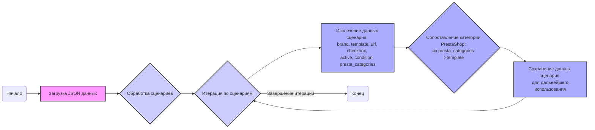

## <алгоритм>

1.  **Начало:** Данные представляют собой JSON-объект, содержащий поле `scenarios`, которое является словарем. Ключи этого словаря – это описания сценариев (например, `"COOLERMASTER MID TOWER"`), а значения – это словари, представляющие конфигурацию каждого сценария.
2.  **Итерация по сценариям:** Проходим по каждому элементу словаря `scenarios`. Ключ - `scenario_name` (например, `"COOLERMASTER MID TOWER"`), значение - `scenario_data` (словарь с информацией о сценарии).
3.  **Извлечение данных сценария:** Для каждого сценария извлекаем следующие поля:
    *   `brand`: Бренд продукта (например, `"COOLER MASTER"`).
    *   `template`: Шаблон (в данном случае всегда пустая строка `""`).
    *   `url`: URL-адрес для веб-скрейпинга.
    *   `checkbox`: Логическое значение, указывающее на использование чекбокса (`false`).
    *   `active`: Логическое значение, указывающее на активность сценария (`true`).
     *   `condition`: Cостояние товара (`"new"`).
    *   `presta_categories`: Словарь, содержащий `template`, который является словарем, где ключом является бренд в нижнем регистре (`"cooler master"`) и значением -  категория товара (например, `"MID TOWER"`).
4.  **Пример для сценария `"COOLERMASTER MID TOWER"`:**
    *   `brand` = `"COOLER MASTER"`
    *   `template` = `""`
    *   `url` = `"https://www.morlevi.co.il/Cat/285?p_315=74&p_124=540&sort=datafloat2%2Cprice&keyword="`
    *   `checkbox` = `false`
    *   `active` = `true`
    *   `condition` = `"new"`
    *   `presta_categories` = `{"template": {"cooler master": "MID TOWER"}}`

5.  **Пример для сценария `"COOLERMASTER gaming full tower"`:**
    *   `brand` = `"COOLER MASTER"`
    *   `template` = `""`
    *   `url` = `"----------------------------COOLER MASTER gaming full TOWER--------------------------------"`
    *   `checkbox` = `false`
    *   `active` = `true`
     *   `condition` = `"new"`
    *   `presta_categories` = `{"template": {"cooler master": "GAMING FULL TOWER"}}`

6.  **Использование:** Эта структура данных предназначена для настройки параметров веб-скрейпинга и сопоставления полученных данных с предопределенными категориями в PrestaShop, на основе URL-адресов и брендов. Сценарии используются для определения, как обрабатывать данные с разных страниц веб-сайта.

## <mermaid>

## <объяснение>

**Структура данных:**

*   **JSON Object:**
    *   Объект JSON содержит единственный ключ `scenarios`.
    *   `scenarios` является словарем (dictionary), где каждый ключ представляет собой имя сценария.
    *   Значение каждого ключа в `scenarios` - это словарь, который содержит настройки для конкретного сценария.

*   **Словарь сценария:** Каждый сценарий (например, `"COOLERMASTER MID TOWER"`) представлен словарем со следующими ключами:
    *   `brand`: Строка, определяющая бренд продукта (например, `"COOLER MASTER"`).
    *   `template`: Строка, представляющая шаблон (в данном случае всегда пустая строка `""`).
    *   `url`: Строка, содержащая URL-адрес для веб-скрейпинга.
    *   `checkbox`: Булево значение, указывающее на использование чекбокса (всегда `false`).
    *   `active`: Булево значение, указывающее, активен ли сценарий (всегда `true`).
    *   `condition`: Состояние товара (всегда `"new"`).
    *   `presta_categories`: Словарь, содержащий ключ `template`, значением которого является словарь.  В этом словаре ключ  `"cooler master"`  (бренд в нижнем регистре) соответствует категории PrestaShop, например, `"MID TOWER"`, `"FULL TOWER"`.

**Назначение:**

*   Этот JSON-файл предназначен для конфигурации процесса веб-скрейпинга для сайта morlevi.co.il и сопоставления полученных данных с категориями PrestaShop.
*   Каждый сценарий определяет, как обрабатывать определенный набор продуктов, основываясь на их URL-адресах и брендах.
*   Поле `url` используется для указания целевой страницы для скрейпинга.
*   Поле `presta_categories` используется для определения соответствия товара категории в PrestaShop.
    `"template": { "cooler master": "MID TOWER" }` означает, что если бренд товара `"cooler master"`, то его нужно отнести к категории `"MID TOWER"` PrestaShop.

**Анализ:**

*   **Отсутствие гибкости:** Значение `template` всегда пустое. Это может быть потенциальной проблемой, если в дальнейшем потребуется использовать шаблоны.
*   **Дублирование данных:** Бренд ("COOLER MASTER") повторяется в каждом сценарии, а также в `presta_categories`. Это может быть не оптимально с точки зрения хранения данных.
*   **Неуниверсальность URL:**  URL-адреса выглядят привязанными к конкретному сайту и параметрам. Это может затруднить повторное использование кода с другими сайтами.
*    **Негибкая структура:** Если в дальнейшем понадобится добавить больше свойств для товара, то придется изменять структуру JSON файла.
*    **Особый случай url:**  В одном из сценариев  `"COOLERMASTER gaming full tower"` поле `url` содержит  `"----------------------------COOLER MASTER gaming full TOWER--------------------------------"`, что явно указывает на некорректное значение. Это может привести к ошибкам при обработке данных.

**Возможные улучшения:**

*   Рассмотреть возможность использования шаблонов для обработки `template`.
*   Реорганизовать структуру данных для устранения дублирования и улучшения читаемости.
*   Использовать более гибкий подход для определения категорий PrestaShop, например, используя regex.
*   Проверять валидность URL-адресов.
*   Улучшить обработки исключительных ситуаций, таких как некорректные значения URL.

**Взаимосвязь с другими частями проекта:**

Этот файл, вероятно, используется в каком-то модуле веб-скрейпинга и импорта данных в PrestaShop. Он определяет, какие страницы нужно скрейпить, и как сопоставлять полученные данные с категориями PrestaShop.