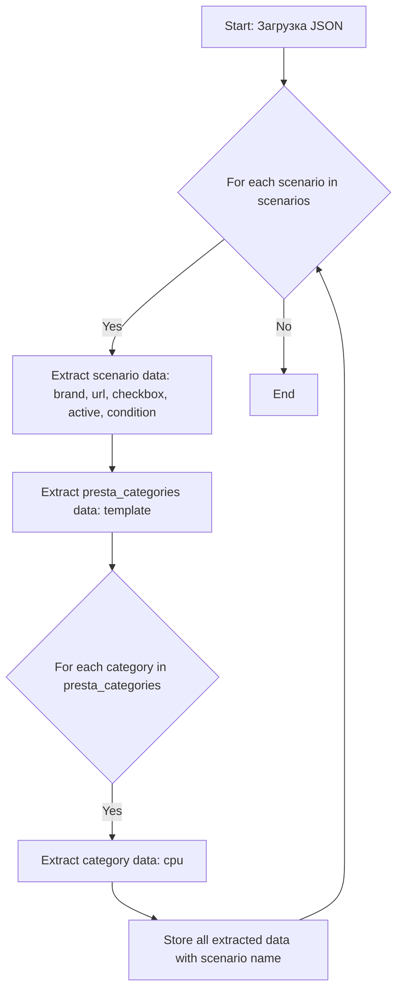
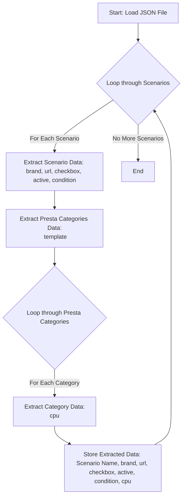

## ИНСТРУКЦИЯ:

Анализируй предоставленный код подробно и объясни его функциональность. Ответ должен включать три раздела:  

1.  **<алгоритм>**: Опиши рабочий процесс в виде пошаговой блок-схемы, включая примеры для каждого логического блока, и проиллюстрируй поток данных между функциями, классами или методами.  
2.  **<mermaid>**: Напиши код для диаграммы в формате `mermaid`, проанализируй и объясни все зависимости, 
    которые импортируются при создании диаграммы. 
    **ВАЖНО!** Убедитесь, что все имена переменных, используемые в диаграмме `mermaid`, 
    имеют осмысленные и описательные имена. Имена переменных вроде `A`, `B`, `C`, и т.д., не допускаются!  
    
    **Дополнительно**: Если в коде есть импорт `import header`, добавьте блок `mermaid` flowchart, объясняющий `header.py`:\
    ```mermaid\
    flowchart TD\
        Start --> Header[<code>header.py</code><br> Determine Project Root]\
    
        Header --> import[Import Global Settings: <br><code>from src import gs</code>] \
    ```
3.  **<объяснение>**: Предоставьте подробные объяснения:  
    - **Импорты**: Их назначение и взаимосвязь с другими пакетами `src.`.  
    - **Классы**: Их роль, атрибуты, методы и взаимодействие с другими компонентами проекта.  
    - **Функции**: Их аргументы, возвращаемые значения, назначение и примеры.  
    - **Переменные**: Их типы и использование.  
    - Выделите потенциальные ошибки или области для улучшения.  

Дополнительно, постройте цепочку взаимосвязей с другими частями проекта (если применимо).  

Это обеспечивает всесторонний и структурированный анализ кода.
## Формат ответа: `.md` (markdown)
**КОНЕЦ ИНСТРУКЦИИ**

## <алгоритм>

Представленный JSON-файл содержит структуру данных, описывающую сценарии для парсинга категорий процессоров (CPU) с веб-сайта morlevi.co.il. Каждый сценарий включает информацию о конкретной модели процессора, включая URL для парсинга, бренд, состояние и настройки для категорий PrestaShop.
**Блок-схема**



**Примеры для логических блоков:**
1. **A: Загрузка JSON:** Загружается JSON-файл `morlevi_categories_cpu.json`.
2. **B: Цикл по сценариям:** Перебираем ключи (например, `"Intel  CELERON LGA1200 Gen 10"`) в словаре `scenarios`.
3. **C: Извлечение данных сценария:** Для сценария `"Intel  CELERON LGA1200 Gen 10"` извлекаются `brand` (`"INTEL"`), `url` (`"https://www.morlevi.co.il/Cat/337?p_134=584&sort=datafloat2%2Cprice&keyword="`), `checkbox` (`false`), `active` (`true`), `condition` (`"new"`).
4. **D: Извлечение данных presta_categories:** Для того же сценария извлекается `template` (`{"cpu": "INTEL CELERON LGA1200"}`).
5. **E: Цикл по категориям presta_categories:** В данном случае, цикл будет выполнен только один раз, т.к. есть только один элемент `template`
6. **F: Извлечение данных категории:** Для ключа `"template"` извлекается `cpu` (`"INTEL CELERON LGA1200"`).
7. **G: Сохранение данных:** Все извлеченные данные (`"Intel  CELERON LGA1200 Gen 10"`, `brand`:`"INTEL"`,  `url`:`"https://www.morlevi.co.il/Cat/337?p_134=584&sort=datafloat2%2Cprice&keyword="`, `checkbox`:`false`, `active`:`true`, `condition`:`"new"`, `cpu`:`"INTEL CELERON LGA1200"`)  сохраняются.
8. **B: Следующий сценарий:**  Цикл переходит к следующему сценарию (например, `"Intel  CELERON LGA1200 Gen 11"`).
9. **H: Конец:** После перебора всех сценариев работа заканчивается.

## <mermaid>


**Анализ диаграммы:**
1.  **A (Start: Load JSON File):** Начало процесса, когда загружается JSON файл со списком сценариев для парсинга.
2.  **B (Loop through Scenarios):** Основной цикл, который проходит по каждому сценарию, определенному в JSON.
3.  **C (Extract Scenario Data):** Из каждого сценария извлекаются основные данные, такие как `brand`, `url`, `checkbox`, `active`, и `condition`. Эти данные описывают общие параметры для парсинга товаров.
4.  **D (Extract Presta Categories Data):** Извлекаются данные о категориях PrestaShop, в частности шаблон (`template`) для связывания товаров с категориями.
5.   **E (Loop through Presta Categories):** Цикл, который проходит по категориям, указанным в `presta_categories`.
6.  **F (Extract Category Data):** Извлекаются данные для каждой категории PrestaShop, в частности данные `cpu`.
7.  **G (Store Extracted Data):** Все извлеченные данные для каждого сценария и его категорий сохраняются.
8.  **H (End):** Завершение обработки JSON файла.

## <объяснение>

**Описание структуры JSON:**
Представленный JSON-файл представляет собой словарь, содержащий ключ `"scenarios"`, значением которого является другой словарь. Этот внутренний словарь содержит ключи, представляющие собой названия различных моделей процессоров, и значения, описывающие конфигурацию парсинга для каждой из них.
**Импорты:**
В данном коде нет импортов, т.к. это просто структура данных в формате JSON. В контексте проекта `hypotez`, этот JSON будет загружен и использован другими модулями.

**Классы:**
В этом коде нет классов. Это файл конфигурации в формате JSON.

**Функции:**
В этом файле нет функций. Это файл конфигурации в формате JSON.

**Переменные:**
-   `scenarios`:  Словарь, содержащий сценарии для парсинга. Ключами являются названия моделей процессоров, а значениями –  словари с настройками парсинга.
-   `brand`: Строка, представляющая бренд процессора (например, `"INTEL"`).
-   `url`: Строка, содержащая URL для парсинга.
-   `checkbox`: Логическое значение, указывающее, нужно ли использовать чекбокс (не используется в данном коде).
-   `active`: Логическое значение, указывающее, активен ли сценарий.
-    `condition`: Строка, представляющая состояние товара (например, `"new"`).
-    `presta_categories`: Словарь, содержащий данные для категорий PrestaShop.
    -   `template`: Словарь, содержащий шаблон для связи товаров с категориями.
        -  `cpu`: Строка, представляющая название категории CPU в PrestaShop.
**Примеры переменных:**
-    Для сценария `Intel CELERON LGA1200 Gen 10`:
    -   `brand` = `"INTEL"`
    -   `url` = `"https://www.morlevi.co.il/Cat/337?p_134=584&sort=datafloat2%2Cprice&keyword="`
    -   `checkbox` = `false`
    -   `active` = `true`
    -    `condition` = `"new"`
    -    `presta_categories` = `{"template": {"cpu": "INTEL CELERON LGA1200"}}`

**Объяснения:**
- **Структура файла**:
   - JSON-файл является конфигурационным файлом для парсера.
   - Он содержит список сценариев, каждый из которых описывает, как нужно обрабатывать определенную категорию процессоров на сайте morlevi.co.il.
   - Каждый сценарий содержит URL, параметры и соответствие категориям PrestaShop.

- **Назначение**:
  -  Основное назначение данного JSON файла - предоставить конфигурацию для автоматизированного парсинга данных с сайта morlevi.co.il и связывания товаров с категориями в PrestaShop.

- **Взаимосвязь с другими частями проекта:**
    -   Этот JSON-файл, вероятно, используется скриптами Python в проекте `hypotez` для автоматизации сбора данных о процессорах с сайта morlevi.co.il и дальнейшего импорта в базу данных PrestaShop.
    -  Скрипты будут загружать этот JSON итерироваться по сценариям, и использовать извлеченные данные для парсинга и формирования данных для PrestaShop.

**Потенциальные ошибки и улучшения:**

* **Отсутствие проверок данных**:
  -  В JSON нет проверок на типы данных.
  -  Желательно добавить валидацию на стороне кода при обработке JSON, чтобы убедиться, что типы данных соответствуют ожиданиям (например, что `url` всегда является строкой).
* **Повторяющиеся данные**:
   -  Многие сценарии имеют одинаковые значения для `brand`, `checkbox`, `active` и `condition`.
  - Можно рассмотреть вынесение этих общих параметров на уровень выше или использовать наследование для уменьшения дублирования.
* **Сложная структура для категорий PrestaShop**:
    -   В текущем виде структура категорий `presta_categories` может усложниться, если потребуется больше уровней вложенности или сложная логика соответствия.
  -  Можно рассмотреть использование более гибкого формата для категорий PrestaShop, например,  словарь с  ключами `id`, `name`, `parent_id` и т.д.
* **Жестко заданные значения:**
  -   Значения в поле `cpu` привязаны к конкретным моделям, и могут быть изменены в будущем.
  -   Желательно рассмотреть возможность вынесения этих значений в отдельную базу данных или файл конфигурации.

В целом, JSON-файл хорошо структурирован и выполняет свою роль конфигурационного файла. Однако,  следует добавить проверки для обработки данных и учесть возможность  изменения логики соответствия PrestaShop.