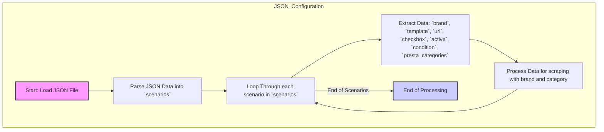

## АНАЛИЗ JSON-КОДА

### 1. <алгоритм>

Данный JSON-файл представляет собой конфигурацию для обработки данных о наушниках разных брендов с сайта Morlevi. Он структурирован в виде словаря с ключом `scenarios`, который, в свою очередь, содержит словарь, где каждый ключ является идентификатором сценария (например, "HEADSET_LOGITECH").

**Блок-схема:**

1.  **Начало**: Загрузка JSON-файла.
2.  **Разбор**: Извлечение словаря `scenarios`.
    *   **Пример:** `scenarios` это словарь: 
    ```python
       {
        "HEADSET_LOGITECH": { ... },
        "HEADSET_MICROSOFT": { ... },
        "HEADSET_ZALMAN": { ... },
        "HEADSET_CORSAIR": { ... },
        "HEADSET_COOLER MASTER": { ... }
       }
    ```
3.  **Цикл по сценариям**: Перебор ключей (идентификаторов сценариев).
    *   **Пример**: Первый ключ - `HEADSET_LOGITECH`
4.  **Извлечение данных сценария**: Для каждого сценария извлекаются данные о бренде, шаблоне, URL, активности, состоянии и категориях PrestaShop.
    *   **Пример для `HEADSET_LOGITECH`**:
        *   `brand`: "LOGITECH"
        *   `template`: "HEADSET_LOGITECH"
        *   `url`: "https://www.morlevi.co.il/Cat/162?p_315=29&sort=datafloat2%2Cprice&keyword="
        *   `checkbox`: `false`
        *   `active`: `true`
        *   `condition`: "new"
        *   `presta_categories`: `{"template": {"logitech": "HEADPHONES"}}`
5.  **Обработка данных**: Данные каждого сценария используются для настройки процесса сбора данных о наушниках с сайта Morlevi. Конкретные действия будут зависеть от остальной части системы.
    *   **Пример**: URL используется для получения HTML-кода страницы, бренд используется для определения какой парсер необходимо вызвать, `presta_categories` используется для определения категории товара в интернет-магазине.
6.  **Конец**: После обработки всех сценариев.

### 2. <mermaid>



**Объяснение:**

*   `Start`: Начальная точка процесса, обозначает загрузку JSON-файла.
*   `ParseJSON`: Разбор JSON-данных и извлечение словаря `scenarios`.
*   `LoopThroughScenarios`: Цикл, который перебирает каждый сценарий в `scenarios`.
*   `ExtractScenarioData`: Извлечение ключевых данных из каждого сценария, таких как `brand`, `template`, `url` и другие параметры.
*   `ProcessScenario`: Обработка полученных данных для сбора данных с веб-сайта, используя `brand` и `presta_categories` для определения логики.
*   `End`: Конечная точка процесса, обозначающая завершение обработки всех сценариев.
*   Связи: Стрелки показывают поток управления, демонстрируя последовательность операций.

### 3. <объяснение>

**Общее описание:**

Этот JSON-файл является конфигурационным файлом, предназначенным для управления сценариями сбора данных о наушниках с сайта Morlevi. Каждый сценарий описывает параметры для конкретного бренда, включая URL страницы, шаблон, состояние, активность, а также соответствие категориям в интернет-магазине PrestaShop.

**Детали:**

*   **Импорты:** В данном коде нет явных импортов. Этот файл содержит лишь JSON-данные, которые будут использоваться в других частях программы. Следовательно, явных импортов нет.  Если этот файл загружается в python то будут  использованы `import json`

*   **`scenarios` (словарь)**:
    *   `HEADSET_LOGITECH`, `HEADSET_MICROSOFT`, `HEADSET_ZALMAN`, `HEADSET_CORSAIR`, `HEADSET_COOLER MASTER`: Это ключи, представляющие идентификаторы отдельных сценариев. Каждый идентификатор содержит настройки для определенного бренда наушников.
    *   **Значение**: Словарь, который содержит:
        *   `brand` (строка): Название бренда (например, "LOGITECH", "MICROSOFT"). Используется для определения логики работы парсера и для фильтрации товаров на сайте.
        *   `template` (строка): Шаблон для обработки, соответствующий бренду, возможно для парсинга конкретных частей HTML-кода.
        *   `url` (строка): URL страницы на сайте Morlevi, содержащий список наушников данного бренда. Используется для парсинга HTML-кода.
        *   `checkbox` (логическое): Флаг (видимо, связанный с каким-то интерфейсом или проверкой)
        *   `active` (логическое): Флаг, определяющий, активен ли данный сценарий. Если `false`, то сценарий не должен выполняться.
        *   `condition` (строка): Указывает на состояние товаров, в данном случае "new".
        *   `presta_categories` (словарь):
            *   `template` (словарь):
                *   Ключ (например, `"logitech"`): Идентификатор для сопоставления.
                *   Значение (`"HEADPHONES"`): Категория товара в PrestaShop. Используется для назначения категорий импортируемым товарам.

**Пример использования:**

В Python это может выглядеть так:

```python
import json

with open('hypotez/src/suppliers/ivory/scenarios/morlevi_categories_headsets.json', 'r') as f:
    data = json.load(f)

scenarios = data['scenarios']

for scenario_id, scenario_data in scenarios.items():
    print(f"Scenario: {scenario_id}")
    print(f"  Brand: {scenario_data['brand']}")
    print(f"  URL: {scenario_data['url']}")
    print(f"  Presta Category: {scenario_data['presta_categories']['template']}")
    # Вызов функций парсера
    
```

**Потенциальные улучшения:**

1.  **Валидация данных**: Добавление схемы валидации JSON, чтобы гарантировать наличие необходимых ключей и правильный тип данных.
2.  **Обработка ошибок**: Добавить обработку возможных исключений при доступе к данным, например, если какие-либо ключи отсутствуют.
3.  **Гибкость**: Возможность задания дополнительных параметров для каждого сценария, если в будущем понадобится более сложная логика обработки.
4.  **Комментарии**:  Добавить комментарии для каждого ключа, чтобы сделать JSON-файл более понятным.

**Взаимосвязь с другими частями проекта:**

Этот файл является конфигурационным и используется другими частями проекта, вероятно, связанными со сбором и обработкой данных с веб-сайтов, таких как `scrapers` и `presta`. Этот файл определяет, какие данные и откуда необходимо получить. Логика обработки данных, скорее всего, находится в других файлах (`.py`).