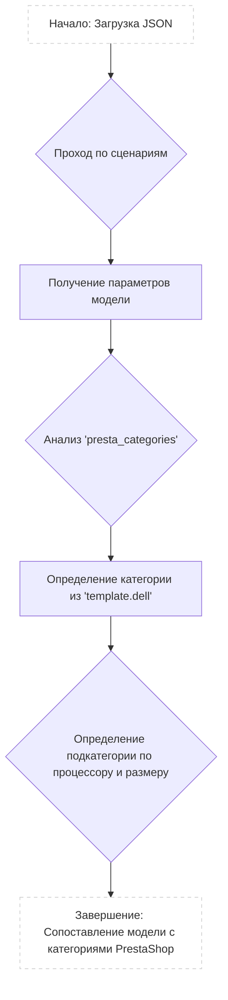

## <алгоритм>

Этот JSON-файл представляет собой конфигурацию для сопоставления моделей ноутбуков Dell с категориями в PrestaShop (или аналогичной системе электронной коммерции). Каждая модель ноутбука (например, "DELL 11.6 I3") имеет свои атрибуты и правила категоризации.

**Пошаговый процесс:**

1.  **Начало:** JSON-файл определяет объект `scenarios`.
    *   Пример:
        ```json
        {
        "scenarios": {
        ...
        }
        }
        ```

2.  **Итерация по сценариям:** Проходим по каждому ключу (названию модели) внутри объекта `scenarios`.
    *   Пример: "DELL 11.6 I3", "DELL 11.6 I5", "DELL 13.4 - 13.3 I3" и т.д.

3.  **Анализ параметров сценария:** Для каждого сценария (модели) получаем набор параметров.
    *   `brand`: Строка, представляющая бренд ноутбука (всегда "DELL").
    *   `url`: Строка, содержащая URL-адрес, если он есть (в большинстве случаев `null`, но иногда содержит URL-адрес страницы конкретной модели).
    *   `checkbox`: Логическое значение (всегда `false`).
    *   `active`: Логическое значение (всегда `true`, что указывает, что сценарий активен).
    *   `condition`: Строка (всегда "new").
    *   `presta_categories`: Объект, содержащий правила сопоставления категорий PrestaShop.
    *  `presta_categories.template`: объект с ключом 'dell', значение которого массив строк
4.  **Определение категории:** Внутри `presta_categories.template.dell` массив строк:
    *   Первая строка это категория процессора, например, "LAPTOPS INTEL I3", "LAPTOPS AMD", "LAPTOPS INTEL CELERON".
    *   Вторая строка это диагональ экрана ноутбука, например "11", "13", "14", "15", "17".

5.  **Завершение:** Процесс повторяется для всех моделей ноутбуков в файле.

**Поток данных:**

JSON файл -> Чтение и парсинг -> Итерация по моделям -> Получение параметров каждой модели -> Определение категории PrestaShop -> Результат (сопоставление модели с категориями)

## <mermaid>



**Объяснение диаграммы:**

1.  **`A[Начало: Загрузка JSON]`**: Начальная точка, где происходит загрузка и разбор JSON-файла.
2.  **`B{Проход по сценариям}`**: Итерация по ключам объекта "scenarios", то есть по каждой модели ноутбука Dell (например, "DELL 11.6 I3").
3.  **`C[Получение параметров модели]`**: Извлечение значений параметров для каждой модели, таких как `brand`, `url`, `checkbox`, `active`, `condition` и `presta_categories`.
4.  **`D{Анализ 'presta_categories'}`**: Анализ объекта `presta_categories` для каждой модели, фокусируясь на правилах категоризации.
5.   **`E[Определение категории из 'template.dell']`**:  Определение категорий PrestaShop из массива `template.dell`, где первый элемент - категория процессора, второй - размер экрана.
6.  **`F{Определение подкатегории по процессору и размеру}`**: Определение подкатегории на основе значений процессора и размера экрана, полученных на предыдущем шаге.
7.  **`G[Завершение: Сопоставление модели с категориями PrestaShop]`**: Конечный результат, где каждая модель ноутбука Dell сопоставлена с конкретными категориями PrestaShop.

## <объяснение>

**Импорты:**

В данном JSON-файле нет импортов, так как это файл конфигурации, а не программный код.

**Классы:**

В этом файле нет классов. Это простой JSON-файл, который представляет собой структуру данных.

**Функции:**

В этом файле нет функций. Его цель — предоставить данные для внешних функций, которые будут использовать эту информацию.

**Переменные:**

В этом JSON файле присутствуют следующие переменные:

*   `scenarios` - объект, содержащий все сценарии.
*   `DELL 11.6 I3`, `DELL 11.6 I5`, `DELL 11.6 I7` и т.д. - Ключи объекта `scenarios`, представляющие конкретные модели ноутбуков Dell.
    *   `brand` (string): всегда "DELL".
    *   `url` (string или `null`): URL-адрес страницы продукта, если он есть; в противном случае `null`.
    *   `checkbox` (boolean): всегда `false`.
    *   `active` (boolean): всегда `true`.
    *   `condition` (string): всегда "new".
    *   `presta_categories` (object): содержит правила для категоризации.
        *   `template` (object): содержит шаблоны для конкретного бренда, в данном случае, `dell`.
            *   `dell` (array): массив строк с категорией и размером экрана.

**Объяснение:**

Этот JSON файл предназначен для конфигурации процесса категоризации товаров (ноутбуков Dell) в PrestaShop. Каждая запись (`"DELL 11.6 I3"`, `"DELL 11.6 I5"` и т.д.) определяет соответствие между конкретной моделью ноутбука и категориями PrestaShop, куда она должна быть отнесена.

Поля `brand`, `checkbox`, `active`, `condition` являются статичными для всех моделей, но они могут быть изменены в зависимости от будущих задач.  `url` предназначен для прямой ссылки на страницу, если такая существует, в противном случае `null`.

Ключевым полем является `presta_categories.template.dell`, которое содержит массив из двух строк: первая указывает на основную категорию процессора (например, `"LAPTOPS INTEL I3"`), а вторая - на размер экрана (например, `"11"`).  На основе этих данных, программа может определить категорию для конкретной модели ноутбука в PrestaShop.

**Возможные улучшения:**

1.  **Централизованное хранение категорий:** Категории (например, "LAPTOPS INTEL I3", "11") дублируются в каждой записи. Было бы полезно хранить категории в отдельной структуре (например, массиве или словаре) и ссылаться на них по ключу, чтобы избежать дублирования и упростить поддержку.
2.  **Более сложные правила категоризации:** В текущем виде правила ограничены двумя параметрами (процессор и размер экрана). Возможно, потребуется добавление более сложных правил, учитывающих другие параметры, такие как объем оперативной памяти, тип жесткого диска и т.д.
3.  **Валидация данных:** Стоит добавить валидацию данных при парсинге JSON-файла, чтобы проверить, например, что все обязательные поля присутствуют и имеют правильный тип.
4.  **Добавление описаний категорий:**  Было бы полезно добавить описания категорий.
5.  **Использование ENUM'ов:** Чтобы избежать опечаток и сделать файл более читаемым, возможно было бы полезно использовать ENUM'ы для категорий и размеров экрана.

**Взаимосвязи с другими частями проекта:**

Этот файл, вероятно, используется в части проекта, отвечающей за импорт и синхронизацию товаров с PrestaShop или иной подобной платформой. Например, при импорте нового товара (ноутбука Dell) приложение будет читать этот файл, находить соответствующую модель, и определять, в какую категорию PrestaShop ее поместить.