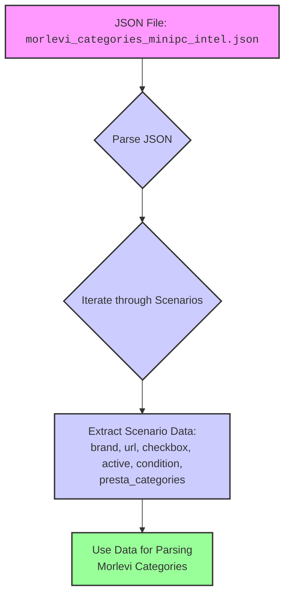

## Анализ кода `hypotez/src/suppliers/ivory/scenarios/morlevi_categories_minipc_intel.json`

### 1. <алгоритм>

Данный JSON файл представляет собой конфигурацию для сценариев парсинга категорий Mini PC от Intel с веб-сайта Morlevi.  Файл содержит объект `scenarios`, который, в свою очередь, содержит объекты, соответствующие категориям Mini PC на основе процессоров Intel (i3, i5, i7, i9, AMD, Celeron). 

Вот пошаговый алгоритм обработки этой конфигурации:

1.  **Чтение JSON файла:** Файл `morlevi_categories_minipc_intel.json` загружается как JSON объект.
    
    *Пример:* `{"scenarios": { ... } }`
2.  **Итерация по сценариям:** Происходит итерация по ключам объекта `scenarios`, где каждый ключ представляет конкретную категорию (например, "INTEL MINIPC I3 8-9th GEN").

    *Пример:* 
    ```
    for key, value in scenarios.items():
        # key = "INTEL MINIPC I3 8-9th GEN"
        # value = {"brand": "INTEL", "url": "...", "checkbox": false, "active": true, "condition": "new", "presta_categories": "159,160"}
        ...
    ```
3.  **Извлечение данных для каждой категории:** Для каждой категории извлекаются значения следующих параметров:
    *   `brand`: Бренд (всегда "INTEL" в данном случае).
    *   `url`: URL-адрес страницы категории на сайте Morlevi.
    *   `checkbox`: Флаг, указывающий, используется ли чекбокс (всегда `false` в данном случае).
    *   `active`: Флаг, указывающий, активна ли категория (всегда `true` в данном случае).
    *   `condition`: Условие товара (всегда `"new"` в данном случае).
    *   `presta_categories`:  Список идентификаторов категорий PrestaShop.
4.  **Использование данных:** Извлеченные данные каждой категории используются для формирования запросов парсинга на сайте Morlevi.

    *Пример:* Для  категории "INTEL MINIPC I3 8-9th GEN", URL `https://www.morlevi.co.il/Cat/127?p_315=3&p_189=3339&sort=datafloat2%2Cprice&keyword=` и `presta_categories` "159,160" используются для парсинга и классификации данных.

### 2. <mermaid>



Диаграмма показывает процесс обработки JSON файла с конфигурациями категорий Mini PC.

*   `A` представляет JSON файл `morlevi_categories_minipc_intel.json`.
*   `B` обозначает процесс разбора JSON.
*   `C` представляет итерацию по сценариям, определенным в JSON.
*   `D` обозначает извлечение данных (brand, url, checkbox, active, condition, presta_categories) для каждого сценария.
*   `E` представляет использование извлеченных данных для парсинга соответствующих категорий на сайте Morlevi.

### 3. <объяснение>

**Импорты:**

В данном коде нет явных импортов, поскольку это JSON файл конфигурации, а не Python код. Этот файл используется другими частями системы.

**Классы:**

Классы отсутствуют, поскольку это JSON файл, который представляет данные в структурированном виде.

**Функции:**

В данном коде нет функций, это JSON файл конфигурации. Однако, этот JSON файл будет использоваться как входные данные для парсинга, скорее всего Python скриптами в проекте.

**Переменные:**

Внутри JSON файла есть переменные, которые используются для конфигурации.

*   `scenarios`: Это объект, содержащий ключи, которые являются названиями категорий (например, "INTEL MINIPC I3 8-9th GEN").
*   `brand`: Строка, представляющая бренд (всегда "INTEL").
*   `url`: Строка, представляющая URL-адрес категории на сайте Morlevi.
*   `checkbox`: Булево значение (всегда `false`). Вероятно, флаг для использования чекбокса на сайте, хотя в данном случае он всегда `false`.
*   `active`: Булево значение (всегда `true`). Флаг, указывающий, что сценарий активен.
*   `condition`: Строка (всегда `"new"`).  Указывает на состояние товара.
*   `presta_categories`: Строка, представляющая идентификаторы категорий в PrestaShop, разделенные запятыми.

**Объяснения:**

1.  **Структура JSON:**
    *   JSON файл содержит объект `scenarios`, который хранит конфигурацию парсинга для различных категорий Mini PC Intel.
    *   Каждый ключ в `scenarios` представляет собой конкретную категорию, а его значение - объект, содержащий детали о данной категории.
    
2.  **Назначение параметров:**
    *   `brand` позволяет однозначно определить производителя.
    *   `url` используется для доступа к странице категории на сайте Morlevi.
    *   `checkbox` может использоваться в будущем, но сейчас не используется (всегда `false`).
    *   `active` позволяет включать или выключать сценарий.
    *   `condition` устанавливает состояние товаров (новые).
    *   `presta_categories` - идентификаторы категорий в PrestaShop, которые используются для организации товаров в базе данных.

3.  **Потенциальные проблемы и улучшения:**
    *   **Жестко заданный бренд**: Параметр `brand` всегда установлен в `"INTEL"`. В будущем, если появятся другие бренды, это значение должно быть параметризовано.
    *   **Отсутствие обработки URL:**  URL'ы для категорий i9, AMD, Celeron содержат заполнители `"-------------INTEL  MINIPC I9---------------- "`. Эти URL необходимо заменить на актуальные.

4. **Взаимосвязи:**
   * Данный файл используется в системе парсинга для получения конфигурации категорий.
   *  `presta_categories` используются для интеграции спарсенных данных с PrestaShop.

**Цепочка взаимосвязей:**

1.  **JSON Configuration:** Файл `morlevi_categories_minipc_intel.json` является отправной точкой, определяющей, какие категории Mini PC Intel следует парсить и как их категоризировать в PrestaShop.
2.  **Parsing Script:** Python-скрипт (вероятно, в модуле `suppliers/ivory/`) читает JSON файл, извлекает данные для каждого сценария и отправляет запросы на веб-сайт Morlevi, используя URL-адреса.
3.  **Data Extraction:** Скрипт парсинга извлекает необходимую информацию с сайта (названия, описания, цены, изображения и т.д.)
4.  **Data Transformation:** Данные приводятся к необходимому формату для загрузки в PrestaShop.
5.  **PrestaShop Integration:** Спаренные данные используются для обновления или создания товаров в PrestaShop с использованием `presta_categories`.

Таким образом, данный JSON файл является ключевым элементом в цепочке обработки данных, начиная с конфигурации и заканчивая обновлением базы данных товаров PrestaShop.