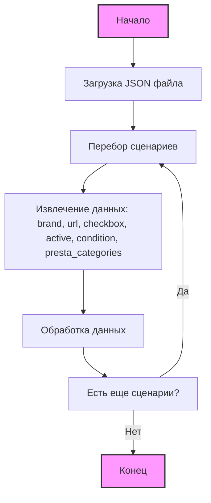

## Анализ `morlevi_categories_monitors_mag.json`

### 1. <алгоритм>

Данный JSON-файл представляет собой конфигурацию для сбора данных о мониторах бренда MAG с сайта morlevi.co.il. 
Структура файла содержит объект `scenarios`, в котором каждый ключ представляет собой конкретный сценарий сбора данных для мониторов определенного размера.

**Блок-схема:**

1.  **Начало:** Загрузка JSON-файла `morlevi_categories_monitors_mag.json`.
2.  **Итерация по `scenarios`:** Перебираем каждый ключ-значение в объекте `scenarios`.
    *   **Пример ключа:** `"MAG 22"`
    *   **Пример значения:** `{"brand": "MAG", "url": "...", "checkbox": false, "active": true, "condition":"new","presta_categories": "127,128,529"}`.
3.  **Извлечение данных:**
    *   Извлекаем `brand` (строка, "MAG").
    *   Извлекаем `url` (строка, URL для сбора данных).
        *   **Пример:** `"https://www.morlevi.co.il/Cat/8?p_315=24&p_350=1805&sort=datafloat2%2Cprice&keyword="`
    *   Извлекаем `checkbox` (логическое значение, `false`).
    *   Извлекаем `active` (логическое значение, `true`).
    *    Извлекаем `condition` (строка, "new")
    *   Извлекаем `presta_categories` (строка, список категорий через запятую).
       *  **Пример:** `"127,128,529"`
4.  **Обработка данных:** Каждый набор данных используется для настройки процесса сбора данных. URL используется для запроса к сайту, `presta_categories` используется для классификации товаров. Остальные параметры используются для фильтрации и активации сценария.
5.  **Повтор:** Возврат к шагу 2 для следующего сценария, пока все сценарии не будут обработаны.
6.  **Конец:** Завершение обработки файла.

**Примеры логических блоков:**

*   **Загрузка файла:** Файл читается из `hypotez/src/suppliers/ivory/scenarios/morlevi_categories_monitors_mag.json`.
*   **Итерация:** Цикл проходит по ключам `"MAG 22"`, `"MAG 24-25"`, `"MAG 27-29"`, `"MAG 32"`, `"MAG 34"`, `"MAG 49"`.
*   **Извлечение:** Для `"MAG 22"`, `brand` = `"MAG"`, `url` = `"https://www.morlevi.co.il/Cat/8?p_315=24&p_350=1805&sort=datafloat2%2Cprice&keyword="`,  `checkbox` = `false`, `active` = `true` , `condition`= `"new"`, `presta_categories` = `"127,128,529"`
*  **Обработка:** URL используется для запроса к сайту, `presta_categories` используются для классификации товаров в PrestaShop.
*   **Конец:** Завершается обработка всех сценариев.

### 2. <mermaid>

**Объяснение `mermaid` диаграммы:**

*   **`Start`**: Начало процесса.
*   **`LoadJSON`**: Загрузка JSON файла `morlevi_categories_monitors_mag.json`.
*   **`LoopScenarios`**: Цикл перебора сценариев внутри объекта `scenarios`.
*   **`ExtractData`**: Извлечение необходимых данных из каждого сценария:
    *   `brand`: Бренд монитора (например, "MAG").
    *   `url`: URL для сбора данных.
    *   `checkbox`: Логическое значение, определяющее нужно ли использовать чекбокс.
    *   `active`: Логическое значение, определяющее активность сценария.
    *   `condition`: Состояние товара (например, "new").
    *    `presta_categories`: категории товара в PrestaShop.
*   **`ProcessData`**: Обработка полученных данных, например, использование `url` для запроса данных с сайта и классификация товаров по `presta_categories`.
*   **`CheckMore`**: Проверка наличия еще не обработанных сценариев.
*   **`End`**: Завершение обработки.

**Зависимости:**

Диаграмма не показывает импорты, так как файл `morlevi_categories_monitors_mag.json` является файлом данных и не содержит исполняемого кода. Но предполагается, что это файл используется в коде на python для настройки параметров сбора данных. В python коде, скорее всего, используются библиотеки для работы с json (например, стандартная библиотека json).

### 3. <объяснение>

**Общая структура:**

Файл `morlevi_categories_monitors_mag.json` представляет собой JSON-объект, содержащий конфигурации для сбора данных о мониторах MAG с сайта morlevi.co.il. Объект `scenarios` содержит набор сценариев, где каждый сценарий представляет собой набор параметров для сбора данных.

**Объяснение полей:**

*   **`scenarios`**: Ключ верхнего уровня, содержащий объект, где каждый ключ - это название сценария (например, `"MAG 22"`), а значение - это объект с параметрами для данного сценария.
*   **`brand`**: (строка) Бренд монитора (всегда `"MAG"` в данном файле).
*   **`url`**: (строка) URL-адрес для сбора данных о мониторе. Этот URL используется для запроса к сайту morlevi.co.il.
*   **`checkbox`**: (логическое значение) Указывает, нужно ли использовать чекбокс (всегда `false` в данном файле).
*  **`active`**: (логическое значение) Указывает, активен ли данный сценарий (всегда `true` в данном файле).
*   **`condition`**: (строка) Указывает состояние товара (всегда `"new"` в данном файле).
*  **`presta_categories`**: (строка)  Список категорий товара в PrestaShop, разделенных запятой.

**Импорты:**
   - В данном файле нет импортов, поскольку это файл данных в формате JSON, а не исполняемый код.

**Взаимосвязи:**

Данный JSON-файл является частью системы сбора данных, которая вероятно использует Python. В этой системе есть:
1.  **Файлы настроек JSON:** Этот файл является одним из файлов настроек, содержащим конфигурацию для конкретного поставщика (ivory) и конкретного типа товара (мониторы MAG)
2.  **Python-код**: Этот файл будет использоваться Python-скриптами для извлечения данных со стороннего сайта morlevi.co.il, а также для классификации данных для PrestaShop.
3.  **БД PrestaShop:** Данные с сайта будут подготавливаться и записываться в базу данных магазина PrestaShop.

**Потенциальные ошибки и улучшения:**

*   **Дублирование бренда:** Значение `"MAG"` для `brand` дублируется в каждом сценарии. Можно было бы вынести это значение на уровень выше (например, в объект `scenarios` верхнего уровня) или в отдельный конфигурационный файл, если бы этот бренд использовался в других файлах настроек.
*   **Жестко закодированные URL:** URL жестко закодированы и могут измениться. Лучше использовать параметры для построения URL, чтобы можно было легко обновить URL в случае изменения структуры сайта morlevi.co.il.
*  **Отсутствие обработки ошибок в `url`:** В файле есть такие строки как `"url": " --------------------------  MAG 34 -----------------------------------"`.  Это некорректный URL, что может привести к ошибкам в работе скрипта сбора данных. Требуется проверка на валидность URL, прежде чем его использовать.
*   **Чекбокс не используется:** Параметр `checkbox` всегда равен `false`, это может указывать на то, что параметр не нужен или что его использование не реализовано.

**Цепочка взаимосвязей:**

1.  Файл `morlevi_categories_monitors_mag.json` содержит конфигурационные данные.
2.  Python-скрипт читает этот файл для настройки процесса сбора данных.
3.  Скрипт использует URL для запроса данных с сайта morlevi.co.il.
4.  Полученные данные подготавливаются и записываются в БД PrestaShop, классифицируются по `presta_categories`.
5.  Данные доступны в админ панели PrestaShop.