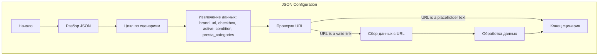

## <алгоритм>

1.  **Начало**: JSON-объект представляет собой конфигурацию для сбора данных о мониторах Philips с сайта morlevi.co.il.
2.  **Разбор JSON**: Программа загружает JSON-файл и извлекает данные из раздела `scenarios`.
3.  **Итерация по сценариям**: Программа перебирает каждый ключ (например, "PHILIPS 22", "PHILIPS 24-25") в разделе `scenarios`.
4.  **Извлечение данных**: Для каждого сценария извлекаются следующие данные:
    *   `brand` (строка): Марка монитора ("PHILIPS").
    *   `url` (строка): URL-адрес страницы категории мониторов на сайте morlevi.co.il. Некоторые URL-адреса заменены на строки, указывающие на название категории (пример: "-----------------------------  PHILIPS 49 ---------------------------------")
    *   `checkbox` (логическое значение): Флаг (всегда `false`).
    *   `active` (логическое значение): Флаг (всегда `true`).
    *   `condition` (строка): Состояние товара (всегда `"new"`).
    *  `presta_categories` (строка):  Категории товара в PrestaShop (пример: `"127,128,526"`).
5.  **Обработка данных**:
    *   Программа может использовать извлеченные данные для запроса веб-страниц (по URL) для сбора информации о продуктах (не реализовано в коде).
    *  Программа может использовать `presta_categories` для сопоставления категорий товаров в PrestaShop (не реализовано в коде).
6.  **Конец**: Программа завершает обработку JSON-конфигурации.

## <mermaid>

**Объяснение диаграммы:**

*   `Start`: Начало процесса разбора JSON.
*   `ParseJson`: Этап загрузки и анализа JSON-данных. Извлекает раздел `scenarios`.
*   `ScenarioLoop`: Цикл, который перебирает каждый сценарий (например, "PHILIPS 22") в разделе `scenarios`.
*  `ExtractData`: На этом этапе из каждого сценария извлекаются необходимые данные (марка, URL, флаги и т. д.).
*   `ConditionalUrl`: Проверяет является ли URL валидной ссылкой или текстовой заглушкой.
*   `FetchData`: Загружает данные с сайта, используя URL, извлеченный из сценария (этот шаг не реализован в представленном коде).
* `ProcessData`: Здесь происходит обработка полученных данных. (этот шаг не реализован в представленном коде).
*   `End`: Конец обработки сценария.

## <объяснение>

**Импорты:**

*   В данном коде нет импортов, так как это JSON-файл, а не Python-код.

**Классы:**

*   В данном коде нет классов, так как это JSON-файл, а не Python-код.

**Функции:**

*   В данном коде нет функций, так как это JSON-файл, а не Python-код.

**Переменные:**

*   `scenarios` (объект): Основной объект, содержащий все сценарии.
*   `PHILIPS 22`, `PHILIPS 24-25`, `PHILIPS 27-29`, `PHILIPS 32`, `PHILIPS 34`, `PHILIPS 49` (ключи-строки): Ключи, представляющие разные категории мониторов Philips, каждый из которых является сценарием.
*   `brand` (строка): Название бренда (всегда "PHILIPS").
*   `url` (строка): URL-адрес страницы с категорией мониторов на сайте morlevi.co.il. Или текстовая заглушка.
*   `checkbox` (логическое значение): Флаг (всегда `false`).
*   `active` (логическое значение): Флаг (всегда `true`).
*   `condition` (строка): Состояние товара (всегда `"new"`).
*  `presta_categories` (строка): Строка с id категориями в PrestaShop (пример: `"127,128,526"`).

**Объяснение:**

Этот JSON-файл представляет собой конфигурационный файл, содержащий данные для сбора информации о мониторах Philips с сайта morlevi.co.il. Каждый ключ в разделе `scenarios` представляет собой отдельный сценарий для парсинга данных с конкретной категории мониторов.

**Потенциальные ошибки и области для улучшения:**

1.  **Отсутствие обработки URL-адресов**: В некоторых сценариях URL-адреса заменены текстовыми заглушками. Это может привести к ошибкам, если предполагается автоматический парсинг страниц по этим URL-адресам. Следует либо предоставлять валидные URL-адреса, либо предусмотреть обработку текстовых заглушек.
2.  **Жестко закодированные значения**: Значения `checkbox`, `active` и `condition` всегда одинаковы для всех сценариев. Если эти значения могут меняться, их следует параметризовать.
3. **Отсутствие обработки ошибок**:  В данном JSON не предусмотрено обработки ошибок, таких как неправильный формат или отсутствие обязательных полей.
4.  **Отсутствие кода обработки**: Этот файл только описывает структуру данных, но не содержит кода, который будет использовать эти данные для парсинга или обработки веб-страниц. Необходимо разработать соответствующий код на Python или другом языке программирования.
5.  **Разбиение на подкатегории**:  Каждая категория `presta_categories` содержит несколько id категорий, возможно, следует добавить обработку для разбиения на подкатегории.

**Взаимосвязь с другими частями проекта:**

Этот JSON-файл, вероятно, используется в качестве входных данных для скриптов, которые выполняют парсинг веб-страниц и/или интеграцию данных с PrestaShop. Он может быть частью более крупной системы, которая автоматизирует процесс сбора и обработки данных.