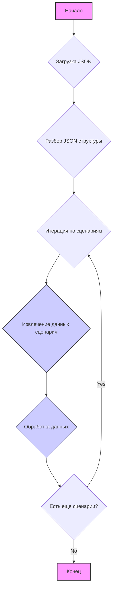

## АНАЛИЗ JSON ФАЙЛА

### <алгоритм>
1. **Начало**: Загрузка JSON файла.
2. **Разбор структуры JSON**: JSON-файл представляет собой словарь, содержащий единственный ключ `scenarios`, значением которого является другой словарь.
3. **Итерация по сценариям**: Проходим по ключам (названиям сценариев, например, "COOLER MASTER 450W") словаря `scenarios`.
4. **Извлечение данных сценария**: Для каждого сценария извлекаем его параметры:
   - `brand`: Бренд продукта (например, "COOLER MASTER").
   - `name`: Название продукта (например, "450W").
   - `url`: URL-адрес страницы продукта (может быть строкой, содержащей URL или заполнитель, например, "---------------------------------COOLER MASTER 550W--------------------------------------").
   - `checkbox`: Булево значение, указывающее, используется ли чекбокс для данного сценария (всегда `false`).
   - `active`: Булево значение, указывающее, активен ли сценарий (всегда `true`).
   - `condition`: Строка, определяющая состояние товара (всегда `new`).
   - `presta_categories`: Строка, содержащая идентификаторы категорий PrestaShop, разделенные запятыми (например, "158,511,188,578").
5. **Обработка данных**: Данные могут быть использованы для парсинга веб-страниц по URL, сопоставления товаров с категориями PrestaShop.
6. **Конец**: Обработка всех сценариев завершена.

### <mermaid>

**Описание зависимостей `mermaid`:**

- **Начало**: Начальная точка процесса.
- **Загрузка JSON**: Загрузка содержимого файла JSON.
- **Разбор JSON структуры**: Преобразование JSON в структуру данных (словарь).
- **Итерация по сценариям**: Цикл, проходящий по каждому сценарию, содержащемуся в структуре.
- **Извлечение данных сценария**: Получение значений для `brand`, `name`, `url`, `checkbox`, `active`, `condition`, `presta_categories` для каждого сценария.
- **Обработка данных**: Выполнение необходимых операций с полученными данными, таких как парсинг, сопоставление и т.д.
- **Есть еще сценарии?**: Проверка, остались ли еще сценарии для обработки.
- **Конец**: Конечная точка процесса.

### <объяснение>

**Импорты:**
   - В данном фрагменте кода нет импортов, так как это JSON-файл, а не Python.

**Классы:**
   - В данном фрагменте кода классы не используются.

**Функции:**
   - В данном фрагменте кода функции не используются.

**Переменные:**
   - **`scenarios`**: Словарь, ключами которого являются названия сценариев (например, "COOLER MASTER 450W"), а значениями - словари с параметрами сценариев.
   - **`brand`**: Строка, представляющая бренд продукта.
   - **`name`**: Строка, представляющая название продукта.
   - **`url`**: Строка, представляющая URL-адрес страницы продукта или заполнитель.
   - **`checkbox`**: Булево значение, указывающее, используется ли чекбокс для данного сценария (всегда `false`).
   - **`active`**: Булево значение, указывающее, активен ли сценарий (всегда `true`).
   - **`condition`**: Строка, указывающая состояние товара (всегда `new`).
   - **`presta_categories`**: Строка, содержащая идентификаторы категорий PrestaShop, разделенные запятыми.

**Объяснение:**

   - Данный JSON-файл содержит конфигурацию для парсинга продуктов "COOLER MASTER" с сайта "morlevi.co.il" с разными мощностями (450W, 500W, и т.д.).
   - Ключ `scenarios` представляет собой словарь, в котором каждый ключ - это определенная конфигурация для конкретной модели товара (например, "COOLER MASTER 450W").
   - Каждый сценарий включает в себя:
     - `brand`: Бренд производителя.
     - `name`: Мощность модели.
     - `url`: URL-адрес страницы продукта, может быть ссылкой или заглушкой, если страница не найдена.
     - `checkbox` и `active` используются для определения, нужно ли использовать данный сценарий и активен ли он.
     - `condition` указывает на то, что все товары новые.
     - `presta_categories`: Категории, к которым данный товар должен быть отнесен в PrestaShop. Каждая строка соответствует одной или нескольким категориям, которые определены в PrestaShop.
   - Этот файл используется для автоматизации сбора данных о товарах и их загрузки в систему PrestaShop.

**Потенциальные ошибки или области для улучшения:**

   - **Заполнители URL**: Некоторые значения `url` не являются фактическими ссылками на страницы товаров, а представляют собой заполнители (например, "---------------------------------COOLER MASTER 550W--------------------------------------"). Это может указывать на отсутствие страницы для конкретного товара или на необходимость ее формирования.
   - **Жестко заданные категории PrestaShop**: Категории PrestaShop (`presta_categories`) указаны строкой с ID, разделенными запятыми. Необходимо обеспечить корректность этих ID и их соответствие фактическим категориям в PrestaShop. Желательно предусмотреть возможность автоматического сопоставления категорий.

**Взаимосвязи с другими частями проекта:**

- Данные из этого JSON-файла, скорее всего, используются в других частях проекта для:
  - Загрузки и парсинга данных с веб-страниц по URL.
  - Сопоставления полученных товаров с категориями в PrestaShop.
  - Создания или обновления информации о товарах в PrestaShop.
- Предположительно, есть скрипт на Python или другом языке, который читает этот файл, обрабатывает данные и выполняет необходимые действия.