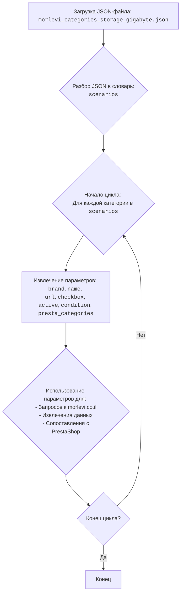

## ИНСТРУКЦИЯ:

Анализируй предоставленный код подробно и объясни его функциональность. Ответ должен включать три раздела:

1. **<алгоритм>**: Опиши рабочий процесс в виде пошаговой блок-схемы, включая примеры для каждого логического блока, и проиллюстрируй поток данных между функциями, классами или методами.
2. **<mermaid>**: Напиши код для диаграммы в формате `mermaid`, проанализируй и объясни все зависимости,
    которые импортируются при создании диаграммы.
    **ВАЖНО!** Убедитесь, что все имена переменных, используемые в диаграмме `mermaid`,
    имеют осмысленные и описательные имена. Имена переменных вроде `A`, `B`, `C`, и т.д., не допускаются!

    **Дополнительно**: Если в коде есть импорт `import header`, добавьте блок `mermaid` flowchart, объясняющий `header.py`:
    ```mermaid
    flowchart TD
        Start --> Header[<code>header.py</code><br> Determine Project Root]

        Header --> import[Import Global Settings: <br><code>from src import gs</code>]
    ```

3. **<объяснение>**: Предоставьте подробные объяснения:
   - **Импорты**: Их назначение и взаимосвязь с другими пакетами `src.`.
   - **Классы**: Их роль, атрибуты, методы и взаимодействие с другими компонентами проекта.
   - **Функции**: Их аргументы, возвращаемые значения, назначение и примеры.
   - **Переменные**: Их типы и использование.
   - Выделите потенциальные ошибки или области для улучшения.

Дополнительно, постройте цепочку взаимосвязей с другими частями проекта (если применимо).

Это обеспечивает всесторонний и структурированный анализ кода.
## Формат ответа: `.md` (markdown)
**КОНЕЦ ИНСТРУКЦИИ**

## <алгоритм>

Данный код представляет собой JSON-файл, который содержит конфигурацию сценариев для парсинга категорий товаров бренда GIGABYTE на сайте morlevi.co.il.  Каждый сценарий описывает определенную категорию товара, например, "internal_ssd_sata_3 120-128GB" или "internal_hdd_35 1TB".

**Блок-схема обработки данных:**

1.  **Начало**: Загрузка JSON-файла `morlevi_categories_storage_gigabyte.json`.
    *   **Пример**: Файл расположен по пути `hypotez/src/suppliers/ivory/scenarios/morlevi_categories_storage_gigabyte.json`.

2.  **Разбор JSON**: Разбор JSON-структуры и получение словаря `scenarios`.
    *   **Пример**: `scenarios` это словарь, где ключи - названия категорий (например, "internal_ssd_sata_3 120-128GB"), а значения - словари с параметрами сценария.

3.  **Цикл по сценариям**: Проход по всем ключам (категориям) в словаре `scenarios`.
    *   **Пример**: Для каждой итерации цикла обрабатывается отдельная категория (например, "internal_ssd_sata_3 120-128GB").

4.  **Извлечение параметров**: Для каждого сценария извлекаются значения параметров:
    *   `brand`: Бренд товара.
        *   **Пример**: `"GIGABYTE"`.
    *   `name`: Имя для идентификации сценария.
        *   **Пример**: `"internal_ssd_sata_3_128"`.
    *   `url`: URL-адрес страницы с товарами.
        *   **Пример**: `"https://www.morlevi.co.il/Cat/50?p_315=2&p_175=822&sort=datafloat2%2Cprice&keyword="`. Некоторые `url` имеют заглушку: `"------------------------GIGABYTE  internal_ssd_sata_3_2tb--------------------------"`.
    *   `checkbox`: Логический флаг (в данном файле всегда `false`).
    *   `active`: Логический флаг, указывающий на активность сценария (в данном файле всегда `true`).
    *   `condition`: Состояние товара (в данном файле всегда `"new"`).
     *   `presta_categories`: Категории товара для PrestaShop (например, `"117,118,134"`).
        *   **Пример**: `"117,118,134"`.

5.  **Использование параметров**: Полученные параметры используются для настройки парсера, например, для:
    *   Формирования запросов к сайту morlevi.co.il.
    *   Определения, какие данные извлекать из HTML-страницы.
    *   Сопоставления найденных товаров с категориями PrestaShop.

6.  **Конец цикла**: После обработки всех сценариев, цикл завершается.

## <mermaid>



**Объяснение:**

*   **A**: Начало процесса загрузки JSON-файла конфигурации. Представляет собой исходную точку, где данные загружаются из файла `morlevi_categories_storage_gigabyte.json`.
*   **B**: Представляет собой этап разбора JSON-данных и преобразования их в словарь `scenarios`. Этот словарь содержит конфигурацию для каждого сценария парсинга.
*   **C**: Начало цикла по каждой категории (ключу) в словаре `scenarios`. Этот цикл гарантирует, что каждый сценарий будет обработан.
*   **D**: Извлечение параметров для текущей категории. К этим параметрам относятся `brand`, `name`, `url`, `checkbox`, `active`, `condition` и `presta_categories`.
*   **E**: Параметры, извлеченные на предыдущем шаге, используются для настройки процесса парсинга. Это включает формирование запросов к сайту `morlevi.co.il`, извлечение данных со страниц и сопоставление найденных товаров с категориями в PrestaShop.
*   **F**: Проверка, завершен ли цикл обработки всех категорий. Если все категории обработаны, процесс переходит к завершению, если нет - возвращается к шагу **С**.
*   **G**: Конец процесса.

## <объяснение>

**Общая структура**:

Файл `morlevi_categories_storage_gigabyte.json` представляет собой JSON-объект, который содержит словарь `scenarios`. Этот словарь содержит конфигурацию для парсинга категорий товаров GIGABYTE с сайта morlevi.co.il. Каждый ключ в словаре `scenarios` представляет собой имя категории товара, а значение является словарем с параметрами для этой категории.

**Ключевые поля в каждом сценарии:**

*   **`brand`**: Строка, указывающая бренд товара. В данном случае, всегда `"GIGABYTE"`.
*   **`name`**: Строка, используемая для идентификации конкретного сценария парсинга.
*   **`url`**: Строка, представляющая URL-адрес страницы на сайте morlevi.co.il, где находятся товары заданной категории. Некоторые URL заменены на текстовую заглушку, что может означать необходимость ручной обработки или недоступность страницы на момент составления конфигурации.
*    **`checkbox`**: Логическое значение, всегда `false`, что может указывать на то, что в данном контексте это поле не используется или игнорируется.
*   **`active`**: Логическое значение, всегда `true`, что указывает на то, что все сценарии активны.
*   **`condition`**: Строка, указывающая состояние товара, в данном случае всегда `"new"`.
*  **`presta_categories`**: Строка, содержащая ID категорий в PrestaShop, к которым следует привязать товары, полученные при парсинге, разделенные запятыми.

**Типы данных:**

*   Словарь (`dict`)
*   Строка (`str`)
*   Логическое значение (`bool`)

**Назначение файла**:

Этот файл используется как конфигурационный файл для системы парсинга. Он позволяет задать список категорий товаров, которые нужно спарсить с сайта morlevi.co.il, а также задать параметры для каждого сценария. Это позволяет гибко настраивать систему парсинга и добавлять новые категории для обработки, редактируя только данный JSON-файл.

**Потенциальные проблемы и области для улучшения:**

1.  **Заглушки URL**: Некоторые значения `url` являются текстовыми заглушками. Это может означать, что для этих категорий автоматический парсинг невозможен или не настроен, и потребуется ручная обработка или дополнительная разработка.
2.  **Использование `checkbox` и `condition`**: Поля `checkbox` и `condition` всегда имеют одинаковые значения (`false` и `"new"` соответственно). Это может быть избыточным. Если они не используются, их можно удалить из JSON-структуры, если их использование предполагается в будущем, то в коде парсера должна быть логика их обработки.
3. **Отсутсвие обработки ошибок**: Код парсинга должен иметь обработку ошибок, например, если URL недоступен, а не просто подставлять заглушку.
4. **Масштабируемость**:  Если товаров у данного поставщика будет в разы больше, то данный json файл станет слишком громоздким. Решением данной проблемы будет выгрузка данных в БД.
5. **Дублирование категорий**: В данном файле присутсвуют дублирования категорий PrestaShop в разных подкатегориях одного товара, например, `"117,120,141,165"`, `"117,120,142,168"` и т.д.

**Взаимосвязи с другими частями проекта:**

Этот файл, вероятно, используется в системе парсинга, которая предназначена для сбора данных о товарах с сайта morlevi.co.il и добавления этих данных в базу данных PrestaShop. При загрузке данных, данная конфигурация используется для определения:

*   Какие страницы нужно спарсить.
*   Какие данные извлекать со страниц.
*   В какие категории PrestaShop поместить товары.

**Заключение:**

Файл `morlevi_categories_storage_gigabyte.json` является ключевым конфигурационным файлом для парсинга товаров GIGABYTE с сайта morlevi.co.il. Он обеспечивает гибкость и настраиваемость процесса парсинга, позволяя легко добавлять новые категории и настраивать параметры для каждого сценария. Однако следует обратить внимание на проблемы с URL-заглушками и возможным дублированием категорий, а также на потенциальные области для улучшения, такие как обработка ошибок.