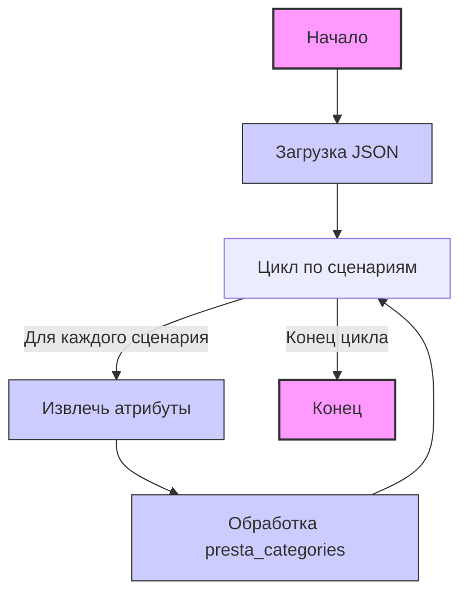

## <алгоритм>

1. **Начало**: Загрузка JSON-файла, содержащего конфигурацию категорий товаров для поставщика "Intel".
2. **Итерация по сценариям**: Программа перебирает каждый сценарий, определенный в ключе "scenarios" JSON-объекта. Каждый сценарий представляет собой конкретную категорию товара (например, "internal_ssd_sata_3 120-128GB").
   - **Пример**: Первый сценарий - `"internal_ssd_sata_3 120-128GB"`.
3. **Извлечение атрибутов сценария**: Для каждого сценария извлекаются атрибуты, такие как:
   - `brand`: Бренд продукта (в данном случае всегда "INTEL").
   - `name`: Уникальное имя продукта (например, "internal_ssd_sata_3_128").
   - `url`: URL, связанный с продуктом. Может быть ссылкой на веб-страницу или строкой-заглушкой.
   - `checkbox`: Логическое значение, указывающее, выбран ли продукт (всегда `false` в данном коде).
   - `active`: Логическое значение, указывающее, активен ли продукт (всегда `true` в данном коде).
   - `condition`: Состояние товара (всегда "new" в данном коде).
   - `presta_categories`: Строка, содержащая ID категорий PrestaShop, разделенные запятыми, к которым относится товар (например, "117,118,134").
   - **Пример**: Для сценария `"internal_ssd_sata_3 120-128GB"`: `brand` - "INTEL", `name` - "internal_ssd_sata_3_128", `presta_categories` - "117,118,134".
4. **Обработка категорий**: Для каждого сценария `presta_categories` представляют собой строку.
   - **Пример**: `"117,118,134"` для сценария `"internal_ssd_sata_3 120-128GB"`.
5. **Конец итерации**: Процесс повторяется для каждого сценария в JSON.
6. **Конец**: Завершение обработки всех сценариев.

## <mermaid>

**Описание диаграммы `mermaid`:**

Диаграмма представляет собой блок-схему (flowchart), описывающую процесс обработки JSON-файла.
-   **Start**: Начало процесса. Обозначен в виде овала.
-   **LoadJson**: Блок, представляющий загрузку JSON-файла.
-   **LoopScenarios**: Блок, представляющий цикл, который итерирует по каждому сценарию в JSON-файле.
-   **ExtractAttributes**: Блок, представляющий извлечение атрибутов для текущего сценария (brand, name, url, checkbox, active, condition, presta_categories).
-   **ProcessCategories**: Блок, представляющий обработку строки `presta_categories`.
-  **LoopScenarios** : Возврат к следующему сценарию.
-   **End**: Конец процесса. Обозначен в виде овала.

Зависимостей от импортов в данном коде нет, так как представлен только JSON, а не код Python.

## <объяснение>

**Импорты**:

В данном примере импорты отсутствуют, поскольку это JSON-файл, а не программный код.

**Классы**:

Классы в данном контексте не используются, так как это файл конфигурации в формате JSON.

**Функции**:

Функции отсутствуют, поскольку это файл данных в формате JSON.

**Переменные**:

-   `scenarios`: Объект JSON, содержащий в себе наборы сценариев (ключ-значение). Ключ - название сценария, значение - объект с информацией о товаре.
    -   Тип: `object` (словарь/ассоциативный массив).
    -   Использование: Используется для хранения конфигурации категорий товаров.
-   `brand`: Строка, представляющая бренд товара (например, "INTEL").
    -   Тип: `string`.
    -   Использование: Идентифицирует производителя товара.
-   `name`: Строка, представляющая уникальное имя товара.
    -   Тип: `string`.
    -   Использование: Используется как идентификатор товара.
-   `url`: Строка, представляющая URL товара.
    -   Тип: `string`.
    -   Использование: Может использоваться для ссылки на страницу товара или как строка-заглушка.
-   `checkbox`: Логическое значение, указывающее, выбран ли товар.
    -   Тип: `boolean`.
    -   Использование: Определяет, должен ли товар быть выбран по умолчанию (в данном случае всегда `false`).
-   `active`: Логическое значение, указывающее, активен ли товар.
    -   Тип: `boolean`.
    -   Использование: Определяет, должен ли товар обрабатываться (в данном случае всегда `true`).
-   `condition`: Строка, представляющая состояние товара.
    -   Тип: `string`.
    -   Использование: Указывает на состояние товара (в данном случае всегда "new").
-   `presta_categories`: Строка, содержащая ID категорий PrestaShop, разделенные запятыми.
    -   Тип: `string`.
    -   Использование: Используется для сопоставления товара с категориями в PrestaShop.

**Объяснение**:

Этот JSON-файл представляет собой конфигурационный файл, содержащий информацию о категориях товаров поставщика "Intel".  Он структурирован в виде набора сценариев, где каждый сценарий представляет собой конкретную категорию товара с ее атрибутами.

**Потенциальные ошибки и области для улучшения**:

1. **Отсутствие валидации**: JSON-файл не содержит никакой валидации данных. В реальных условиях было бы полезно добавить схему JSON для проверки правильности формата данных и наличия обязательных полей.
2. **Неоднородность `url`**: Значения поля `url` варьируются от строк-заглушек до реальных URL, что может вызвать сложности при обработке.
3. **Зависимость от строк**: Использование строк для `presta_categories` может привести к ошибкам при обработке, если форматирование строки будет нарушено. Лучше использовать списки ID категорий.
4. **Повторение значений**: Такие значения, как `brand`, `checkbox`, `active`, и `condition` повторяются для всех сценариев. Эти значения, вероятно, можно вынести на более высокий уровень или использовать как значение по умолчанию в коде обработки.

**Цепочка взаимосвязей**:

Этот файл конфигурации используется в процессе импорта или синхронизации данных с платформой электронной коммерции PrestaShop. Он определяет соответствия между конкретными товарами поставщика "Intel" и категориями в PrestaShop. Данный файл, вероятно, используется модулем или скриптом Python, который анализирует JSON и затем взаимодействует с API PrestaShop для создания или обновления категорий и товаров.