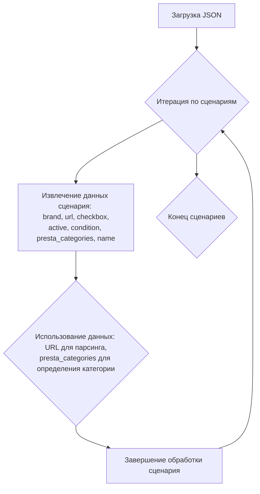

## <алгоритм>

1.  **Начало**: Загрузка JSON-данных, представляющих сценарии для продуктов KINGSTON.
2.  **Итерация по сценариям**: Проходим по каждому ключу (названию продукта, например, "KINGSTON NVME GEN4 512GB") в словаре `scenarios`.
3.  **Извлечение данных сценария**: Для каждого сценария извлекаем следующие данные:
    *   `brand`: Бренд продукта (всегда "KINGSTON" в этом файле).
    *   `url`: URL-адрес страницы продукта на сайте morlevi.co.il.
    *   `checkbox`: Логическое значение, которое всегда `false`.
    *   `active`: Логическое значение, которое всегда `true`.
    *   `condition`: Строка, которая всегда `new`.
    *   `presta_categories`: Словарь, содержащий шаблон (`template`) для категорий PrestaShop,  где ключ `kingston` содержит строку с названием категории.
    *   `name`: (Не всегда присутствует) Имя товара, если указано,  используется как название товара, а не название ключа.
    
4.  **Использование данных**:
    *   URL используется для парсинга страниц и получения информации о продуктах.
    *   `presta_categories` используются для определения категории продукта в PrestaShop.
    *   Остальные поля (`brand`, `checkbox`, `active`, `condition`) вероятно используются для дальнейшей обработки или фильтрации продуктов.

**Пример для сценария "KINGSTON NVME GEN4 512GB":**

1.  Извлекаем: `brand` = "KINGSTON", `url` = "https://www.morlevi.co.il/Cat/314?p_315=22&p_175=826&sort=datafloat2%2Cprice&keyword=", `checkbox` = `false`, `active` = `true`, `condition` = "new", `presta_categories` = `{ "template": { "kingston": "SSD NVME GEN4 512GB" } }`
2.  URL используется для загрузки страницы продукта.
3.  `presta_categories` используется для присвоения категории "SSD NVME GEN4 512GB" в PrestaShop.

**Поток данных:**

Загрузка JSON -> Итерация по сценариям -> Извлечение данных -> Использование данных (парсинг URL, назначение категорий)

## <mermaid>

**Объяснение диаграммы:**

*   `A`: Начальный шаг - загрузка JSON-данных из файла.
*   `B`: Цикл, который проходит по всем сценариям, описанным в JSON.
*   `C`:  Извлекает данные для текущего сценария. Эти данные включают название бренда (`brand`), URL страницы продукта (`url`), флаг `checkbox`, флаг `active`, состояние товара (`condition`), категории PrestaShop (`presta_categories`), и, опционально, название товара (`name`).
*   `D`: Использование извлеченных данных.  URL используется для дальнейшей обработки, например, для парсинга страницы, а категории `presta_categories` используются для присвоения соответствующих категорий в PrestaShop.
*   `E`: Завершение обработки текущего сценария.
*   `F`:  Конец обработки всех сценариев.

## <объяснение>

**Общая структура:**

Файл `morlevi_categories_storage_kingston.json` содержит JSON-объект, структурированный как словарь, где ключи - это названия продуктов KINGSTON (например, "KINGSTON NVME GEN4 512GB"), а значения - это словари с параметрами для каждого продукта. Эти параметры включают URL, флаги активности, состояние товара и информацию о категориях PrestaShop.

**Импорты:**

В данном JSON файле нет импортов, поскольку это конфигурационный файл, а не код на Python.

**Классы:**

В данном файле нет классов, так как он представляет собой структуру данных в формате JSON.

**Функции:**

В данном файле нет функций, так как он представляет собой структуру данных в формате JSON. Функции для обработки этих данных будут написаны в других частях проекта.

**Переменные:**

*   `scenarios`:  Словарь (JSON-объект), содержащий все сценарии для продуктов KINGSTON. Ключи этого словаря – названия сценариев (т.е. названия продуктов), а значения – словари, содержащие детальную информацию о каждом сценарии.
*   Внутри каждого сценария:
    *   `brand`: Строка, представляющая бренд продукта. В этом файле всегда "KINGSTON".
    *   `url`: Строка, представляющая URL-адрес страницы продукта на сайте morlevi.co.il.
    *   `checkbox`: Логическое значение (всегда `false` в данном файле).
    *   `active`: Логическое значение (всегда `true` в данном файле).
    *   `condition`: Строка, описывающая состояние продукта (всегда "new" в данном файле).
    *   `presta_categories`: Словарь, содержащий информацию о категориях PrestaShop. Вложенный словарь `template` с ключом `kingston` содержит строку с названием категории.
    *    `name`: Строка, представляющая альтернативное имя товара. Присутствует не во всех сценариях.

**Назначение и использование:**

Этот JSON-файл, вероятно, используется в качестве конфигурационного файла для парсера, который будет загружать страницы продуктов с сайта morlevi.co.il и сопоставлять их с категориями в PrestaShop. Поле `url` используется для загрузки страницы, а поле `presta_categories` используется для присвоения корректных категорий продуктам в PrestaShop.

**Цепочка взаимосвязей:**

Этот файл является частью системы, которая, скорее всего, автоматизирует процесс добавления и обновления товаров в интернет-магазине на платформе PrestaShop. Он представляет собой хранилище конфигурации для парсера, который работает со списком товаров от поставщика Morlevi.

1.  **Парсер:**  Парсер (написанный на Python или другом языке) будет загружать этот JSON-файл.
2.  **Обработка URL:**  Парсер будет использовать значения `url`, для загрузки страниц с товарами с сайта morlevi.co.il.
3.  **Сопоставление категорий:** Затем парсер будет использовать `presta_categories`, чтобы установить правильные категории для товаров в PrestaShop.
4.  **Обновление PrestaShop:**  После чего, информация о товарах будет передана в базу данных PrestaShop.

**Потенциальные ошибки и области для улучшения:**

*   **Жёстко закодированные значения:**  Значения `checkbox` (всегда `false`), `active` (всегда `true`), и `condition` (всегда "new") могут быть вынесены в настройки по умолчанию или в другой конфигурационный файл, если планируется их изменять.
*   **Дублирование брендов:**  `brand`  для всех сценариев "KINGSTON". Можно вынести это в отдельный уровень, чтобы избежать повторения.

Этот анализ предоставляет полное понимание структуры и назначения предоставленного JSON-файла, а также его роли в более широком контексте проекта.