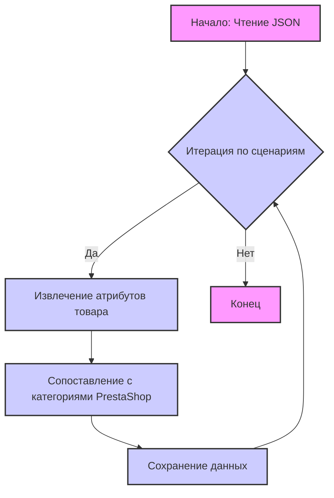

## АНАЛИЗ КОДА

### 1. <алгоритм>
Данный JSON файл содержит конфигурацию для сбора данных о товарах Samsung из интернет-магазина Morlevi.

**Блок-схема:**

1.  **Начало**: Загрузка JSON-файла.
    *   _Пример_: Файл `morlevi_categories_storage_samsung.json`
2.  **Чтение данных**: Парсинг JSON в структуру данных. В результате получается словарь, где ключами являются названия моделей, а значениями - их характеристики.
    *   _Пример_: Чтение структуры `scenarios`.
3.  **Итерация**: Перебор словаря `scenarios`. Для каждой модели (например, `SAMSUNG NVME GEN4 512GB`):
    *   _Пример_: Текущая модель - `SAMSUNG NVME GEN4 512GB`
4.  **Извлечение атрибутов**: Извлечение атрибутов: `brand` (бренд), `url` (URL страницы товара), `checkbox` (флаг для чекбокса), `active` (флаг активности), `condition` (состояние товара), `presta_categories` (категории товара PrestaShop).
    *   _Пример_: Для `SAMSUNG NVME GEN4 512GB`:
        *   `brand`: "SAMSUNG"
        *   `url`: "https://www.morlevi.co.il/Cat/314?p_315=28&p_175=826&sort=datafloat2%2Cprice&keyword="
        *   `checkbox`: `false`
        *   `active`: `true`
        *   `condition`: "new"
        *   `presta_categories`: `{"template": {"samsung": "SSD NVME GEN4 512GB"}}`
5.  **Обработка данных**: Обработка извлеченных данных. Сопоставление данных с категориями PrestaShop.
    *   _Пример_: Сопоставление `SAMSUNG NVME GEN4 512GB` с категорией "SSD NVME GEN4 512GB".
6.  **Сохранение данных**: Сохранение обработанных данных (в базу данных, файл и т.д.).
    *   _Пример_:  Сохранение сопоставления категории "SSD NVME GEN4 512GB" для товара  `SAMSUNG NVME GEN4 512GB`.
7. **Переход к следующей итерации**: Переход к следующей модели из словаря `scenarios`.
8.  **Завершение**: После перебора всех моделей, завершение процесса.

### 2. <mermaid>

**Анализ зависимостей:**
Диаграмма `mermaid` не подразумевает импорт зависимостей, она лишь отображает поток управления и обработки данных внутри этого JSON файла. Здесь нет импортов, т.к. это файл данных, а не исполняемый код.
Используются следующие переменные:
*   `A` - начальный блок, обозначающий начало обработки JSON-файла.
*   `B` - блок, представляющий цикл итерации по списку сценариев.
*   `C` - блок, отвечающий за извлечение атрибутов товара из текущего сценария.
*   `D` - блок, отвечающий за сопоставление товара с категориями PrestaShop.
*  `E` - блок, отвечающий за сохранения обработанных данных.
*   `F` - конечный блок, обозначающий окончание обработки JSON-файла.

### 3. <объяснение>
**Описание файла `morlevi_categories_storage_samsung.json`**

Это файл в формате JSON, который содержит конфигурационные данные для парсинга товаров бренда Samsung с сайта Morlevi. Эти данные используются для сопоставления товаров с категориями в PrestaShop.
Файл содержит один корневой объект `scenarios`, который является словарем. Ключами этого словаря являются названия моделей товаров Samsung, а значениями - словари с атрибутами для каждой модели.

**Структура данных**

-   `scenarios`:
    -   Каждый ключ - это **название модели товара** (например, "SAMSUNG NVME GEN4 512GB").
    -   Каждое значение - это **словарь**, содержащий следующие ключи:
        -   `brand`: **строка**, указывающая бренд товара (всегда "SAMSUNG" в данном файле).
        -   `url`: **строка**, URL страницы товара на сайте Morlevi.
        -   `checkbox`: **логическое значение**, указывающее на необходимость использования чекбокса (всегда `false` в данном файле).
        -   `active`: **логическое значение**, указывает, активен ли сценарий (всегда `true` в данном файле).
        -   `condition`: **строка**, указывающая состояние товара (всегда "new" в данном файле).
        -   `presta_categories`: **словарь**, содержащий категории для PrestaShop:
            -   `template`: **словарь**, содержащий соответствия для разных брендов.
                -   `samsung`: **строка**, название категории в PrestaShop для данного товара.

**Примеры:**

*   Для модели "SAMSUNG NVME GEN4 512GB":
    -   Бренд "SAMSUNG".
    -   URL: "https://www.morlevi.co.il/Cat/314?p_315=28&p_175=826&sort=datafloat2%2Cprice&keyword="
    -   Активен.
    -   Состояние - новое.
    -   Соответствующая категория PrestaShop: "SSD NVME GEN4 512GB".

**Назначение:**

Этот файл используется как источник данных для парсинга товаров Samsung с сайта Morlevi и их сопоставления с категориями в PrestaShop. Он содержит всю необходимую информацию, такую как URL товаров, их бренды и соответствующие категории PrestaShop.

**Взаимосвязь с другими частями проекта:**

Этот файл является частью системы сбора данных для интернет-магазина. Предполагается, что данные из этого файла будут использоваться в Python скриптах для парсинга HTML страниц с сайта Morlevi и загрузки информации в PrestaShop.  Вероятно, в проекте есть модули, отвечающие за чтение данных из JSON, парсинг HTML, и взаимодействие с API PrestaShop.

**Потенциальные ошибки и области для улучшения:**

1.  **Дублирование URL**: URL-ы могут меняться, но все они, по сути, имеют одну структуру.  Было бы целесообразнее хранить только параметры, которые изменяются в URL, например, `p_175` и `Cat/`, а полную URL генерировать в коде при парсинге.
2.  **Жестко закодированный бренд:** Все записи имеют одинаковый бренд `"SAMSUNG"`. В будущем это может потребовать рефакторинга, если потребуется добавить другие бренды.
3. **Название категорий**: Название категорий задано в файле и это может вызвать ошибки при изменении категорий на сайте PrestaShop.
4.  **Нет обработки ошибок:** В JSON файле не предусмотрена обработка ошибок, таких как отсутствие данных или неправильный формат URL. Это следует предусмотреть на уровне парсинга в Python.

**Заключение:**

Файл `morlevi_categories_storage_samsung.json` представляет собой конфигурационный файл для парсинга данных о товарах Samsung с сайта Morlevi и сопоставления их с категориями PrestaShop. Он содержит информацию о URL, брендах, состоянии товаров и их соответствующих категориях.  Несмотря на свою простоту, файл выполняет важную роль в системе парсинга и требует дальнейшей интеграции с Python скриптами, отвечающими за парсинг данных и обновление информации в PrestaShop.