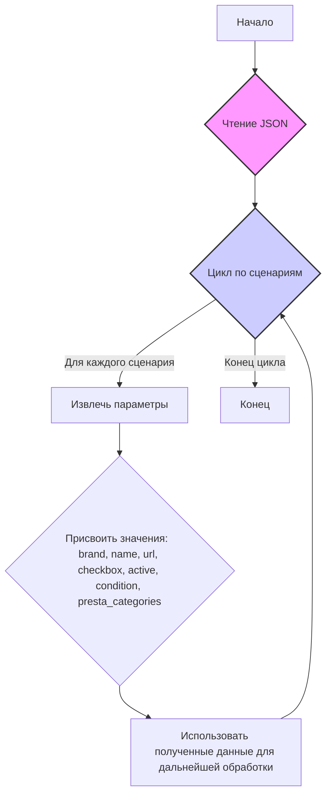
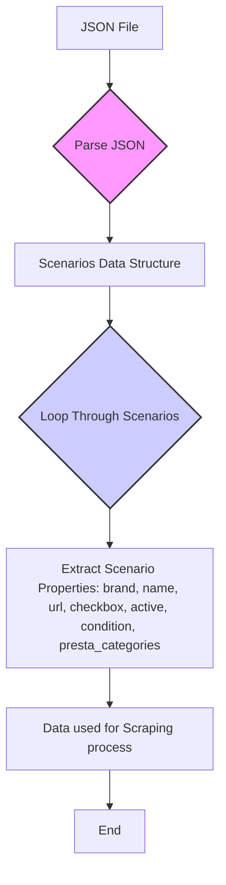

## АНАЛИЗ КОДА

### 1. **<алгоритм>**

Данный код представляет собой JSON-файл, содержащий конфигурацию сценариев для сбора данных о продуктах SANDISK на сайте Morlevi.  Каждый сценарий представляет собой набор параметров, описывающих определенную категорию товаров.

**Блок-схема:**

**Примеры:**

1.  **Сценарий:** `internal_ssd_sata_3 120-128GB`
    *   **brand:** `"SANDISK"`
    *   **name:** `"internal_ssd_sata_3_128"`
    *   **url:** `"https://www.morlevi.co.il/Cat/50?p_315=23&p_175=822&sort=datafloat2%2Cprice&keyword="`
    *   **checkbox:** `false`
    *   **active:** `true`
    *  **condition:** `"new"`
    *   **presta_categories:** `"117,118,134"`
    
2.  **Сценарий:** `internal_ssd_nvmi 2TB`
    *   **brand:** `"SANDISK"`
    *   **name:** `"internal_ssd_nvme_2tb"`
    *   **url:** `"------------------------SANDISK internal_ssd_nvme_2tb---------------------------"`
    *   **checkbox:** `false`
    *   **active:** `true`
    *   **condition:** `"new"`
    *   **presta_categories:** `"117,119,144"`

**Поток данных:**

JSON ->  Словарь Python (при чтении) -> Данные сценария -> Обработка (в другом коде)

### 2. **<mermaid>**

**Объяснение:**

Диаграмма описывает процесс обработки JSON-файла, представляющего сценарии для сбора данных. Начинается с чтения JSON файла (A)  затем происходит парсинг данных (B).  Результатом является структура данных (словарь) со всеми сценариями  (C). Далее происходит итерирование по всем сценариям  (D). Для каждого сценария извлекаются его свойства, такие как `brand`, `name`, `url`, `checkbox`, `active`, `condition`, `presta_categories` (E). Извлеченные данные используются в дальнейшей логике приложения для парсинга веб-страниц  (F), завершая процесс (G).

### 3. **<объяснение>**

**Структура файла:**

JSON-файл содержит объект с ключом `scenarios`.  Значение `scenarios` - это словарь, где каждый ключ является идентификатором сценария (например, "internal\_ssd\_sata\_3 120-128GB"), а значение - это словарь, содержащий параметры этого сценария.

**Параметры сценария:**

*   **brand**: (строка)  Указывает бренд товара (в данном случае всегда "SANDISK").
*   **name**: (строка)  Уникальное имя сценария, обычно отражающее тип и объем товара.
*   **url**: (строка)  URL-адрес веб-страницы, с которой нужно собирать данные.  Некоторые  URL помечены как `"------------------------SANDISK ...---------------------------"`, что может указывать на то, что они не используются для парсинга, а просто для каталогизации категорий.
*   **checkbox**: (логическое значение)  Используется ли чекбокс при выборе опций. Всегда `false` в данном файле.
*   **active**: (логическое значение)  Указывает, активен ли данный сценарий. Всегда `true` в данном файле.
*   **condition**: (строка)  Состояние товара, в данном случае всегда "new".
*   **presta\_categories**: (строка)  Список категорий PrestaShop (разделённый запятыми), к которым относится товар.

**Назначение:**

Этот JSON-файл служит конфигурационным файлом для системы сбора данных о товарах SANDISK на сайте Morlevi. Он определяет, какие категории товаров нужно обрабатывать, и предоставляет необходимые параметры для парсинга веб-страниц и идентификации товаров.

**Связь с другими частями проекта:**

Вероятно, этот файл используется скриптами или классами в  `src/suppliers/ivory`, которые отвечают за парсинг данных с сайта Morlevi.  Скрипт, загрузив этот JSON, получает список категорий, которые нужно спарсить, и необходимые параметры для каждого сценария.

**Потенциальные ошибки и области для улучшения:**

*   **Обработка URL:** Некоторые URL-адреса представляют собой строки-заполнители  `"------------------------SANDISK ...---------------------------"`,  не являющиеся валидными URL. Это может потребовать дополнительной логики в коде, использующем этот файл, чтобы обрабатывать такие значения и игнорировать их или подставлять URL-адреса из других источников.
*   **Жестко закодированные значения**: Все сценарии имеют `"checkbox": false`, `"active": true` и `"condition":"new"`. Возможно, стоит сделать их более динамичными или вынести в общую конфигурацию.
*   **Дублирование:** Некоторые значения (например, `"brand": "SANDISK"`) повторяются в каждом сценарии. Их можно вынести на более высокий уровень.

**Цепочка взаимосвязей:**

1.  **JSON-файл** →
2.  **Скрипт парсинга** (`src/suppliers/ivory`) →
3.  **Обработанные данные** →
4.  **База данных/Система управления контентом**.

**В заключение**, этот файл представляет собой хорошо структурированный JSON-файл, который обеспечивает необходимые данные для  парсинга товаров SANDISK на сайте Morlevi. Однако требуется дополнительная логика для обработки недействительных URL-адресов.