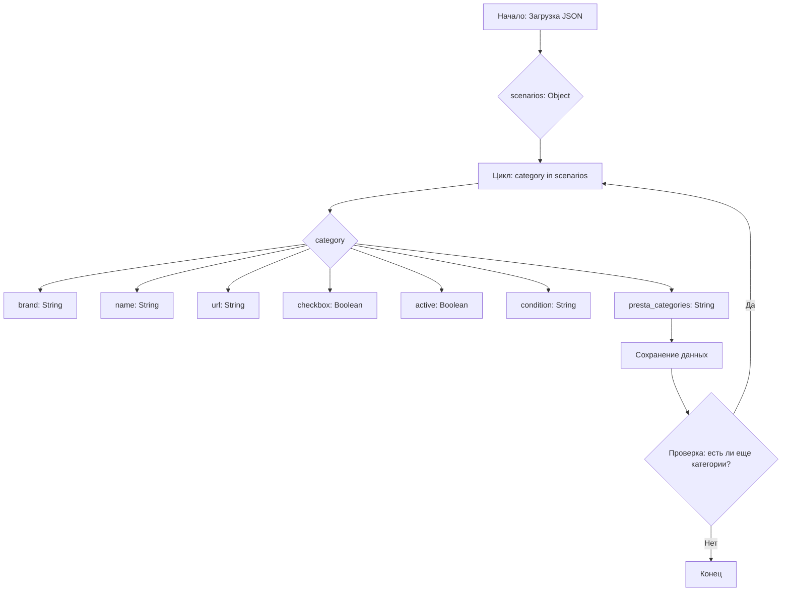

## АНАЛИЗ КОДА:

### 1. <алгоритм>

Представленный код описывает структуру данных в формате JSON, предназначенную для хранения информации о различных категориях товаров (жестких дисков и SSD) от поставщика TOSHIBA. Каждая категория характеризуется набором атрибутов, таких как бренд, название, URL, активность, состояние и идентификаторы категорий PrestaShop.

**Блок-схема:**

1.  **Начало**: Загрузка JSON-файла.
    
    *   Пример: Загружается файл `morlevi_categories_storage_toshiba.json`
2.  **Чтение основного объекта "scenarios"**: Извлечение данных о категориях товаров.
    *  Пример: Получаем словарь, где каждый ключ – это название категории (например, `"internal_ssd_sata_3 120-128GB"`), а значение – словарь с информацией о данной категории.
3.  **Цикл по категориям**: Обработка каждой категории товаров.
    *   Пример: Для категории `"internal_ssd_sata_3 120-128GB"` выполняется итерация.
4.  **Извлечение атрибутов**: Получение значений атрибутов (brand, name, url, checkbox, active, condition, presta_categories).
    *  Пример: для категории `"internal_ssd_sata_3 120-128GB"` извлекаются значения: `brand` = `"TOSHIBA"`, `name` = `"internal_ssd_sata_3_128"`, `url` = `"---------------------------------------------------------------"`, `checkbox` = `false`, `active` = `true`, `condition` = `"new"`, `presta_categories` = `"117,118,134"`.
5.  **Сохранение данных**: Сохранение полученных данных в структуре, удобной для дальнейшей работы (например, Python dict).
    *   Пример: Категория `"internal_ssd_sata_3 120-128GB"` и ее атрибуты хранятся в словаре.
6.  **Конец цикла**: Переход к следующей категории или завершение обработки, если все категории были обработаны.
    *  Пример: После обработки `"internal_ssd_sata_3 120-128GB"` происходит переход к `"internal_ssd_sata_3 240-256GB"` и т.д.
7. **Конец**: Выход из алгоритма.

### 2. <mermaid>

**Объяснение диаграммы:**
*   **Начало: Загрузка JSON**: Начальная точка, где загружаются данные из JSON-файла.
*   **scenarios: Object**: Представляет собой основной объект в JSON, содержащий все категории товаров.
*   **Цикл: category in scenarios**: Обозначает цикл, который проходит по всем категориям товаров.
*   **category**: Представляет собой текущую обрабатываемую категорию.
*   **brand, name, url, checkbox, active, condition, presta_categories**: Атрибуты каждой категории, которые извлекаются.
*   **Сохранение данных**: Этап, на котором данные о текущей категории сохраняются в нужной структуре.
*   **Проверка: есть ли еще категории?**: Условие для продолжения цикла или его завершения.
*   **Конец**: Завершение обработки JSON-файла.

### 3. <объяснение>

#### **Общая структура:**

Данный JSON-файл представляет собой словарь, где ключом является название категории товара (например, `"internal_ssd_sata_3 120-128GB"`), а значением - словарь с описанием этой категории.
    
#### **Атрибуты категорий:**

*   `brand`: (String) Бренд товара, всегда "TOSHIBA".
*   `name`: (String) Название товара, используется для идентификации конкретной модели или категории.
*   `url`: (String) URL-адрес, используемый для поиска товара, либо строка с описанием (в основном используется строка "--------------------").
*   `checkbox`: (Boolean) Логическое значение, которое всегда `false`.  Возможно используется как флаг для каких-то операций.
*   `active`: (Boolean) Логическое значение, которое всегда `true`, указывает на активность категории.
*  `condition`: (String)  Состояние товара. Всегда `new`.
*   `presta_categories`: (String) Строка, содержащая через запятую идентификаторы категорий в PrestaShop.

#### **Назначение:**

Файл предназначен для хранения и управления данными о категориях товаров Toshiba, предположительно, для дальнейшей интеграции с интернет-магазином на платформе PrestaShop.

#### **Примеры:**

*   Категория `"internal_ssd_sata_3 120-128GB"` представляет собой внутренний SSD SATA 3 объемом 120-128 ГБ, относящийся к категориям PrestaShop с идентификаторами 117, 118 и 134.
*   Категория `"external_hdd_25 2TB"` — это внешний жесткий диск 2.5" объемом 2 ТБ, относящийся к категориям PrestaShop с идентификаторами 117, 125 и 185.

#### **Потенциальные ошибки и области улучшения:**

*   **Неоднородность URL:** Некоторые URL представляют собой строку "-...", а другие являются ссылками на страницы поиска. Это может вызвать проблемы при их автоматической обработке. Желательно унифицировать формат URL.
*   **Неиспользуемый параметр checkbox:** Все значения `checkbox` равны `false`. Возможно, это поле является резервным или устаревшим и его можно убрать.
*   **Дублирование названий:** Есть дублирование названий (`internal_ssd_sata_3_1tb`, `internal_ssd_m2sata_256`). Необходимо пересмотреть названия для избежания путаницы.
*   **Жестко заданные значения `active` и `condition`:**  Значения `active` всегда `true`, а `condition` всегда `"new"`.  Возможно стоит сделать эти поля динамическими.

#### **Взаимосвязь с другими частями проекта:**

Предполагается, что данный файл используется как источник данных для:

*   **Импорта товаров в PrestaShop:** Значения `presta_categories` указывают на разделы каталога товаров.
*   **Создания структуры данных для парсинга сайтов поставщиков:** Атрибуты `name` и `url` могут использоваться для поиска и сбора данных о товарах.
*   **Формирования запросов к API PrestaShop:** Идентификаторы категорий и другие атрибуты могут быть использованы для автоматизации операций с PrestaShop.

**В заключение:** Файл содержит структурированные данные о категориях товаров, что позволяет автоматизировать различные процессы, такие как импорт товаров в магазин и парсинг сайтов. Необходимо обратить внимание на потенциальные проблемы, указанные выше, чтобы сделать код более эффективным и надежным.