## ИНСТРУКЦИЯ:

Анализируй предоставленный код подробно и объясни его функциональность. Ответ должен включать три раздела:

1.  **<алгоритм>**: Опиши рабочий процесс в виде пошаговой блок-схемы, включая примеры для каждого логического блока, и проиллюстрируй поток данных между функциями, классами или методами.
2.  **<mermaid>**: Напиши код для диаграммы в формате `mermaid`, проанализируй и объясни все зависимости,
    которые импортируются при создании диаграммы.
    **ВАЖНО!** Убедитесь, что все имена переменных, используемые в диаграмме `mermaid`,
    имеют осмысленные и описательные имена. Имена переменных вроде `A`, `B`, `C`, и т.д., не допускаются!

    **Дополнительно**: Если в коде есть импорт `import header`, добавьте блок `mermaid` flowchart, объясняющий `header.py`:
    ```mermaid
    flowchart TD
        Start --> Header[<code>header.py</code><br> Determine Project Root]

        Header --> import[Import Global Settings: <br><code>from src import gs</code>]
    ```

3.  **<объяснение>**: Предоставьте подробные объяснения:
    -   **Импорты**: Их назначение и взаимосвязь с другими пакетами `src.`.
    -   **Классы**: Их роль, атрибуты, методы и взаимодействие с другими компонентами проекта.
    -   **Функции**: Их аргументы, возвращаемые значения, назначение и примеры.
    -   **Переменные**: Их типы и использование.
    -   Выделите потенциальные ошибки или области для улучшения.

Дополнительно, постройте цепочку взаимосвязей с другими частями проекта (если применимо).

Это обеспечивает всесторонний и структурированный анализ кода.
## Формат ответа: `.md` (markdown)
**КОНЕЦ ИНСТРУКЦИИ**

## <алгоритм>

Этот JSON-файл представляет собой конфигурацию сценариев для обработки категорий товаров поставщика "Ivory" (по всей видимости, израильского поставщика). Каждый сценарий описывает определенную категорию товаров Western Digital и связывает ее с категориями в PrestaShop.

**Блок-схема обработки сценария:**

```mermaid
graph TD
    Start[Начало] --> LoadJSON[Загрузка JSON-конфигурации];
    LoadJSON --> LoopScenarios[Цикл по сценариям];
    LoopScenarios --> GetScenarioData[Получение данных сценария];
    GetScenarioData --> ExtractProductInfo{Извлечение информации о продукте: <br>brand, name, url};
    ExtractProductInfo -- Проверка URL --> CheckURL{Проверка URL: <br>Является ли URL допустимым?};
    CheckURL -- URL valid --> ExtractPrestaCategories{Извлечение категорий PrestaShop: <br>presta_categories};
    CheckURL -- URL invalid --> LogInvalidURL[Логирование невалидного URL];
    LogInvalidURL --> LoopScenarios;
   
    ExtractPrestaCategories --> PrepareData[Подготовка данных для дальнейшей обработки];
     PrepareData--> UpdateProductCatalog{Обновление каталога продукции <br>(например, добавление или изменение связи продукта с категориями)};    
    UpdateProductCatalog --> LoopScenarios;

     LoopScenarios -- Конец цикла --> End[Конец];
    
    
  
   
    style LogInvalidURL fill:#f9f,stroke:#333,stroke-width:2px
```

**Примеры для логических блоков:**

1.  **Загрузка JSON-конфигурации**: Загружается весь JSON-объект из файла, который имеет структуру вида `{"scenarios": { ... }}`.
    *   *Пример*: Объект `data` теперь содержит всю информацию из файла.
2.  **Цикл по сценариям**: Проходим по каждому ключу в объекте `data["scenarios"]`.
    *   *Пример*: На первом шаге будет обрабатываться сценарий с ключом `"WESTERN DIGITAL internal_ssd_sata_3 120-128GB"`, на втором - `"internal_ssd_sata_3 240-256GB"` и т.д.
3.  **Получение данных сценария**: Извлекаются данные для текущего сценария.
    *   *Пример*:  Для сценария `"WESTERN DIGITAL internal_ssd_sata_3 120-128GB"` извлекаются данные: `{"brand": "WESTERN DIGITAL", "name": "internal_ssd_sata_3_128", "url": "...", "checkbox": false, "active": true, "condition":"new", "presta_categories": "117,118,134"}`
4.  **Извлечение информации о продукте:** Извлекаются данные `brand`, `name`, `url`
    *   *Пример*: для сценария `"WESTERN DIGITAL internal_ssd_sata_3 120-128GB"` получаем:  `"brand": "WESTERN DIGITAL"`,  `"name": "internal_ssd_sata_3_128"`,  `"url": "..."`
5.  **Проверка URL**: Проверяется валидность URL. 
    *   *Пример*:  Если  `url` начинается с `http` или `https` URL считается валидным, иначе не валидным.
6.  **Извлечение категорий PrestaShop**: Извлекаются категории PrestaShop, указанные в виде строки, разделенной запятыми.
    *   *Пример*: `"presta_categories": "117,118,134"` извлекаются как `["117", "118", "134"]` .
7.  **Логирование невалидного URL**: Если URL не валиден, информация об этом сценарии логируется.
8.  **Подготовка данных для дальнейшей обработки**: Данные о товаре и категориях подготавливаются для добавления или обновления в каталоге.
9.  **Обновление каталога продукции**: На основе подготовленных данных обновляется или добавляется информация о продукте в каталоге.

```mermaid
graph TD
    subgraph scenarios
      direction TB
        scenario_1["WESTERN DIGITAL internal_ssd_sata_3 120-128GB"]
        scenario_2["internal_ssd_sata_3 240-256GB"]
        scenario_3["internal_ssd_sata_3 480-525GB"]
        scenario_4["internal_ssd_sata_3 960GB-1TB"]
        scenario_5["internal_ssd_sata_3 2TB"]
        scenario_6["internal_ssd_sata_3 4TB"]
        scenario_7["internal_ssd_sata_3 8TB"]
        scenario_8["internal_ssd_msata 240-256GB"]
        scenario_9["internal_ssd_m2sata 240-256GB"]
        scenario_10["internal_ssd_m2sata 480-525GB"]
        scenario_11["internal_ssd_nvmi 240-256GB"]
        scenario_12["internal_ssd_nvmi 480-525GB"]
        scenario_13["internal_ssd_nvmi 960GB-1TB"]
         scenario_14["internal_ssd_nvmi 2TB"]
        scenario_15["internal_ssd_nvmi_gen4 240-256GB"]
        scenario_16["internal_ssd_nvmi_gen4 480-525GB"]
        scenario_17["internal_ssd_nvmi_gen4 960GB-1TB"]
        scenario_18["internal_ssd_nvmi_gen4 2TB"]
        scenario_19["external_ssd 500GB"]
        scenario_20["external_ssd 500"]
         scenario_21["external_ssd 1TB"]
        scenario_22["external_ssd 2TB"]
        scenario_23["internal_hdd_35 1TB"]
         scenario_24["internal_hdd_35 2TB"]
         scenario_25["internal_hdd_35 3TB"]
         scenario_26["internal_hdd_35 4TB"]
        scenario_27["internal_hdd_35 6TB"]
         scenario_28["internal_hdd_35 8TB"]
         scenario_29["internal_hdd_35 10TB"]
        scenario_30["internal_hdd_35 18TB"]
        scenario_31["internal_hdd_25 500GB"]
        scenario_32["internal_hdd_25 1TB"]
        scenario_33["external_hdd_25 1TB"]
         scenario_34["external_hdd_25 2TB"]
        scenario_35["external_hdd_25 4TB"]
         scenario_36["external_hdd_25 5TB"]
        scenario_37["external_hdd_35 4TB"]
          scenario_38["external_hdd_35 6TB"]
        scenario_39["external_hdd_35 8TB"]
         scenario_40["external_hdd_35 10TB"]
          scenario_1 --> scenario_2
        scenario_2 --> scenario_3
        scenario_3 --> scenario_4
        scenario_4 --> scenario_5
        scenario_5 --> scenario_6
        scenario_6 --> scenario_7
        scenario_7 --> scenario_8
        scenario_8 --> scenario_9
        scenario_9 --> scenario_10
        scenario_10 --> scenario_11
        scenario_11 --> scenario_12
        scenario_12 --> scenario_13
        scenario_13 --> scenario_14
        scenario_14 --> scenario_15
        scenario_15 --> scenario_16
        scenario_16 --> scenario_17
         scenario_17 --> scenario_18
        scenario_18 --> scenario_19
        scenario_19 --> scenario_20
         scenario_20 --> scenario_21
        scenario_21 --> scenario_22
        scenario_22 --> scenario_23
         scenario_23 --> scenario_24
        scenario_24 --> scenario_25
        scenario_25 --> scenario_26
         scenario_26 --> scenario_27
        scenario_27 --> scenario_28
        scenario_28 --> scenario_29
        scenario_29 --> scenario_30
         scenario_30 --> scenario_31
        scenario_31 --> scenario_32
         scenario_32 --> scenario_33
        scenario_33 --> scenario_34
        scenario_34 --> scenario_35
        scenario_35 --> scenario_36
         scenario_36 --> scenario_37
        scenario_37 --> scenario_38
        scenario_38 --> scenario_39
        scenario_39 --> scenario_40
      
    end
   
    Start[Начало] --> LoadJSON[Загрузка JSON: <br> <code>morlevi_categories_storage_wd.json</code>];
    LoadJSON --> ProcessScenarios[Обработка сценариев];
    ProcessScenarios --> scenarios
    scenarios --> End[Конец];
   
    classDef scenarioClass fill:#f0f0f0,stroke:#333,stroke-width:1px;
    class scenario_1,scenario_2,scenario_3,scenario_4,scenario_5,scenario_6,scenario_7,scenario_8,scenario_9,scenario_10,scenario_11,scenario_12,scenario_13,scenario_14,scenario_15,scenario_16,scenario_17,scenario_18,scenario_19,scenario_20,scenario_21,scenario_22,scenario_23,scenario_24,scenario_25,scenario_26,scenario_27,scenario_28,scenario_29,scenario_30,scenario_31,scenario_32,scenario_33,scenario_34,scenario_35,scenario_36,scenario_37,scenario_38,scenario_39,scenario_40 scenarioClass;
```

## <mermaid>



**Описание диаграммы:**

1.  **`Start`**: Начало процесса.
2.  **`LoadJSON`**: Загружает JSON файл `morlevi_categories_storage_wd.json`
3.  **`ProcessScenarios`**: Этот узел представляет процесс обработки всех сценариев.
4. **`scenarios`**: Узел-подграф, который содержит все сценарии, представленные в JSON файле. Каждый сценарий представляет собой отдельный узел, соединенный в последовательную цепочку
   *   `scenario_1` - `scenario_40`: каждый из этих узлов представляет собой отдельный сценарий из JSON файла, описывающий определенную категорию товаров Western Digital. Например, `scenario_1` представляет `"WESTERN DIGITAL internal_ssd_sata_3 120-128GB"`.
5.  **`End`**: Конец процесса.

**Зависимости:**

-   Нет импортов.
-   Диаграмма описывает только структуру данных, представленных в JSON файле, без зависимостей от других модулей или файлов.

## <объяснение>

**Общее описание:**
JSON-файл `morlevi_categories_storage_wd.json` содержит конфигурационные данные для сопоставления категорий товаров поставщика "Western Digital" с категориями в PrestaShop.  Данный файл используется для автоматизации процесса назначения соответствующих категорий товарам при их импорте.

**Структура JSON:**

-   `scenarios`: Основной ключ, содержащий объект со списком сценариев.
-   Каждый ключ внутри `scenarios` представляет собой **название сценария**, например, `"WESTERN DIGITAL internal_ssd_sata_3 120-128GB"`.
-   Каждый **сценарий** представляет собой объект, имеющий следующие ключи:
    -   `brand` (строка): Бренд продукта.
    -   `name` (строка): Имя продукта, используемое как идентификатор.
    -   `url` (строка): URL-адрес, связанный с товаром, используется для поиска продукта у поставщика.
    -   `checkbox` (булево): Указывает, должен ли быть включен чекбокс для этого сценария (похоже, не используется).
    -   `active` (булево): Указывает, активен ли сценарий.
    -   `condition` (строка): Состояние товара, например "new".
    -   `presta_categories` (строка):  Строка с идентификаторами категорий PrestaShop, разделенными запятыми.

**Импорты:**

В данном коде нет импортов, поскольку это чистый JSON-файл. Он предназначен для чтения и использования другими частями программного обеспечения, а не для исполнения как Python-скрипт.

**Классы:**

Классы в данном коде отсутствуют, поскольку JSON-файл содержит только данные.

**Функции:**

Функции отсутствуют. Обработка данных из этого JSON-файла будет происходить в другом модуле.

**Переменные:**

В этом файле переменными выступают ключи JSON и их значения. Их можно разделить на несколько групп:

*   **Ключи сценариев**:  Представляют собой названия категорий товаров, например `"WESTERN DIGITAL internal_ssd_sata_3 120-128GB"`
*   **Атрибуты сценария:**
    *   `brand` (строка): Название бренда (`"WESTERN DIGITAL"`).
    *   `name` (строка): Название товара (`"internal_ssd_sata_3_128"`).
    *   `url` (строка): URL-адрес продукта (`"-------------------------------------WESTERN DIGITAL internal_ssd_sata_3 120-128GB--------------------------"` или URL c сайта morlevi.co.il).
    *   `checkbox` (булево): Значение `false`.
    *   `active` (булево): Значение `true`.
    *    `condition` (строка): Значение `"new"`.
    *   `presta_categories` (строка): Строка с идентификаторами категорий PrestaShop. Например, `"117,118,134"`.

**Потенциальные ошибки и улучшения:**

1.  **Проверка URL**: В некоторых сценариях поле `url` не содержит URL, а строку с разделителями, что может вызвать проблемы при автоматической обработке. Необходимо добавить проверку на валидность URL (например, начинается с `http` или `https`).
2.  **Формат `presta_categories`**:  Значения `presta_categories` представлены в виде строки, разделённой запятыми. Целесообразно обрабатывать эту строку, преобразуя её в список целых чисел, что облегчит дальнейшую работу с данными.
3.  **Дублирование данных**: Некоторые товары с разными названиями имеют одинаковые `url`, что может привести к проблемам. Желательно убедиться в уникальности URL-ов или иметь отдельную стратегию обработки.
4.  **Поддержка нескольких состояний**: Сейчас все `condition` установлены в `new`.  Следует учитывать, что состояние товара может быть разным (например, "used").
5.  **Отсутствие документации**: Не хватает описания назначения данного файла и его использования в контексте всего проекта.
6.  **Неочевидные названия:**  Некоторые названия категорий, например, `external_ssd 500` могут быть не очевидными.  Требуется более явное именование, чтобы было понятно назначение каждой категории.

**Взаимосвязь с другими частями проекта:**

Этот файл является частью системы импорта товаров для магазина PrestaShop и предназначен для поставщика "Ivory". Он является одним из файлов, который определяет логику сопоставления товаров поставщиков с категориями в интернет-магазине. Этот файл используется в связке с другими файлами, которые занимаются парсингом сайта поставщика, импортом товаров и обновлением каталога PrestaShop.