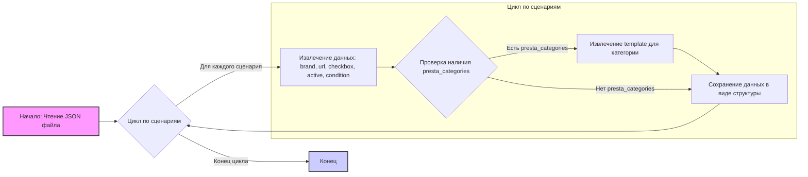
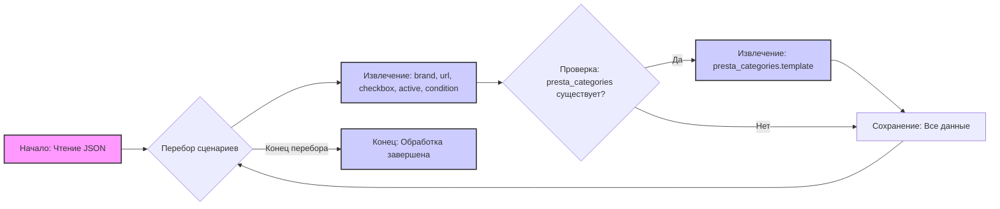

## АНАЛИЗ JSON КОДА

### 1. <алгоритм>

**Блок-схема:**

**Примеры:**

1.  **Начало:** Программа начинает с чтения JSON файла `morlevi_categories_video.json`.
2.  **Цикл по сценариям:** Начинается перебор ключей (например, "GIGABYTE RTX 4090", "GIGABYTE RTX 4080" и т.д.) в разделе "scenarios".
3.  **Извлечение данных:** Для сценария "GIGABYTE RTX 4090" извлекаются `brand` ("GIGABYTE"), `url` ("https://www.morlevi.co.il/Cat/85?p_315=2&p_55=4408&sort=datafloat2%2Cprice&keyword="), `checkbox` (false), `active` (true), `condition` ("new").
4.  **Проверка наличия presta_categories:**  Проверяется, есть ли раздел `presta_categories`. В примере он есть.
5.  **Извлечение template для категории:** Извлекается значение `template` ({"gigabyte": "RTX 4090"}).
6.  **Сохранение данных в виде структуры:** Все извлеченные данные сохраняются в структуре данных.
7.  **Конец цикла:** Процесс повторяется для всех сценариев в JSON, пока не будут обработаны все записи.
8.  **Конец:** Программа заканчивает работу после обработки всех сценариев.

### 2. <mermaid>

**Объяснение зависимостей:**

*   Диаграмма `mermaid` отображает последовательность действий по обработке данных из JSON-файла.
*   Начинается с чтения файла (шаг `A`), затем начинается цикл по сценариям (`B`).
*   В цикле извлекаются основные данные каждого сценария (`C`).
*   Проверяется наличие секции `presta_categories` (`D`). Если секция существует, то из нее извлекаются данные  (`E`), если нет, то данные сохраняются без извлечения `presta_categories`.
*   Данные сохраняются, и цикл продолжается до обработки всех сценариев.
*   В конце обработки работа завершается (`G`).
*   Используется `classDef` для визуального выделения блоков извлечения и логического блока.

### 3. <объяснение>

**Импорты:**
В данном коде нет импортов. Это JSON файл с данными, а не код на Python.

**Классы:**
В данном коде нет классов, так как это файл данных. Структура представляет собой JSON объект с ключом `scenarios`, который содержит другие JSON объекты, представляющие различные сценарии.

**Функции:**
В данном коде нет функций, так как это файл данных. JSON используется для хранения структурированных данных, которые могут быть использованы в других частях проекта.

**Переменные:**
*   `scenarios`: Это основной ключ в JSON, который содержит все сценарии. Тип - JSON object.
*   Ключи внутри `scenarios` (например, "GIGABYTE RTX 4090"): Названия сценариев. Тип - String.
*   `brand`: Бренд товара. Тип - String.
*   `url`: URL товара на сайте. Тип - String.
*   `checkbox`: Флаг чекбокса. Тип - Boolean.
*   `active`: Флаг активности сценария. Тип - Boolean.
*   `condition`: Состояние товара. Тип - String.
*   `presta_categories`: Объект, содержащий категории для PrestaShop. Тип - JSON object.
*   `template`: Объект с шаблоном для категорий. Тип - JSON object.
*   Ключи внутри `template` (например, "gigabyte"): Названия ключей категорий. Тип - String.
*   Значения внутри `template` (например, "RTX 4090"): Значения ключей категорий. Тип - String.

**Цепочка взаимосвязей с другими частями проекта:**
Этот файл `morlevi_categories_video.json` используется в проекте как источник данных для определения параметров видеокарт, предоставляемых поставщиком `morlevi`. Он, вероятно, используется в сочетании с другими файлами, например, скриптами, которые:

1.  Считывают и обрабатывают этот JSON-файл.
2.  Используют информацию для определения категорий товаров на сайте (PrestaShop).
3.  Получают данные с веб-сайта `morlevi` (`url`) для сравнения цен или других параметров.

**Потенциальные ошибки или области для улучшения:**

1.  **Отсутствие проверок:** В коде, который будет использовать этот JSON, следует предусмотреть проверки на наличие всех необходимых ключей и корректность типов данных.
2.  **Жестко заданные категории:**  `presta_categories.template` может быть более гибким, если позволить задавать несколько уровней категорий.
3.  **Отсутствие описаний полей:**  Желательно добавить краткое описание назначения каждого поля в JSON, например в виде комментариев.
4. **Дублирование данных**: Наблюдается повторение структуры (brand, url, checkbox, active, condition, presta_categories) во всех сценариях. Возможно, стоит реорганизовать файл для избегания дублирования, например выделить отдельные настройки для поставщика и отдельные настройки для товаров.

Этот анализ предоставляет подробное понимание структуры данных, их использования и потенциальных улучшений.